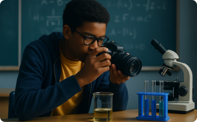

layout: true
<div style="position: absolute;left:20px;bottom:5px;color:black;font-size: 12px;">Nexellence Institute | `r rmarkdown::metadata$title` | `r format(Sys.time(), '%d %B %Y')`</div>

<!--- `r rmarkdown::metadata$subtitle` | `r format(Sys.time(), '%d %B %Y')`-->

---

class: title-slide
background-position: 10% 90%, 100% 50%
background-size: 160px, 50% 100%
background-color: #0148A4

```{r, load_refs, echo=FALSE, cache=FALSE, message=FALSE}
library(RefManageR)
BibOptions(check.entries = FALSE,
           bib.style = "authoryear",
           cite.style = 'authoryear',
           style = "markdown",
           hyperlink = FALSE,
           dashed = FALSE)
myBib <- ReadBib("assets/example.bib", check = FALSE)
top_icon = function(x) {
  icons::icon_style(
    icons::fontawesome(x),
    position = "fixed", top = 10, right = 10
  )
}
```

```{r setup, include=FALSE}
# xaringanExtra::use_scribble() ## Draw on slides. Requires dev version of xaringanExtra.
options(modelsummary_factory_latex = "kableExtra")
options(htmltools.dir.version = FALSE)
library(knitr)
opts_chunk$set(
  fig.align="center",
  fig.height=4, fig.width=6,
  out.width="748px", out.length="520.75px",
  dpi=300, #fig.path='Figs/',
  cache=T#, echo=F, warning=F, message=F
  )
```


```{r, cache=FALSE, message=FALSE, warning=FALSE, include=TRUE, eval=TRUE, results=FALSE, echo=FALSE, tidy.opts = list(width.cutoff = 50), tidy = TRUE}
## Load and install the packages that we'll be using today
if (!require("pacman")) install.packages("pacman")
pacman::p_load(tictoc, parallel, pbapply, future, future.apply, furrr, RhpcBLASctl, memoise, here, foreign, mfx, tidyverse, hrbrthemes, estimatr, ivreg, fixest, sandwich, lmtest, margins, vtable, broom, modelsummary, stargazer, fastDummies, recipes, dummy, gplots, haven, huxtable, kableExtra, gmodels, survey, gtsummary, data.table, tidyfast, dtplyr, microbenchmark, ggpubr, tibble, viridis, wesanderson, censReg, rstatix, srvyr, formatR, sysfonts, showtextdb, showtext, thematic, sampleSelection, RefManageR, DT, googleVis, png, grid)

font_add_google("Fira Sans", "firasans")
font_add_google("Fira Code", "firasans")

showtext_auto()

theme_customs <- theme(
  text = element_text(family = 'firasans', size = 16),
  plot.title.position = 'plot',
  plot.title = element_text(
    face = 'bold',
    colour = thematic::okabe_ito(8)[6],
    margin = margin(t = 2, r = 0, b = 7, l = 0, unit = "mm")
  ),
)

colors <-  thematic::okabe_ito(5)

theme_set(hrbrthemes::theme_ipsum() + theme_customs)

# COLOR PALLETES
library(paletteer)

### COLOR BLIND PALLETES
colorBlindness <- paletteer_d("colorBlindness::Blue2Orange12Steps")
cbbPalette <- c("#000000", "#E69F00", "#56B4E9", "#009E73", "#F0E442", "#0072B2", "#D55E00", "#CC79A7")

# To use for fills, add
  scale_fill_manual(values="colorBlindness::Blue2Orange12Steps")

# To use for line and point colors, add
  scale_colour_manual(values="colorBlindness::Blue2Orange12Steps")
```

```{r xaringan-panelset, echo=FALSE}
xaringanExtra::use_panelset()
```


```{css, echo=F}
    /* Table width = 100% max-width */

    .remark-slide table{
        width: auto !important; /* Adjusts table width */
    }

    /* Change the background color to white for shaded rows (even rows) */

    .remark-slide thead, .remark-slide tr:nth-child(2n) {
        background-color: white;
    }
    .remark-slide thead, .remark-slide tr:nth-child(n) {
        background-color: white;
    }

    .chev-row {
      display: flex;
      align-items: center;
      gap: 0.9em;
      margin-bottom: 0.6em;
    }
    .chev {
      flex: 0 0 62px;
      height: 78px;
      background: #c9e4f6;
      clip-path: polygon(0 0, 50% 14%, 100% 0, 100% 78%, 50% 100%, 0 78%);
      display: flex;
      align-items: center;
      justify-content: center;
      font-weight: bold;
      font-size: 1.7em;
      color: #1a1a1a;
    }
    .chev-text {
      flex: 1;
    }
    .chev-sm {
      flex: 0 0 52px;
      height: 58px;
      background: #c9e4f6;
      clip-path: polygon(0 0, 50% 14%, 100% 0, 100% 78%, 50% 100%, 0 78%);
      display: flex;
      align-items: center;
      justify-content: center;
    }
    .chev-row-sm {
      display: flex;
      align-items: center;
      gap: 0.8em;
      margin-bottom: 0.25em;
    }

    .chev-flow {
      display: flex;
      gap: 0.7em;
      margin-top: 1em;
    }
    .chev-step {
      flex: 1;
      text-align: center;
    }
    .chev-step p {
      text-align: left;
    }
    .chev-right {
      height: 58px;
      background: #c9e4f6;
      clip-path: polygon(0 0, 86% 0, 100% 50%, 86% 100%, 0 100%, 14% 50%);
      display: flex;
      align-items: center;
      justify-content: center;
      margin-bottom: 0.6em;
    }

    .three-col {
      display: flex;
      gap: 1.5em;
      margin-top: 1.5em;
    }
    .three-col .col {
      flex: 1;
      text-align: center;
    }
    .three-col .col p:first-child {
      margin-bottom: 0.4em;
    }

    .img-row {
      display: flex;
      gap: 1em;
      align-items: center;
      justify-content: center;
      margin-top: 0.8em;
    }
    .img-row img {
      max-width: 100%;
      border-radius: 6px;
    }
    .img-row .cell {
      flex: 1;
      text-align: center;
    }

```

# .text-shadow[.white[Outline for Today]]

<ol>
    <li><h4 class="white">What Is Data? Types of Data</h4></li>
    <li><h4 class="white">Common Mistakes & Biases in Research</h4></li>
    <li><h4 class="white">Accuracy in Data Recording</h4></li>
    <li><h4 class="white">Tools, Tables & Graphs</h4></li>
    <li><h4 class="white">Extra: Data Ethics</h4></li>
</ol>

---
### Welcome to Day 6!

.font110[**Let's learn more about data.**]

<br>

#### `r fontawesome::fa("layer-group", height = "1em", fill = "#4a7fb5")` &nbsp; Understanding different types of data

#### `r fontawesome::fa("scale-unbalanced", height = "1em", fill = "#4a7fb5")` &nbsp; Avoiding biases in data collection

#### `r fontawesome::fa("file-pen", height = "1em", fill = "#4a7fb5")` &nbsp; Data recording: best practices

#### `r fontawesome::fa("chart-column", height = "1em", fill = "#4a7fb5")` &nbsp; Understanding & reporting data: tools to use

---
### What Is Data?

.font85[
.three-col[
.col[


**Evidence**

Information collected to examine hypotheses, address questions, or describe phenomena.
]
.col[


**Foundation**

Transforms uncertainty into insight with observable reality.
]
.col[


**Towards Replicable Conclusions**

Moves beyond opinion toward supported, replicable conclusions.
]
]
]

---
### Quantitative vs. Qualitative Data

<div class="img-row" style="max-width: 80%; margin-left: auto; margin-right: auto;">
  <div class="cell"></div>
  <div class="cell"></div>
</div>

--

.pull-left[
.content-box-blue[
.font80[
**Quantitative Data** &mdash; information that can be **measured or counted**:

- Test scores
- Survey ratings
- Hours spent on homework
- Growth measurements

*Expressed in numbers.*
]
]
]

.pull-right[
.content-box-yellow[
.font80[
**Qualitative Data** &mdash; descriptive, **non-numerical** information:

- Open-ended survey responses
- Observational notes
- Interview narratives
- Written explanations

*Provides context and depth.*
]
]
]

---
### A Balanced Approach

.font90[
<div class="chev-flow">
  <div class="chev-step">
    <div class="chev-right">`r fontawesome::fa("calculator", height = "1.6em", fill = "#0148A4")`</div>
    <p><strong>Quantitative Precision</strong><br>
    Measures patterns with numerical accuracy.</p>
  </div>
  <div class="chev-step">
    <div class="chev-right">`r fontawesome::fa("comments", height = "1.6em", fill = "#0148A4")`</div>
    <p><strong>Qualitative Depth</strong><br>
    Explains the "why" behind patterns.</p>
  </div>
  <div class="chev-step">
    <div class="chev-right">`r fontawesome::fa("object-group", height = "1.6em", fill = "#0148A4")`</div>
    <p><strong>Integrated Research</strong><br>
    Combines approaches for comprehensive understanding.</p>
  </div>
</div>
]

---
### Primary vs. Secondary Data

.pull-left[
```{r img7, echo=FALSE, warning=FALSE, fig.width=4, fig.height=6, out.width="55%", fig.show='hold', fig.align='center'}
# Read the image file
img <- readPNG("assets/p07-img.png")

# Plot the image
grid.raster(img)
```
]

--

.pull-right[
.content-box-blue[
**`r fontawesome::fa("flask", fill = "#4a7fb5")` Primary Data**

Information you collect **directly through your own effort**:

- Experiments
- Surveys
- Interviews
- Observations
]

.content-box-green[
**`r fontawesome::fa("book-open", fill = "#4a7fb5")` Secondary Data**

Information that **already exists**, collected by others:

- Books
- Websites
- Articles
- Databases
]
]

---
### When to Use Each Type

.pull-left[.font90[
<div class="chev-row">
  <div class="chev">1</div>
  <div class="chev-text"><strong>Use Primary Data When...</strong><br>
  Your question is specific and unique; you need fresh data nobody has collected; you want control over how data is obtained.</div>
</div>

<div class="chev-row">
  <div class="chev">2</div>
  <div class="chev-text"><strong>Use Secondary Data When...</strong><br>
  Information already exists; you need to save time; you need broader context.</div>
</div>

<div class="chev-row">
  <div class="chev">3</div>
  <div class="chev-text"><strong>Best Practice</strong><br>
  Many strong research projects use <strong>both types</strong> for a fuller understanding.</div>
</div>
]]

.pull-right[
```{r img9, echo=FALSE, warning=FALSE, fig.width=4, fig.height=6, out.width="55%", fig.show='hold', fig.align='center'}
# Read the image file
img <- readPNG("assets/p09-img.png")

# Plot the image
grid.raster(img)
```
]

---
### Common Mistakes in Research

.pull-left[
```{r img10, echo=FALSE, warning=FALSE, fig.width=4, fig.height=6, out.width="55%", fig.show='hold', fig.align='center'}
# Read the image file
img <- readPNG("assets/p10-img.png")

# Plot the image
grid.raster(img)
```
]

.pull-right[
.font105[**We can make mistakes at every stage:**]

#### `r fontawesome::fa("users", height = "1em", fill = "#4a7fb5")` &nbsp; When selecting participants &mdash; **selection bias**

#### `r fontawesome::fa("ruler", height = "1em", fill = "#4a7fb5")` &nbsp; When collecting data &mdash; **measuring bias, response bias**

#### `r fontawesome::fa("magnifying-glass", height = "1em", fill = "#4a7fb5")` &nbsp; When analyzing data &mdash; **confirmation bias**

#### `r fontawesome::fa("file-lines", height = "1em", fill = "#4a7fb5")` &nbsp; When reporting results &mdash; **reporting bias**
]

---
### Mistake 1: Biased Sampling

.content-box-yellow[
**`r fontawesome::fa("triangle-exclamation", fill = "#4a7fb5")` Example:** Only surveying students who participate in sports about favorite activities.
]

--

.content-box-green[
**`r fontawesome::fa("wrench", fill = "#4a7fb5")` Fix:** Include students with diverse interests and backgrounds. Go for **random sampling** if it is possible.
]

---
### Importance of Random Sampling

.three-col[
.col[
`r fontawesome::fa("people-group", height = "2.5em", fill = "#4a7fb5")`

**Representative Results**

Random sampling helps ensure your findings reflect the whole population.
]
.col[
`r fontawesome::fa("scale-balanced", height = "2.5em", fill = "#4a7fb5")`

**Reduced Bias**

Everyone has an equal chance of being selected.
]
.col[
`r fontawesome::fa("check-double", height = "2.5em", fill = "#4a7fb5")`

**Statistical Validity**

Allows for more accurate statistical analysis.
]
]

---
### Mistake 2: Leading Questions

.content-box-yellow[
**`r fontawesome::fa("triangle-exclamation", fill = "#4a7fb5")` Example:** "Don't you agree that homework is too stressful?"
]

--

.content-box-green[
**`r fontawesome::fa("wrench", fill = "#4a7fb5")` Fix:** "How would you describe your experience with homework?"
]

---
### Fixing Biased Questions

.font85[

| `r fontawesome::fa("xmark", fill = "#D55E00")` Biased Questions | `r fontawesome::fa("check", fill = "#009E73")` Neutral Alternatives |
|---------------------------------------------------------------|--------------------------------------------------------------------|
| Don't you agree that school starts too early? | What time do you think school should start? |
| Why is the new lunch policy so unfair? | What are your thoughts on the new lunch policy? |
| How much do you hate doing homework? | How would you describe your experience with homework? |
| Wouldn't you prefer having more recess time? | What is your opinion about current recess time? |

]

---
### Mistake 3: Confirmation Bias

.content-box-yellow[
**`r fontawesome::fa("triangle-exclamation", fill = "#4a7fb5")` Example:** Only noticing data that supports your hypothesis.
]

--

.content-box-green[
**`r fontawesome::fa("wrench", fill = "#4a7fb5")` Fix:** Actively look for evidence that **contradicts** your expectations.
]

---
class: segue-yellow

# Accuracy in Data Recording `r top_icon("pencil-alt")`

---
### Accuracy in Data Recording

<div class="chev-row">
  <div class="chev">1</div>
  <div class="chev-text"><strong>Valid Conclusions</strong><br>
  Accurate data leads to trustworthy findings.</div>
</div>

<div class="chev-row">
  <div class="chev">2</div>
  <div class="chev-text"><strong>Replicable Research</strong><br>
  Others can verify and build on your work.</div>
</div>

<div class="chev-row">
  <div class="chev">3</div>
  <div class="chev-text"><strong>Research Integrity</strong><br>
  Honest recording reflects scientific ethics.</div>
</div>

---
### Data Recording Best Practices

.font85[
<div class="img-row" style="max-width: 95%; margin-left: auto; margin-right: auto;">
  <div class="cell"><p><strong>Record Immediately</strong><br>.font80[Don't rely on memory &mdash; write down observations right away.]</p></div>
  <div class="cell"><p><strong>Use Standardized Forms</strong><br>.font80[Create consistent templates for data collection.]</p></div>
  <div class="cell"><p><strong>Document Visually</strong><br>.font80[Take photos or videos when appropriate.]</p></div>
  <div class="cell"><p><strong>Back Up Your Data</strong><br>.font80[Keep multiple copies in different locations.]</p></div>
</div>
]

---
### Tools We Use to Work on Data

.font90[Some common tools make it easier to spot patterns, test ideas, and share results with others. These include:]

.content-box-blue[
**`r fontawesome::fa("calculator", fill = "#4a7fb5")` Statistics software to run analyses**

**SPSS** (Statistical Package for the Social Sciences) or **R**, both of which are used in academic research and professional fields to run complex calculations, such as correlations or regressions.
]

.content-box-blue[
**`r fontawesome::fa("chart-pie", fill = "#4a7fb5")` Charts or visuals to help others understand what the data shows**

Data visualization tools such as **Canva** or **Tableau** can assist us in creating informative visuals.
]

.content-box-green[
**`r fontawesome::fa("table", fill = "#4a7fb5")` Excel, Google Sheets, Numbers (on Mac)**

Allow us to make simple statistical calculations, make tables, sort data, and create graphs. *Let's take a look.*
]

---
### Tables

.pull-left[
.font95[Tables arrange data in **r<u>&nbsp;&nbsp;&nbsp;</u>** and **c<u>&nbsp;&nbsp;&nbsp;&nbsp;</u>**, making information **c<u>&nbsp;&nbsp;&nbsp;&nbsp;&nbsp;</u>** at a glance.]

| Student | Math Score | Science Score | Reading Score |
|---------|------------|---------------|---------------|
| Alex    | 85         | 92            | 78            |
| Jamie   | 92         | 88            | 95            |
| Taylor  | 78         | 85            | 90            |
]

.pull-right[
```{r img22, echo=FALSE, warning=FALSE, fig.width=4, fig.height=6, out.width="55%", fig.show='hold', fig.align='center'}
# Read the image file
img <- readPNG("assets/p22-img.png")

# Plot the image
grid.raster(img)
```
]

--

.content-box-green[
.font90[Tables arrange data in **rows** and **columns**, making information **clear** at a glance.]
]

---
### Tally Charts: Counting Made Simple

.pull-left[
.font90[Tally charts record **f<u>&nbsp;&nbsp;&nbsp;&nbsp;&nbsp;&nbsp;&nbsp;&nbsp;&nbsp;&nbsp;&nbsp;</u>** with marks grouped in sets of **f<u>&nbsp;&nbsp;&nbsp;&nbsp;&nbsp;&nbsp;&nbsp;&nbsp;</u>**. Perfect for counting observations in real time without losing track.]

**Example: counting how students commute to school.**

| Transportation | Tally | Total |
|----------------|-------|-------|
| Walking | IIII IIII II | 12 |
| Biking  | IIII | 5 |
| Bus     | IIII IIII | 10 |
| Car     | IIII IIII IIII III | 18 |
]

--

.pull-right[
<br>

.content-box-green[
.font90[Tally charts record **frequencies** with marks grouped in sets of **five**.]
]
]

---
### Bar Graphs: Comparing Categories

.pull-left[
**What They Show**

.font90[
- Bar graphs compare amounts across different **c<u>&nbsp;&nbsp;&nbsp;&nbsp;&nbsp;&nbsp;&nbsp;&nbsp;&nbsp;&nbsp;</u>** using bars of equal **w<u>&nbsp;&nbsp;&nbsp;&nbsp;&nbsp;&nbsp;&nbsp;</u>**.

- Perfect for categorical data like favorite pets, subjects, or sports.

- The **h<u>&nbsp;&nbsp;&nbsp;&nbsp;&nbsp;&nbsp;&nbsp;&nbsp;&nbsp;&nbsp;</u>** of each bar represents the value for that category.
]
]

.pull-right[
```{r img26, echo=FALSE, warning=FALSE, out.width="95%", fig.show='hold', fig.align='center'}
# Read the image file
img <- readPNG("assets/p26-img.png")

# Plot the image
grid.raster(img)
```
]

--

.content-box-green[
.font90[Bar graphs compare amounts across different **categories** using bars of equal **width**. The **height** of each bar represents the value for that category.]
]

---
### Reading Bar Graphs

.pull-left[.font90[
<div class="chev-row">
  <div class="chev">1</div>
  <div class="chev-text"><strong>Check the Labels</strong><br>
  Identify what's being compared and the scale of measurement.</div>
</div>

<div class="chev-row">
  <div class="chev">2</div>
  <div class="chev-text"><strong>Compare Heights</strong><br>
  Taller bars represent larger values.</div>
</div>

<div class="chev-row">
  <div class="chev">3</div>
  <div class="chev-text"><strong>Look for Patterns</strong><br>
  Notice which categories have highest/lowest values.</div>
</div>

<div class="chev-row">
  <div class="chev">4</div>
  <div class="chev-text"><strong>Ask Questions</strong><br>
  Wonder why certain patterns appear in the data.</div>
</div>
]]

.pull-right[
```{r img28, echo=FALSE, warning=FALSE, fig.width=4, fig.height=6, out.width="55%", fig.show='hold', fig.align='center'}
# Read the image file
img <- readPNG("assets/p28-img.png")

# Plot the image
grid.raster(img)
```
]

---
### Pie Charts: Showing Parts of a Whole

.pull-left[
.font90[Shows how a **w<u>&nbsp;&nbsp;&nbsp;&nbsp;&nbsp;&nbsp;</u>** is divided into parts, like slices of a **p<u>&nbsp;&nbsp;</u>**. Each slice represents a **p<u>&nbsp;&nbsp;&nbsp;&nbsp;&nbsp;&nbsp;&nbsp;&nbsp;&nbsp;</u>** or fraction of the total.]

**Example: Favorite Pets**

| Pet   | Students | Percentage |
|-------|----------|------------|
| Dogs  | 15       | 50%        |
| Cats  | 10       | 33%        |
| Birds | 5        | 17%        |
| **Total** | **30** | **100%**  |
]

.pull-right[
```{r img29, echo=FALSE, warning=FALSE, out.width="95%", fig.show='hold', fig.align='center'}
# Read the image file
img <- readPNG("assets/p29-img.png")

# Plot the image
grid.raster(img)
```
]

--

.content-box-green[
.font85[Shows how a **whole** is divided into parts, like slices of a **pie**. Each slice represents a **percentage** of the total. The pie chart makes it easy to see that dogs are the most popular pet, chosen by half the students.]
]

---
### Line Graphs: Tracking Changes Over Time

.pull-left[
**What They Show**

.font90[
- Line graphs display data that **c<u>&nbsp;&nbsp;&nbsp;&nbsp;&nbsp;&nbsp;&nbsp;&nbsp;&nbsp;&nbsp;</u>** continuously over time.

- Points are plotted and connected with **l<u>&nbsp;&nbsp;&nbsp;&nbsp;</u>** to show trends.

- Perfect for showing how something increases, decreases, or fluctuates.
]
]

.pull-right[
```{r img31, echo=FALSE, warning=FALSE, out.width="95%", fig.show='hold', fig.align='center'}
# Read the image file
img <- readPNG("assets/p31-img.png")

# Plot the image
grid.raster(img)
```
]

--

.content-box-green[
.font90[Line graphs display data that **changes** continuously over time. Points are plotted and connected with **lines** to show trends.]
]

---
### Reading Line Graph Trends

.pull-left[.font90[
<div class="chev-row-sm">
  <div class="chev-sm">`r fontawesome::fa("arrow-trend-up", height = "1.3em", fill = "#0148A4")`</div>
  <div class="chev-text"><strong>Upward Slope</strong> &mdash; values <strong>i<u>&nbsp;&nbsp;&nbsp;&nbsp;&nbsp;&nbsp;&nbsp;&nbsp;&nbsp;</u></strong> over time (scores improving, population growing).</div>
</div>

<div class="chev-row-sm">
  <div class="chev-sm">`r fontawesome::fa("arrow-trend-down", height = "1.3em", fill = "#0148A4")`</div>
  <div class="chev-text"><strong>Downward Slope</strong> &mdash; values <strong>d<u>&nbsp;&nbsp;&nbsp;&nbsp;&nbsp;&nbsp;&nbsp;&nbsp;&nbsp;</u></strong> over time (temperatures dropping).</div>
</div>

<div class="chev-row-sm">
  <div class="chev-sm">`r fontawesome::fa("minus", height = "1.3em", fill = "#0148A4")`</div>
  <div class="chev-text"><strong>Flat Line</strong> &mdash; little or no <strong>c<u>&nbsp;&nbsp;&nbsp;&nbsp;&nbsp;&nbsp;&nbsp;&nbsp;</u></strong> over that period.</div>
</div>

<div class="chev-row-sm">
  <div class="chev-sm">`r fontawesome::fa("wave-square", height = "1.3em", fill = "#0148A4")`</div>
  <div class="chev-text"><strong>Jagged Line</strong> &mdash; <strong>f<u>&nbsp;&nbsp;&nbsp;&nbsp;&nbsp;&nbsp;&nbsp;</u></strong> (ups and downs) over <strong>t<u>&nbsp;&nbsp;&nbsp;&nbsp;&nbsp;&nbsp;&nbsp;</u></strong>.</div>
</div>
]]

.pull-right[
```{r img33, echo=FALSE, warning=FALSE, fig.width=4, fig.height=6, out.width="55%", fig.show='hold', fig.align='center'}
# Read the image file
img <- readPNG("assets/p33-img.png")

# Plot the image
grid.raster(img)
```
]

--

.content-box-green[
.font85[**Answers:** upward = values **increasing**; downward = values **decreasing**; flat = little or no **change**; jagged = **fluctuations** over **time**.]
]

---
### Line Graph Example: Study Time vs. Quiz Scores

```{r img35, echo=FALSE, warning=FALSE, out.width="75%", fig.show='hold', fig.align='center'}
# Read the image file
img <- readPNG("assets/p35-img.png")

# Plot the image
grid.raster(img)
```

.font85[This line graph shows how study time and quiz scores changed over six weeks. Notice how quiz scores tend to rise when study hours increase, suggesting a **positive relationship** between studying and performance.]

---
### Choosing the Right Graph

.pull-left[.font90[
.content-box-blue[
**`r fontawesome::fa("chart-column", fill = "#4a7fb5")` Bar Graph**

Best for comparing **c<u>&nbsp;&nbsp;&nbsp;&nbsp;&nbsp;&nbsp;&nbsp;&nbsp;&nbsp;&nbsp;</u>** like favorite foods, test grades by subject, or sports participation.
]

.content-box-blue[
**`r fontawesome::fa("chart-pie", fill = "#4a7fb5")` Pie Chart**

Best for showing **p<u>&nbsp;&nbsp;&nbsp;&nbsp;&nbsp;&nbsp;</u>** of a whole like budget breakdown, time spent on activities, or survey responses.
]

.content-box-blue[
**`r fontawesome::fa("chart-line", fill = "#4a7fb5")` Line Graph**

Best for showing **c<u>&nbsp;&nbsp;&nbsp;&nbsp;&nbsp;&nbsp;&nbsp;&nbsp;&nbsp;</u>** over time like temperature trends, growth patterns, or progress tracking.
]
]]

.pull-right[
```{r img36, echo=FALSE, warning=FALSE, fig.width=4, fig.height=6, out.width="55%", fig.show='hold', fig.align='center'}
# Read the image file
img <- readPNG("assets/p36-img.png")

# Plot the image
grid.raster(img)
```
]

--

.content-box-green[
.font85[**Answers:** bar = comparing **categories**; pie = showing **parts** of a whole; line = showing **changes** over time.]
]

---
### Homework &mdash; Teamwork

.pull-left[
```{r img38, echo=FALSE, warning=FALSE, fig.width=4, fig.height=6, out.width="55%", fig.show='hold', fig.align='center'}
# Read the image file
img <- readPNG("assets/p38a-img.png")

# Plot the image
grid.raster(img)
```
]

.pull-right[
#### `r fontawesome::fa("magnifying-glass-chart", height = "1em", fill = "#4a7fb5")` &nbsp; Simply explore your data
Look at your data to see which graphs and tables can help you answer your research question. (You can work on crafting them tomorrow, but first see what may come out of your data.)

#### `r fontawesome::fa("person-chalkboard", height = "1em", fill = "#4a7fb5")` &nbsp; Start your presentation slides
Lit review &amp; research questions.
]

---
class: segue

# EXTRA SLIDES FOR DAY 6

---
class: segue-green

# Let's Shift Our Attention to Data Ethics! `r top_icon("balance-scale")`

### .white[As you work with data, be mindful of the ethical considerations.]

---
### What Is Data Ethics?

.pull-left[
.content-box-blue[
**`r fontawesome::fa("book", fill = "#4a7fb5")` What is Data Ethics?**

Data ethics is about using data **responsibly, honestly, and fairly** &mdash; and it applies to every step of the process including collecting, analyzing, sharing, or presenting it. Whether you're doing a science fair project or studying global issues, ethical data use matters.
]
]

.pull-right[
.content-box-yellow[
**`r fontawesome::fa("circle-question", fill = "#4a7fb5")` Why Should We Care?**

Data can shape decisions, influence opinions, and affect real people. If used dishonestly, data can mislead, harm others, or spread false information.
]
]

---
### Basic Rules of Data Ethics (1&ndash;3)

.font85[
<div class="chev-row">
  <div class="chev">1</div>
  <div class="chev-text"><strong>Don't Cherry-Pick</strong><br>
  Only showing data that supports your idea and ignoring data that doesn't is dishonest. Report all results, even if they surprise or challenge your expectations.</div>
</div>

<div class="chev-row">
  <div class="chev">2</div>
  <div class="chev-text"><strong>Don't Manipulate Data to Fit Your Hypothesis</strong><br>
  Changing numbers or tweaking how you measure things just to get a better result is not okay. Let the data speak for itself. Don't round, group, or leave out data points to make your idea look better.</div>
</div>

<div class="chev-row">
  <div class="chev">3</div>
  <div class="chev-text"><strong>Protect People's Privacy</strong><br>
  If you collect data from real people, protect their identities and personal information. Ask for permission (informed consent). Keep names or sensitive details private unless permission is given.</div>
</div>
]

---
### Basic Rules of Data Ethics (4&ndash;6)

.font85[
<div class="chev-row">
  <div class="chev">4</div>
  <div class="chev-text"><strong>Be Clear and Honest</strong><br>
  Don't mislead with fancy graphs or confusing statistics. Avoid using tricky visuals that exaggerate results. Label graphs clearly and explain what the numbers mean.</div>
</div>

<div class="chev-row">
  <div class="chev">5</div>
  <div class="chev-text"><strong>Give Credit</strong><br>
  If you use data from other sources, say where it came from. Always cite your sources (websites, reports, surveys). Don't act like someone else's data is your own.</div>
</div>

<div class="chev-row">
  <div class="chev">6</div>
  <div class="chev-text"><strong>Think About Harm</strong><br>
  Ask: could this data hurt or stereotype anyone? Consider whether your research might unintentionally reinforce bias or harm a group of people. Avoid making generalizations based on incomplete or biased data.</div>
</div>
]

---
class: center, middle

## Final Thought

.font150[**Data is power!**]

.font120[Hence, it comes with responsibility.]

--

.font130[<strong style="color:#0148A4;">Be honest, fair, and curious &mdash; not just right.</strong>]

```{r gen_pdf, include = FALSE, cache = FALSE, eval = FALSE}
library(renderthis)
# https://hhadah.github.io/nexellence-summer-instit/day-6/06-class.html

to_pdf(from = "~/Documents/GiT/nexellence-summer-instit/day-6/06-class.html",
       to = "~/Documents/GiT/nexellence-summer-instit/day-6/06-class.pdf")
to_pdf(from = "~/Documents/GiT/nexellence-summer-instit/day-6/06-class.html")
```
