layout: true
<div style="position: absolute;left:20px;bottom:5px;color:black;font-size: 12px;">Nexellence Institute | `r rmarkdown::metadata$title` | `r format(Sys.time(), '%d %B %Y')`</div>

<!--- `r rmarkdown::metadata$subtitle` | `r format(Sys.time(), '%d %B %Y')`-->

---

class: title-slide
background-position: 10% 90%, 100% 50%
background-size: 160px, 50% 100%
background-color: #0148A4

```{r, load_refs, echo=FALSE, cache=FALSE, message=FALSE}
library(RefManageR)
BibOptions(check.entries = FALSE,
           bib.style = "authoryear",
           cite.style = 'authoryear',
           style = "markdown",
           hyperlink = FALSE,
           dashed = FALSE)
myBib <- ReadBib("assets/example.bib", check = FALSE)
top_icon = function(x) {
  icons::icon_style(
    icons::fontawesome(x),
    position = "fixed", top = 10, right = 10
  )
}
```

```{r setup, include=FALSE}
# xaringanExtra::use_scribble() ## Draw on slides. Requires dev version of xaringanExtra.
options(modelsummary_factory_latex = "kableExtra")
options(htmltools.dir.version = FALSE)
library(knitr)
opts_chunk$set(
  fig.align="center",
  fig.height=4, fig.width=6,
  out.width="748px", out.length="520.75px",
  dpi=300, #fig.path='Figs/',
  cache=T#, echo=F, warning=F, message=F
  )
```


```{r, cache=FALSE, message=FALSE, warning=FALSE, include=TRUE, eval=TRUE, results=FALSE, echo=FALSE, tidy.opts = list(width.cutoff = 50), tidy = TRUE}
## Load and install the packages that we'll be using today
if (!require("pacman")) install.packages("pacman")
pacman::p_load(tictoc, parallel, pbapply, future, future.apply, furrr, RhpcBLASctl, memoise, here, foreign, mfx, tidyverse, hrbrthemes, estimatr, ivreg, fixest, sandwich, lmtest, margins, vtable, broom, modelsummary, stargazer, fastDummies, recipes, dummy, gplots, haven, huxtable, kableExtra, gmodels, survey, gtsummary, data.table, tidyfast, dtplyr, microbenchmark, ggpubr, tibble, viridis, wesanderson, censReg, rstatix, srvyr, formatR, sysfonts, showtextdb, showtext, thematic, sampleSelection, RefManageR, DT, googleVis, png, grid)

font_add_google("Fira Sans", "firasans")
font_add_google("Fira Code", "firasans")

showtext_auto()

theme_customs <- theme(
  text = element_text(family = 'firasans', size = 16),
  plot.title.position = 'plot',
  plot.title = element_text(
    face = 'bold',
    colour = thematic::okabe_ito(8)[6],
    margin = margin(t = 2, r = 0, b = 7, l = 0, unit = "mm")
  ),
)

colors <-  thematic::okabe_ito(5)

theme_set(hrbrthemes::theme_ipsum() + theme_customs)

# COLOR PALLETES
library(paletteer)

### COLOR BLIND PALLETES
colorBlindness <- paletteer_d("colorBlindness::Blue2Orange12Steps")
cbbPalette <- c("#000000", "#E69F00", "#56B4E9", "#009E73", "#F0E442", "#0072B2", "#D55E00", "#CC79A7")

# To use for fills, add
  scale_fill_manual(values="colorBlindness::Blue2Orange12Steps")

# To use for line and point colors, add
  scale_colour_manual(values="colorBlindness::Blue2Orange12Steps")
```

```{r xaringan-panelset, echo=FALSE}
xaringanExtra::use_panelset()
```


```{css, echo=F}
    /* Table width = 100% max-width */

    .remark-slide table{
        width: auto !important; /* Adjusts table width */
    }

    /* Change the background color to white for shaded rows (even rows) */

    .remark-slide thead, .remark-slide tr:nth-child(2n) {
        background-color: white;
    }
    .remark-slide thead, .remark-slide tr:nth-child(n) {
        background-color: white;
    }

    .chev-row {
      display: flex;
      align-items: center;
      gap: 0.9em;
      margin-bottom: 0.6em;
    }
    .chev {
      flex: 0 0 62px;
      height: 78px;
      background: #c9e4f6;
      clip-path: polygon(0 0, 50% 14%, 100% 0, 100% 78%, 50% 100%, 0 78%);
      display: flex;
      align-items: center;
      justify-content: center;
      font-weight: bold;
      font-size: 1.7em;
      color: #1a1a1a;
    }
    .chev-text {
      flex: 1;
    }
    .chev-sm {
      flex: 0 0 52px;
      height: 58px;
      background: #c9e4f6;
      clip-path: polygon(0 0, 50% 14%, 100% 0, 100% 78%, 50% 100%, 0 78%);
      display: flex;
      align-items: center;
      justify-content: center;
    }
    .chev-row-sm {
      display: flex;
      align-items: center;
      gap: 0.8em;
      margin-bottom: 0.25em;
    }

    .chev-flow {
      display: flex;
      gap: 0.7em;
      margin-top: 1em;
    }
    .chev-step {
      flex: 1;
      text-align: center;
    }
    .chev-step p {
      text-align: left;
    }
    .chev-right {
      height: 58px;
      background: #c9e4f6;
      clip-path: polygon(0 0, 86% 0, 100% 50%, 86% 100%, 0 100%, 14% 50%);
      display: flex;
      align-items: center;
      justify-content: center;
      margin-bottom: 0.6em;
    }

    .three-col {
      display: flex;
      gap: 1.5em;
      margin-top: 1.5em;
    }
    .three-col .col {
      flex: 1;
      text-align: center;
    }
    .three-col .col p:first-child {
      margin-bottom: 0.4em;
    }

    .img-row {
      display: flex;
      gap: 1em;
      align-items: center;
      justify-content: center;
      margin-top: 0.8em;
    }
    .img-row img {
      max-width: 100%;
      border-radius: 6px;
    }
    .img-row .cell {
      flex: 1;
      text-align: center;
    }

```

# .text-shadow[.white[Outline for Today]]

<ol>
    <li><h4 class="white">What Is a "Data Detective"?</h4></li>
    <li><h4 class="white">The Perils of "Face Value"</h4></li>
    <li><h4 class="white">The Mindset: Curiosity and Skepticism</h4></li>
    <li><h4 class="white">Basic Data Terminology</h4></li>
    <li><h4 class="white">Becoming a Critical Thinker with Data</h4></li>
    <li><h4 class="white">Introduction to Coding Agents</h4></li>
</ol>

---
class: segue-yellow

# Chapter 1: Introduction <br> What Is a "Data Detective"? `r top_icon("search")`

---
### Thinking Like a Data Detective

.pull-left[
```{r img1, echo=FALSE, warning=FALSE, fig.width=4, fig.height=6, out.width="58%", fig.show='hold', fig.align='center'}
# Read the image file
img <- readPNG("assets/01-img.png")

# Plot the image
grid.raster(img)
```
]

.pull-right[.font90[
.content-box-blue[
Data is everywhere &mdash; and most of it is trying to tell you something. **Your job is to figure out what's signal and what's noise.**
]

**In this chapter:**

- How data shapes decisions &mdash; from algorithms to policy
- Analytical frameworks for evaluating claims and sources
- Core statistical concepts: variables, distributions, correlation vs. causation
- Introduction to coding agents as analytical tools
]]

---
### Data in Everyday Life &mdash; Why Data Matters

.font110[Can you think of some data examples in your daily life?]

<div class="img-row">
  <div class="cell">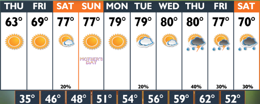<p><strong>Weather forecast</strong></p></div>
  <div class="cell">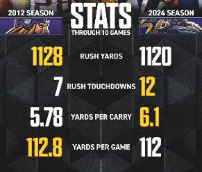<p><strong>Sport stats</strong></p></div>
  <div class="cell">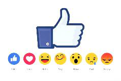<p><strong>Social media trends</strong></p></div>
</div>

---
### What Is a "Data Detective"?

.pull-left[.font80[
- **Applies systematic skepticism** &mdash; treats every claim as a hypothesis to be tested against evidence.

- **Interrogates methodology**: how data was collected, who collected it, and what incentives may have shaped it.

- **Uses tools** &mdash; spreadsheets, statistical summaries, visualizations, and code &mdash; to surface patterns invisible to the naked eye.

- **Distinguishes correlation from causation** and resists the pull of compelling but misleading narratives.

- **Communicates findings with appropriate uncertainty** &mdash; knowing what the data does and does not support.
]]

.pull-right[
```{r img3, echo=FALSE, warning=FALSE, fig.width=4, fig.height=6, out.width="58%", fig.show='hold', fig.align='center'}
# Read the image file
img <- readPNG("assets/03-img.png")

# Plot the image
grid.raster(img)
```
]

---
### What Would a Data Detective Ask?

.pull-left[
```{r img4, echo=FALSE, warning=FALSE, out.width="80%", fig.show='hold', fig.align='center'}
# Read the image file
img <- readPNG("assets/04-img.png")

# Plot the image
grid.raster(img)
```
]

.pull-right[
.content-box-blue[
Imagine your school newspaper claims that **"90% of students prefer online homework."**
]

#### `r fontawesome::fa("circle-question", height = "1em", fill = "#4a7fb5")` &nbsp; How did they get that number?

#### `r fontawesome::fa("users", height = "1em", fill = "#4a7fb5")` &nbsp; Did they survey all students or just a few?

#### `r fontawesome::fa("comment-dots", height = "1em", fill = "#4a7fb5")` &nbsp; Could the wording of the question have influenced the answers?
]

---
class: segue-green

# The Perils of "Face Value" `r top_icon("exclamation-triangle")`

---
### The Perils of "Face Value"

.font80[
.three-col[
.col[


**Misleading Scales**

Zoomed-in axes can make small changes look dramatic &mdash; a 2% shift appears catastrophic when the y-axis starts at 98.
]
.col[
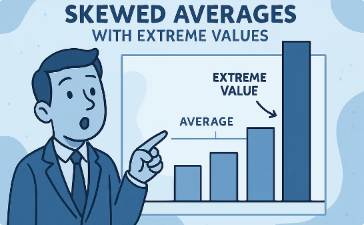

**Skewed Averages**

Outliers skew the mean without affecting the median &mdash; always ask which measure of central tendency best represents the distribution.
]
.col[
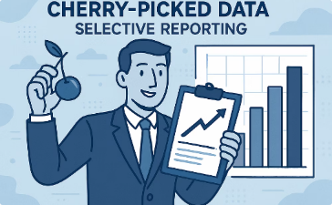

**Cherry-Picked Data**

Selecting a convenient time window or subgroup can reverse a trend &mdash; this is why peer review requires full data disclosure.
]
]
]

---
### Pay Attention to What You See

.pull-left[
.content-box-yellow[
**`r fontawesome::fa("triangle-exclamation", fill = "#4a7fb5")` Manipulated axis**

A truncated y-axis exaggerates small differences and can make an ordinary change look like a crisis.
]
]

.pull-right[
.content-box-green[
**`r fontawesome::fa("check", fill = "#009E73")` Correct axis**

Starting the y-axis at zero shows the true size of the difference.
]
]

<div style="clear: both;"></div>

.font70[Source: [CDC &mdash; High school students sleep facts and stats](https://www.cdc.gov/sleep/data-research/facts-stats/high-school-students-sleep-facts-and-stats.html)]

---
### Misleading Scales

.font110[Can you spot the issue with this plot?]

<div class="img-row">
  <div class="cell" style="flex: 1.4;">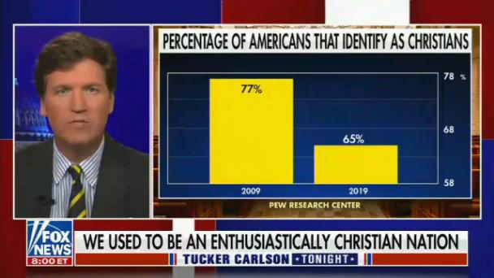</div>
  <div class="cell">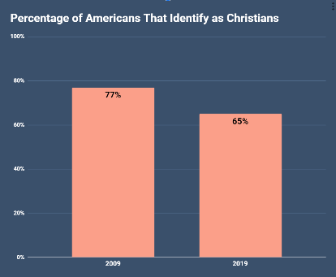</div>
</div>

.font70[Source: [Bad Data Visualisation: Real Life Examples (Medium)](https://medium.com/%40thomas.ellyatt/bad-data-visualisation-real-life-examples-out-there-in-the-wild-eb5032329aeb)]

---
### Can You Spot the Issue with This Plot?

<div class="img-row" style="max-width: 75%; margin-left: auto; margin-right: auto;">
  <div class="cell">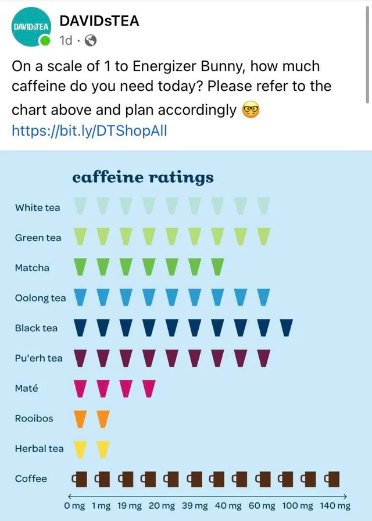</div>
  <div class="cell">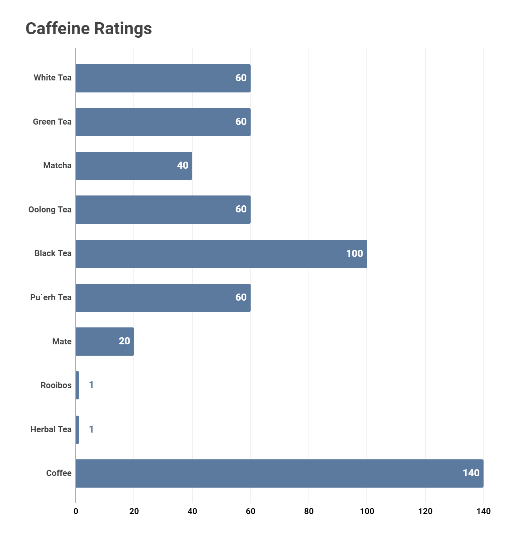</div>
</div>

.font70[Source: [Bad Data Visualisation: Real Life Examples (Medium)](https://medium.com/%40thomas.ellyatt/bad-data-visualisation-real-life-examples-out-there-in-the-wild-eb5032329aeb)]

---
### Misleading Scales

.font100[Your team's math-contest accuracy rose from **60% last semester to 65% this semester**. Can you spot the differences on the two plots? Which plot presents the difference accurately?]

<div class="img-row" style="max-width: 80%; margin-left: auto; margin-right: auto;">
  <div class="cell">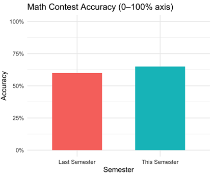</div>
  <div class="cell">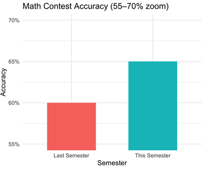</div>
</div>

---
### Skewed Averages &mdash; the Example of Stat Land

.pull-left[
.font100[**Average income in the Stat Land!**]

#### `r fontawesome::fa("circle-question", height = "1em", fill = "#4a7fb5")` &nbsp; What is the mean income?

#### `r fontawesome::fa("scale-unbalanced", height = "1em", fill = "#4a7fb5")` &nbsp; Does the mean income well represent everyone in the Stat Land?

.content-box-yellow[
This one person skews the dataset, making **$5M/year**.
]
]

.pull-right[
```{r img9, echo=FALSE, warning=FALSE, out.width="100%", fig.show='hold', fig.align='center'}
# Read the image file
img <- readPNG("assets/09a-img.png")

# Plot the image
grid.raster(img)
```

```{r img9b, echo=FALSE, warning=FALSE, out.width="45%", fig.show='hold', fig.align='center'}
# Read the image file
img <- readPNG("assets/09b-img.png")

# Plot the image
grid.raster(img)
```
]

---
### Cherry Picking Data

.pull-left[
.content-box-blue[
By deliberately cherry picking inappropriate time periods, here **1998&ndash;2012**, an artificial "pause" can be created, even though the overall warming trend continues.
]

.font70[Source: [Wikipedia &mdash; Cherry picking](https://en.wikipedia.org/wiki/Cherry_picking)]
]

.pull-right[
```{r img10, echo=FALSE, warning=FALSE, out.width="70%", fig.show='hold', fig.align='center'}
# Read the image file
img <- readPNG("assets/10-img.png")

# Plot the image
grid.raster(img)
```
]

---
class: segue-yellow

# The Mindset of a Data Detective: <br> Curiosity and Skepticism `r top_icon("lightbulb")`

---
### The Mindset of a Data Detective: Curiosity and Skepticism

.pull-left[.font80[
- **Cultivate curiosity as a professional habit**: every statistic is an invitation to ask "Why? How? Under what conditions?"

- **Follow the evidence chain**: from raw data &rarr; measurement &rarr; analysis &rarr; claim &mdash; each link can introduce error or bias.

- **Practice calibrated skepticism**: demand methodological transparency, not just numerical results.

- **Guard against anchoring**: the first data point you encounter shapes all subsequent interpretation &mdash; seek disconfirming evidence deliberately.
]]

.pull-right[
<div class="img-row" style="max-width: 80%; margin-left: auto; margin-right: auto;">
  <div class="cell"></div>
  <div class="cell"></div>
</div>
]

---
### The School Newspaper Claim

.font70[
.three-col[
.col[


**A curious person**

"Wow, why do so many prefer online? What do they like about it?"
]
.col[


**A skeptical person**

"90% seems high, did they really ask everyone?"
]
.col[
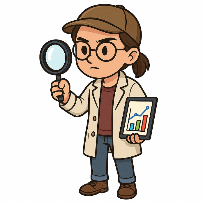

**A data detective**

"Why and how was the data collected? What would your answer be if the question were phrased as: 'Do you enjoy the flexibility of online homework?'"
]
]
]

--

.font90[.center[**Curiosity** keeps you engaged and digging deeper. **Skepticism** ensures you validate and verify rather than jump to conclusions. *Both are necessary.*]]

---
### Chocolate Mystery

.pull-left[
```{r img13, echo=FALSE, warning=FALSE, fig.width=4, fig.height=6, out.width="55%", fig.show='hold', fig.align='center'}
# Read the image file
img <- readPNG("assets/13-img.png")

# Plot the image
grid.raster(img)
```
]

.pull-right[
.content-box-yellow[
**Claim: Eating chocolate improves memory by 50%.**
]

<br>

#### As a data detective, what questions would you ask about the data behind it?

<br>

.content-box-blue[
**`r fontawesome::fa("user-group", fill = "#4a7fb5")` Work in pairs** to list 3&ndash;4 questions.
]
]

---
### Ice Cream and Drowning &mdash; a Classic Case of Misinterpreting Data

```{r img14, echo=FALSE, warning=FALSE, out.width="75%", fig.show='hold', fig.align='center'}
# Read the image file
img <- readPNG("assets/14b-img.png")

# Plot the image
grid.raster(img)
```

--

.pull-left[
#### `r fontawesome::fa("magnifying-glass", height = "1em", fill = "#4a7fb5")` &nbsp; Is there a hidden factor here?
]

.pull-right[
#### `r fontawesome::fa("circle-question", height = "1em", fill = "#4a7fb5")` &nbsp; Can you say ice cream consumption "causes" drowning?
]

---
### The Mindset of a Data Detective

```{r img15, echo=FALSE, warning=FALSE, fig.width=6, fig.height=6, out.width="42%", fig.show='hold', fig.align='center'}
# Read the image file
img <- readPNG("assets/15-img.png")

# Plot the image
grid.raster(img)
```

---
### Cultivating Curiosity

```{r img16, echo=FALSE, warning=FALSE, fig.width=4, fig.height=6, out.width="32%", fig.show='hold', fig.align='center'}
# Read the image file
img <- readPNG("assets/16-img.png")

# Plot the image
grid.raster(img)
```

---
### Practicing Skepticism

```{r img17, echo=FALSE, warning=FALSE, fig.width=5, fig.height=5.5, out.width="38%", fig.show='hold', fig.align='center'}
# Read the image file
img <- readPNG("assets/17-img.png")

# Plot the image
grid.raster(img)
```

---
### The SIFT Framework for Evaluating Claims

.pull-left[.font90[
<div class="chev-row">
  <div class="chev">S</div>
  <div class="chev-text"><strong>Stop</strong><br>
  Pause before sharing or accepting a claim &mdash; your gut reaction is the least reliable filter.</div>
</div>

<div class="chev-row">
  <div class="chev">I</div>
  <div class="chev-text"><strong>Investigate the source</strong><br>
  What is the publisher's track record, funding, and potential conflicts of interest?</div>
</div>

<div class="chev-row">
  <div class="chev">F</div>
  <div class="chev-text"><strong>Find better coverage</strong><br>
  Seek the original study, data set, or primary source rather than relying on media summaries.</div>
</div>

<div class="chev-row">
  <div class="chev">T</div>
  <div class="chev-text"><strong>Trace claims</strong><br>
  Follow data back upstream &mdash; sampling method, sample size, response rate, and how variables were operationalized all matter.</div>
</div>
]]

.pull-right[
```{r img18, echo=FALSE, warning=FALSE, out.width="70%", fig.show='hold', fig.align='center'}
# Read the image file
img <- readPNG("assets/18-img.png")

# Plot the image
grid.raster(img)
```
]

---
### What Is Reliable?

.font70[
1. **TikTok:** "Teens who use social media 3+ hours daily have lower test scores"

2. **Company advertisement:** "Use our app and boost test scores by 50%"

3. **Study in *Youth &amp; Society*:** Based on a survey of 1,459 middle schoolers, frequent social media use was associated with decreased academic achievement, accounting for factors like age, gender, and race

4. **According to the Centers for Disease Control:** 1 in 4 teens (ages 12&ndash;17) who use screens 4+ hours daily reported anxiety (27.1%) or depression (25.9%) in the past 2 weeks, significantly higher than teens using screens less (&lt;4 hrs: 12.3% anxiety; 9.5% depression) ([CDC Data Brief 513](https://www.cdc.gov/nchs/products/databriefs/db513.htm))
]

--

.content-box-blue[
**`r fontawesome::fa("user-group", fill = "#4a7fb5")` Work in pairs to:**

- **Rank the sources by reliability** (most &rarr; least)
- **Justify rankings** (method, sample, controls, sources, etc.)
]

---
class: segue-green

# Basic Data Terminology `r top_icon("database")`

---
### Basic Data Terminology

.font90[
.pull-left[
.content-box-blue[
**`r fontawesome::fa("file-lines", fill = "#4a7fb5")` Data**

Structured vs. Unstructured &mdash; tabular rows/columns are structured; text, images, and social posts are unstructured and require preprocessing.
]

.content-box-blue[
**`r fontawesome::fa("table", fill = "#4a7fb5")` Dataset**

A structured collection of data; can be tidy (one observation per row, one variable per column) or messy &mdash; real-world data is almost always messy.
]
]

.pull-right[
.content-box-blue[
**`r fontawesome::fa("sliders", fill = "#4a7fb5")` Variable**

Can be quantitative (continuous or discrete) or categorical (nominal or ordinal). The type determines which statistical operations are valid.
]

.content-box-blue[
**`r fontawesome::fa("list", fill = "#4a7fb5")` Observation**

One record (a row) representing a single entity. Sample size *n* = number of observations; larger *n* generally reduces sampling error.
]
]
]

---
### How to Read a Dataset

.pull-left[

| Name | Age | Favorite Subject |
|------|-----|------------------|
| Ali  | 14  | Math             |
| Sara | 15  | Science          |
| Omar | 14  | History          |

.font80[
&uarr; Each **row** is an observation; each **column** is a variable.
]
]

.pull-right[
#### `r fontawesome::fa("font", height = "1em", fill = "#4a7fb5")` &nbsp; Data can be textual (names and favorite subject), or numeric (age).

#### `r fontawesome::fa("table-list", height = "1em", fill = "#4a7fb5")` &nbsp; In this dataset we have **3 observations** (rows) and **3 variables** (columns).
]

---
### Let's Explore a Dataset

.pull-left[

| Student | Daily Screen Time (hrs) | Nightly Sleep (hrs) |
|---------|-------------------------|---------------------|
| A       | 3                       | 8                   |
| B       | 7                       | 6                   |
| C       | 2                       | 9                   |
| D       | 8                       | 5                   |
| E       | 5                       | 7                   |

]

.pull-right[.font70[
1. **Calculate the mean and median** for each variable. Do they differ? Why might that matter?

2. **Describe the apparent relationship** between screen time and sleep. Is this correlation positive or negative? Can you say it's causal? What would you need to know?

3. With only **n=5 observations**, how confident can you be in any pattern you observe? What sample size would give you more confidence, and why?

4. What **confounding variables** might explain this relationship? Propose a follow-up study design that could isolate the effect of screen time.
]]

---
class: segue-yellow

# Becoming a Critical Thinker with Data `r top_icon("brain")`

---
### Becoming a Critical Thinker with Data

.font90[
<div class="img-row" style="max-width: 90%; margin-left: auto; margin-right: auto;">
  <div class="cell">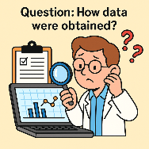<p><strong>Ask Questions</strong></p></div>
  <div class="cell">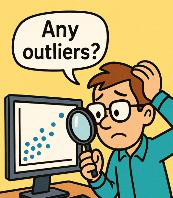<p><strong>Examine the Evidence</strong></p></div>
  <div class="cell">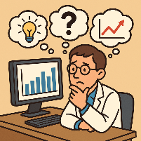<p><strong>Consider Context</strong></p></div>
  <div class="cell">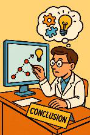<p><strong>Watch for Bias &amp; Use Logic</strong></p></div>
</div>
]

---
### Ask Questions about the Data

.pull-left[.font80[
**Who?**
Who collected it, who funded it, and who is represented or excluded? Coverage bias systematically omits populations that are harder to reach.

**What?**
What construct is being measured &mdash; and is the measurement actually valid? (e.g., GPA measures academic performance, but does it measure learning?)

**When &amp; Where?**
When and where was the data collected (could things have changed since then or be different elsewhere)?

**Why &amp; How?**
Why was the data collected (purpose) and how (methodology)?
]]

.pull-right[
```{r img20, echo=FALSE, warning=FALSE, out.width="68%", fig.show='hold', fig.align='center'}
# Read the image file
img <- readPNG("assets/20-img.png")

# Plot the image
grid.raster(img)
```
]

---
### Examine the Evidence

.pull-left[.font75[
- **Scrutinize axes**: Is the y-axis truncated? Does it start at zero? What does the scale choice emphasize or conceal?

- **Check methodology disclosures**: sample size, response rate, confidence intervals, and p-values are all red flags when missing.

- **When possible, access the raw data**: summary statistics flatten distributions and can hide bimodality, heavy tails, or outlier clusters.

- **Distinguish statistical significance from practical significance** &mdash; a result can be statistically real yet too small to matter in the real world.

- **Build your own interpretation** before reading the author's conclusion &mdash; then compare. Where you differ is often where the most interesting analysis lives.
]]

.pull-right[
```{r img21, echo=FALSE, warning=FALSE, fig.width=4, fig.height=6, out.width="55%", fig.show='hold', fig.align='center'}
# Read the image file
img <- readPNG("assets/21-img.png")

# Plot the image
grid.raster(img)
```
]

---
### Consider Context

.font110[.center[**Context gives meaning to the data.**]]

.font80[
.three-col[
.col[


**"The new movie made $100M!"**

Is $100 million good? Depends on the budget and industry standards.
]
.col[


**"I got 75 out of 100 on a test."**

Is 75/100 good? Depends on the class average and difficulty.
]
.col[


**"1% might be bigger than 50%."**

1% of a city of one million is larger than 50% of a small town with 1,000 population.
]
]
]

---
### Challenge

.content-box-yellow[
**Claim: "Crime increased 200% this year"**
]

.font100[Apply the **SIFT framework** and answer these questions in your group:]

<div class="chev-row">
  <div class="chev">1</div>
  <div class="chev-text">A 200% increase <strong>from what baseline</strong>? (From 1 incident to 3 is also 200%.)</div>
</div>

<div class="chev-row">
  <div class="chev">2</div>
  <div class="chev-text"><strong>Which crime types are included?</strong> Violent crime and property crime trend very differently.</div>
</div>

<div class="chev-row">
  <div class="chev">3</div>
  <div class="chev-text">Could <strong>reporting rates have changed</strong> (e.g., new online reporting system) rather than actual incidents?</div>
</div>

---
### Be Aware of Confirmation Bias

.font70[
.three-col[
.col[


**What Is It?**

A cognitive bias where we preferentially seek, interpret, and remember information consistent with our pre-existing beliefs &mdash; even when contradictory evidence is equally available.

*Related: motivated reasoning &mdash; where the conclusion is decided first and "evidence" is gathered to support it rather than to test it.*
]
.col[


**Example**

A researcher who believes social media causes depression may only publish studies that confirm it &mdash; this is publication bias, a systemic form of confirmation bias in science.

*The backfire effect: when shown contradictory evidence, people sometimes strengthen their original belief rather than update it.*
]
.col[


**How to Combat It**

Practice "steel-manning": construct the strongest possible version of the opposing view before dismissing it.

*Pre-mortem thinking: before accepting a result, ask "How could this be wrong?" &mdash; a technique used by scientists, auditors, and intelligence analysts.*
]
]
]

---
### Use Logical Reasoning

.pull-left[.font80[
**Deductive vs. Inductive Reasoning**

- **Deductive**: Start with a general rule, apply it to a specific case. Valid logic + true premises = certain conclusion.
- **Inductive**: Observe specific cases and generalize &mdash; the foundation of data science. Conclusions are probabilistic, never certain.

**Establishing Causation (Not Just Correlation)**

- Three requirements: **temporal order** (cause precedes effect), **covariation** (they move together), and **elimination of confounders** (no third variable explains both).
- Randomized controlled experiments are the gold standard &mdash; observational data alone rarely establishes causation.
]]

.pull-right[
```{r img24, echo=FALSE, warning=FALSE, fig.width=4, fig.height=6, out.width="55%", fig.show='hold', fig.align='center'}
# Read the image file
img <- readPNG("assets/24-img.png")

# Plot the image
grid.raster(img)
```
]

---
### Challenge

.pull-left[.font75[
.content-box-yellow[
**Claim: Teenagers spend 6 hours a day on phones.**

As a data detective, what questions would you ask about the data behind it?
]

1. **Operationalization:** What counts as "on a phone"? Active use only? Screen-on time? Music playing in pocket?

2. **Measurement method:** Self-report surveys vs. screen-time app data &mdash; which is more accurate, and why might each be biased?

3. **Population:** Which teenagers? Age range, geography, socioeconomic background? A global average would look very different from a US suburban average.

4. **Distribution:** Is 6 hours the mean or median? If a small number of heavy users skew the mean, the median might be 3 hours &mdash; a very different story.
]]

.pull-right[
```{r img25, echo=FALSE, warning=FALSE, fig.width=4, fig.height=6, out.width="55%", fig.show='hold', fig.align='center'}
# Read the image file
img <- readPNG("assets/25-img.png")

# Plot the image
grid.raster(img)
```
]

---
### Assignment

.font80[Work in groups to find a **data-backed claim** from a news article, research summary, or advertisement. Apply a full methodological audit.]

.font75[
**Methodology Evaluation Rubric:**

<div class="chev-row-sm">
  <div class="chev-sm">1</div>
  <div class="chev-text"><strong>Source &amp; Credibility:</strong> Who produced this? What are their incentives? Is this peer-reviewed, journalism, or marketing?</div>
</div>

<div class="chev-row-sm">
  <div class="chev-sm">2</div>
  <div class="chev-text"><strong>Methodology:</strong> How was the data collected? What was the sample size, sampling method, and response rate?</div>
</div>

<div class="chev-row-sm">
  <div class="chev-sm">3</div>
  <div class="chev-text"><strong>Operationalization:</strong> How were key terms defined and measured? Could a different definition change the result?</div>
</div>

<div class="chev-row-sm">
  <div class="chev-sm">4</div>
  <div class="chev-text"><strong>Confounders &amp; Alternative Explanations:</strong> What third variables might explain the relationship? Is causation being implied from correlation?</div>
</div>

<div class="chev-row-sm">
  <div class="chev-sm">5</div>
  <div class="chev-text"><strong>Verdict:</strong> On a scale of 1&ndash;5, how reliable is this claim? What would it take to move the rating up one point?</div>
</div>
]

--

.content-box-green[
.font80[**Deliverable:** A 1-page audit report using the rubric above. Be prepared to present your verdict and defend it.]
]

---
### The Journey Ahead

.content-box-blue[
**You've built the mindset. Now build the toolkit.**

Coming up: we move from analyzing data manually to writing code that does it for you &mdash; and then to working alongside AI coding agents that can accelerate your analysis.
]

--

**The Road Ahead:**

#### `r fontawesome::fa("broom", height = "1em", fill = "#4a7fb5")` &nbsp; Chapter 2: Data Wrangling &mdash; loading, cleaning, and reshaping datasets with Python/pandas

#### `r fontawesome::fa("chart-column", height = "1em", fill = "#4a7fb5")` &nbsp; Chapter 3: Visualization &mdash; translating data into charts that reveal (and sometimes deceive)

#### `r fontawesome::fa("robot", height = "1em", fill = "#4a7fb5")` &nbsp; Chapter 4: Coding Agents &mdash; using AI as a collaborator to write, debug, and extend your analysis code

--

.font90[The skills you practiced today &mdash; skepticism, source evaluation, causal reasoning &mdash; are exactly what make you an effective partner with an AI agent.]

---
### Bonus: Code It Yourself

<div class="chev-row">
  <div class="chev">1</div>
  <div class="chev-text">Collect class screen-time data, then open a <strong>Python notebook</strong> and load your numbers into a list. Calculate the mean, median, and standard deviation &mdash; compare your manual answer to Python's output.</div>
</div>

<div class="chev-row">
  <div class="chev">2</div>
  <div class="chev-text">Calculate the mean and median. <strong>Did an outlier</strong> (like someone who said "12 hours") <strong>affect the mean?</strong></div>
</div>

<div class="chev-row">
  <div class="chev">3</div>
  <div class="chev-text">Use <strong>matplotlib</strong> to plot the same data twice: once with a full y-axis (starting at 0) and once truncated. Screenshot both &mdash; how different do they look? This is the y-axis manipulation you saw earlier, now in code.</div>
</div>

---
class: segue-green

# Introduction to Coding Agents `r top_icon("robot")`

---
### What Is a Coding Agent?

.content-box-blue[
A coding agent is an AI system that **reads instructions in plain English, writes code to carry them out, runs that code, observes the results, and iterates** &mdash; all in a loop.
]

--

.pull-left[
.content-box-yellow[
**`r fontawesome::fa("comment", fill = "#4a7fb5")` Chatbot**

- Answers questions with text
- One-shot response
]
]

.pull-right[
.content-box-green[
**`r fontawesome::fa("robot", fill = "#4a7fb5")` Coding agent**

- Executes real code and returns real outputs
- Multi-step loop (plan &rarr; code &rarr; run &rarr; check &rarr; revise)
]
]

<div style="clear: both;"></div>

.font90[**What coding agents can do for data analysis:** load and clean messy datasets, compute statistics, generate visualizations, and explain every step of the code they write.]

---
### How a Coding Agent Thinks

**The Agent Loop**

.font80[
<div class="chev-flow">
  <div class="chev-step">
    <div class="chev-right">`r fontawesome::fa("circle-question", height = "1.6em", fill = "#0148A4")`</div>
    <p><strong>1. Understand</strong><br>
    Parse your goal from natural language into a concrete task.</p>
  </div>
  <div class="chev-step">
    <div class="chev-right">`r fontawesome::fa("list-check", height = "1.6em", fill = "#0148A4")`</div>
    <p><strong>2. Plan</strong><br>
    Break the task into sub-steps (e.g., load data &rarr; filter rows &rarr; compute mean &rarr; plot).</p>
  </div>
  <div class="chev-step">
    <div class="chev-right">`r fontawesome::fa("code", height = "1.6em", fill = "#0148A4")`</div>
    <p><strong>3. Code</strong><br>
    Write Python (or another language) to execute each sub-step.</p>
  </div>
  <div class="chev-step">
    <div class="chev-right">`r fontawesome::fa("play", height = "1.6em", fill = "#0148A4")`</div>
    <p><strong>4. Execute</strong><br>
    Run the code and capture any outputs, errors, or warnings.</p>
  </div>
  <div class="chev-step">
    <div class="chev-right">`r fontawesome::fa("rotate", height = "1.6em", fill = "#0148A4")`</div>
    <p><strong>5. Reflect</strong><br>
    If an error occurred or output looks wrong, revise the code and retry.</p>
  </div>
</div>
]

--

.content-box-blue[
.font90[**Why this matters for you:** you direct the agent with your analytical judgment. The agent handles syntax. Together you move much faster than either alone.]
]

---
### You Are Still the Detective

.content-box-yellow[
**The agent is a tool, not the analyst.**

- A coding agent will do exactly what you ask &mdash; even if what you asked was the wrong question. *Garbage in, garbage out still applies.*
- It can compute a correlation coefficient in seconds. It cannot tell you whether the correlation is **meaningful** without your domain knowledge.
]

--

**Your critical thinking skills are non-negotiable:**

#### `r fontawesome::fa("circle-question", height = "1em", fill = "#4a7fb5")` &nbsp; You must frame the right question &mdash; the agent cannot know what you are actually trying to understand.

#### `r fontawesome::fa("magnifying-glass", height = "1em", fill = "#4a7fb5")` &nbsp; You must evaluate the output &mdash; check that results are plausible, the right columns were used, and no silent errors occurred.

#### `r fontawesome::fa("lightbulb", height = "1em", fill = "#4a7fb5")` &nbsp; You must interpret the findings &mdash; statistical output has no meaning until a human connects it to the real world.

---
### Prompting a Coding Agent Effectively

.font90[**The quality of your output depends on the quality of your prompt.**]

.pull-left[
.content-box-yellow[
**`r fontawesome::fa("xmark", fill = "#D55E00")` Weak**

"Analyze this data."
]
]

.pull-right[
.content-box-green[
**`r fontawesome::fa("check", fill = "#009E73")` Strong**

"Load the CSV, show me the first 5 rows, then compute the mean and median of the sleep column and flag any values below 4 hours as outliers."
]
]

<div style="clear: both;"></div>

.font80[
**Prompt best practices:**

1. **Specify the task precisely:** what column, what operation, what output format.
2. **Give context:** explain what the data represents and what question you're trying to answer.
3. **Ask for explanations:** "Explain what each line of the code does" turns every analysis into a learning opportunity.
4. **Challenge its output:** "Is this the right chart type for this data?" or "What assumptions does this method make?"
]

---
### Hands-On: Agent-Assisted Data Investigation

.font90[**Activity (small groups, 20 minutes):** you will use a coding agent to investigate a real dataset. Your job is to direct the agent, evaluate its outputs, and draw conclusions.]

.font85[
<div class="chev-row">
  <div class="chev">1</div>
  <div class="chev-text"><strong>Pose a question</strong><br>
  Choose a question your group cares about (e.g., "Is there a relationship between hours of sleep and GPA in this dataset?").</div>
</div>

<div class="chev-row">
  <div class="chev">2</div>
  <div class="chev-text"><strong>Direct the agent</strong><br>
  Write a precise prompt asking it to load the data, compute the relevant statistics, and produce a scatter plot.</div>
</div>

<div class="chev-row">
  <div class="chev">3</div>
  <div class="chev-text"><strong>Evaluate and challenge</strong><br>
  Is the output correct? Are there outliers? Does the chart tell the right story? Ask the agent to adjust and explain its reasoning.</div>
</div>

<div class="chev-row">
  <div class="chev">4</div>
  <div class="chev-text"><strong>Present your verdict</strong><br>
  What does the data support? What does it not support? What would you need to strengthen the claim?</div>
</div>
]

```{r gen_pdf, include = FALSE, cache = FALSE, eval = FALSE}
library(renderthis)
# https://hhadah.github.io/nexellence-summer-instit/week-02-investigation-and-analysis/session-06-planning-a-study-deepening-lit-review/06-class.html

to_pdf(from = "~/Documents/GiT/nexellence-summer-instit/week-02-investigation-and-analysis/session-06-planning-a-study-deepening-lit-review/06-class.html",
       to = "~/Documents/GiT/nexellence-summer-instit/week-02-investigation-and-analysis/session-06-planning-a-study-deepening-lit-review/06-class.pdf")
to_pdf(from = "~/Documents/GiT/nexellence-summer-instit/week-02-investigation-and-analysis/session-06-planning-a-study-deepening-lit-review/06-class.html")
```
