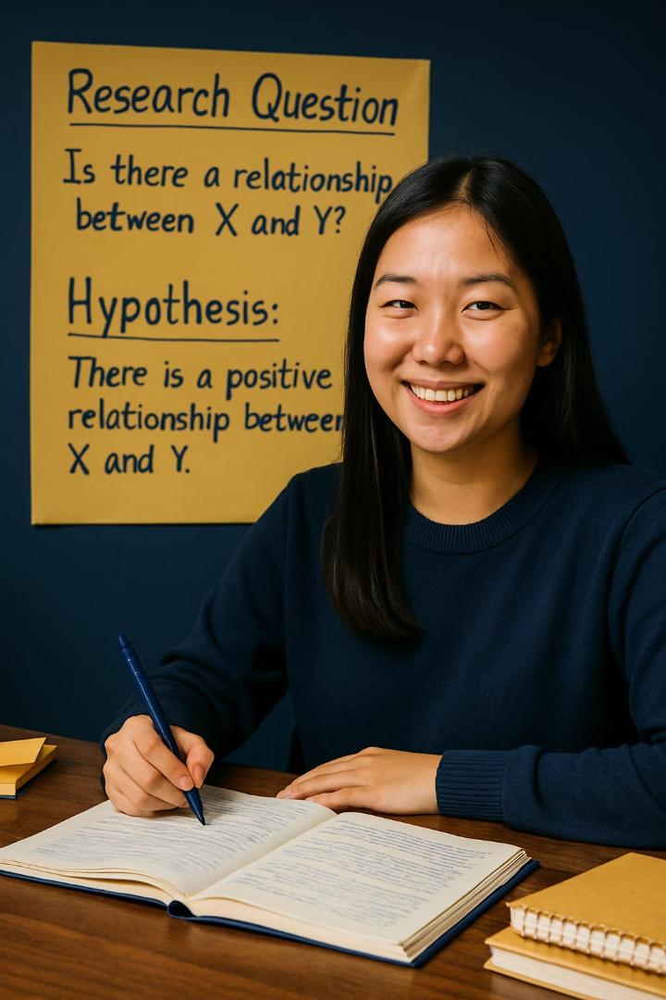
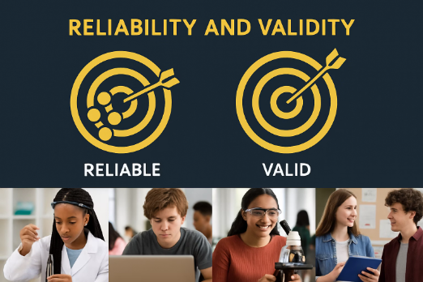
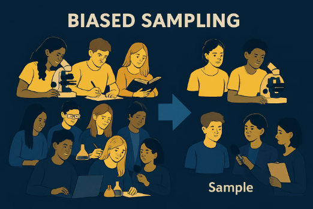
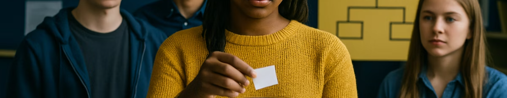

layout: true
<div style="position: absolute;left:20px;bottom:5px;color:black;font-size: 12px;">Nexellence Institute | `r rmarkdown::metadata$title` | July 6, 2026</div>

<!--- `r rmarkdown::metadata$subtitle` | `r format(Sys.time(), '%d %B %Y')`-->

---

class: title-slide
background-position: 10% 90%, 100% 50%
background-size: 160px, 50% 100%
background-color: #0148A4

```{r, load_refs, echo=FALSE, cache=FALSE, message=FALSE}
library(RefManageR)
BibOptions(check.entries = FALSE,
           bib.style = "authoryear",
           cite.style = 'authoryear',
           style = "markdown",
           hyperlink = FALSE,
           dashed = FALSE)
myBib <- ReadBib("assets/example.bib", check = FALSE)
top_icon = function(x) {
  icons::icon_style(
    icons::fontawesome(x),
    position = "fixed", top = 10, right = 10
  )
}
```

```{r setup, include=FALSE}
# xaringanExtra::use_scribble() ## Draw on slides. Requires dev version of xaringanExtra.
options(htmltools.dir.version = FALSE)
library(knitr)
opts_chunk$set(
  fig.align="center",
  fig.height=4, fig.width=6,
  out.width="748px", out.length="520.75px",
  dpi=300, #fig.path='Figs/',
  cache=FALSE
  )
```

```{r xaringan-panelset, echo=FALSE}
xaringanExtra::use_panelset()
```


```{css, echo=F}
    /* Table width = 100% max-width */

    .remark-slide table{
        width: auto !important; /* Adjusts table width */
    }

    /* Change the background color to white for shaded rows (even rows) */

    .remark-slide thead, .remark-slide tr:nth-child(2n) {
        background-color: white;
    }
    .remark-slide thead, .remark-slide tr:nth-child(n) {
        background-color: white;
    }

    .chev-row {
      display: flex;
      align-items: center;
      gap: 0.9em;
      margin-bottom: 0.6em;
    }
    .chev {
      flex: 0 0 62px;
      height: 78px;
      background: #c9e4f6;
      clip-path: polygon(0 0, 50% 14%, 100% 0, 100% 78%, 50% 100%, 0 78%);
      display: flex;
      align-items: center;
      justify-content: center;
      font-weight: bold;
      font-size: 1.7em;
      color: #1a1a1a;
    }
    .chev-text {
      flex: 1;
    }

    .three-col {
      display: flex;
      gap: 1.5em;
      margin-top: 1.5em;
    }
    .three-col .col {
      flex: 1;
      text-align: center;
    }
    .three-col .col p:first-child {
      margin-bottom: 0.4em;
    }

    .img-row {
      display: flex;
      gap: 1em;
      align-items: center;
      justify-content: center;
      margin-top: 0.8em;
    }
    .img-row img {
      max-width: 100%;
      border-radius: 6px;
    }
    .img-row .cell {
      flex: 1;
      text-align: center;
    }

    /* 2x2 card grid used for the "Improving ..." and "Tips" slides */
    .card-grid {
      display: flex;
      flex-wrap: wrap;
      gap: 0.8em;
      margin-top: 0.8em;
    }
    .card {
      flex: 1 1 44%;
      background: #d9ecf9;
      border-radius: 8px;
      padding: 0.5em 0.9em;
    }
    .card h4 {
      margin: 0 0 0.25em 0;
      color: #0148A4;
    }
    .card p {
      margin: 0;
      font-size: 0.85em;
    }
    .banner {
      width: 100%;
      max-height: 175px;
      object-fit: cover;
      border-radius: 6px;
      margin-bottom: 0.4em;
    }

    /* ===== Sampling ball animations ===== */
    .samp-stage { position: relative; text-align: center; margin-top: 0.4em; }

    .samp-pop {
      display: grid;
      grid-template-columns: repeat(8, 30px);
      gap: 14px;
      justify-content: center;
      position: relative;
      z-index: 2;
    }

    .samp-ball {
      width: 30px; height: 30px;
      border-radius: 50%;
      background: #b9c4cf;
      display: flex; align-items: center; justify-content: center;
      color: #fff; font-size: 16px; line-height: 1;
      box-shadow: inset 0 -3px 4px rgba(0,0,0,.12);
    }
    .samp-star { color: #FFC83D; }

    /* balls that get selected drop into the tray, then loop back */
    .samp-ball.pick {
      animation: samp-drop 5s ease-in-out infinite;
      animation-delay: var(--d, 0s);
    }
    /* selected balls that also change colour (random / convenience / purposive) */
    .samp-ball.recolor {
      animation: samp-drop 5s ease-in-out infinite,
                 samp-fill 5s ease-in-out infinite;
      animation-delay: var(--d, 0s), var(--d, 0s);
    }
    /* persistent selection ring (stratified / purposive) */
    .samp-ball.ring {
      outline: 3px solid #0148A4;
      outline-offset: 2px;
    }

    @keyframes samp-drop {
      0%, 12%   { transform: translateY(0) scale(1); }
      26%       { transform: translateY(0) scale(1.2); }
      52%, 80%  { transform: translateY(var(--drop, 150px)) scale(1); }
      96%, 100% { transform: translateY(0) scale(1); }
    }
    @keyframes samp-fill {
      0%, 18%   { background: #b9c4cf; }
      30%, 82%  { background: #0148A4; }
      96%, 100% { background: #b9c4cf; }
    }

    .samp-tray {
      height: 88px;
      margin: 20px auto 0;
      max-width: 560px;
      border: 2px dashed #0148A4;
      border-radius: 10px;
      background: #eef4fb;
      position: relative;
    }
    .samp-tray-label {
      position: absolute; top: 6px; left: 12px;
      font-size: 13px; color: #0148A4; font-weight: bold;
    }
    .samp-caption {
      margin-top: 12px;
      font-size: 16px;
      color: #5a3e9e;
    }

    /* cluster sampling: bordered groups */
    .samp-clusters {
      display: flex; gap: 18px;
      justify-content: center;
      position: relative; z-index: 2;
    }
    .samp-cluster {
      border: 2px solid #cbd5e0;
      border-radius: 10px;
      padding: 8px 10px 4px;
      background: #f7f9fc;
    }
    .samp-cluster.picked {
      border-color: #0148A4;
      background: #e4eef9;
    }
    .samp-cluster-grid {
      display: grid;
      grid-template-columns: repeat(2, 30px);
      gap: 10px;
    }
    .samp-cluster-cap {
      font-size: 12px; color: #555;
      margin-top: 6px; text-align: center;
    }

```

```{r countdown-setup, echo=FALSE}
library(countdown)
# Helper: a centered, inline countdown timer (click to start/pause/reset)
timer <- function(minutes = 1L, seconds = 0L, ...) {
  countdown::countdown(
    minutes = minutes, seconds = seconds,
    style = "position: relative; display: inline-block; margin: 0.6em auto;",
    color_border = "#0148A4",
    color_running_background = "#0148A4",
    color_running_text = "#FFFFFF",
    color_finished_background = "#D55E00",
    font_size = "2.2rem",
    warn_when = 30L,
    ...
  )
}
```

```{r sampling-helpers, echo=FALSE}
library(htmltools)

# One ball in the population grid.
.samp_ball <- function(pick = FALSE, color = NULL, ring = FALSE,
                       recolor = FALSE, star = FALSE, delay = 0, drop = 150) {
  cls <- "samp-ball"
  if (pick)    cls <- paste(cls, "pick")
  if (recolor) cls <- paste(cls, "recolor")
  if (ring)    cls <- paste(cls, "ring")
  sty <- sprintf("--d:%.2fs;--drop:%dpx;", delay, as.integer(drop))
  if (!is.null(color)) sty <- paste0(sty, sprintf("background:%s;", color))
  inner <- if (star) '<span class="samp-star">&#9733;</span>' else ""
  sprintf('<div class="%s" style="%s">%s</div>', cls, sty, inner)
}

# Wrap the animated middle section in a stage + a "Sample" tray + caption.
.samp_wrap <- function(middle, caption = "", tray = "Sample") {
  htmltools::HTML(sprintf(
    '<div class="samp-stage">%s<div class="samp-tray"><span class="samp-tray-label">%s</span></div><div class="samp-caption">%s</div></div>',
    middle, tray, caption))
}

# Build a population grid; `spec(r, c)` returns a list describing each ball.
.samp_grid <- function(spec, nrow = 3, ncol = 8, caption = "") {
  pitch <- 44; ord <- 0; cells <- character(0)
  for (r in 0:(nrow - 1)) for (c in 0:(ncol - 1)) {
    s <- spec(r, c); if (is.null(s)) s <- list()
    pk <- isTRUE(s$pick); dl <- 0
    if (pk) { dl <- ord * 0.22; ord <- ord + 1 }
    dr <- (nrow - 1 - r) * pitch + 84
    cells <- c(cells, .samp_ball(pick = pk, color = s$color, ring = isTRUE(s$ring),
                                 recolor = isTRUE(s$recolor), star = isTRUE(s$star),
                                 delay = dl, drop = dr))
  }
  .samp_wrap(sprintf('<div class="samp-pop">%s</div>', paste(cells, collapse = "")), caption)
}

.samp_inset <- function(P) function(r, c) any(vapply(P, function(x) x[1] == r && x[2] == c, logical(1)))

samp_random <- function() {
  hit <- .samp_inset(list(c(0,1), c(0,5), c(1,3), c(1,7), c(2,0), c(2,6)))
  .samp_grid(function(r, c) if (hit(r, c)) list(pick = TRUE, recolor = TRUE) else list(),
             caption = "Every ball has an <b>equal chance</b> &mdash; picks land anywhere at random.")
}

samp_stratified <- function() {
  rc  <- c("#0148A4", "#E69F00", "#009E73")   # one colour per stratum (row)
  hit <- .samp_inset(list(c(0,2), c(0,5), c(1,1), c(1,6), c(2,3), c(2,7)))
  .samp_grid(function(r, c) {
    base <- list(color = rc[r + 1])
    if (hit(r, c)) c(base, list(pick = TRUE, ring = TRUE)) else base
  }, caption = "Split into <b>subgroups (strata)</b> by colour, then sample from <b>each</b> one.")
}

samp_convenience <- function() {
  hit <- .samp_inset(list(c(1,0), c(1,1), c(2,0), c(2,1), c(2,2)))
  .samp_grid(function(r, c) if (hit(r, c)) list(pick = TRUE, recolor = TRUE) else list(),
             caption = "Just grab whoever is <b>closest / easiest to reach</b> &mdash; often not representative.")
}

samp_purposive <- function() {
  hit <- .samp_inset(list(c(0,3), c(1,1), c(1,6), c(2,4)))
  .samp_grid(function(r, c) if (hit(r, c)) list(pick = TRUE, ring = TRUE, recolor = TRUE, star = TRUE) else list(),
             caption = "<b>Deliberately</b> choose specific cases (&#9733;) that fit the research need.")
}

samp_cluster <- function() {
  clusters <- 4; nr <- 3; nc <- 2; picked <- c(2, 4); ord <- 0
  boxes <- character(0)
  for (k in 1:clusters) {
    isp <- k %in% picked; balls <- character(0)
    for (r in 0:(nr - 1)) for (cc in 0:(nc - 1)) {
      dl <- 0; if (isp) { dl <- ord * 0.16; ord <- ord + 1 }
      dr <- (nr - 1 - r) * 44 + 92
      balls <- c(balls, .samp_ball(pick = isp, recolor = isp, delay = dl, drop = dr))
    }
    cls <- if (isp) "samp-cluster picked" else "samp-cluster"
    boxes <- c(boxes, sprintf(
      '<div class="%s"><div class="samp-cluster-grid">%s</div><div class="samp-cluster-cap">Group %d</div></div>',
      cls, paste(balls, collapse = ""), k))
  }
  .samp_wrap(sprintf('<div class="samp-clusters">%s</div>', paste(boxes, collapse = "")),
             caption = "Randomly pick <b>whole groups</b> (e.g. entire classrooms) &mdash; then study everyone in them.")
}
```


# .text-shadow[.white[Outline for Today]]

<ol>
    <li><h4 class="white">Mindset Check-In: "The Struggle Is the Point"</h4></li>
    <li><h4 class="white">Reliability &amp; Validity</h4></li>
    <li><h4 class="white">Sampling: Who or What Will You Study?</h4></li>
    <li><h4 class="white">Team Activity: "Stress Test Your Study"</h4></li>
    <li><h4 class="white">Finalize &amp; Present the Literature Review</h4></li>
    <li><h4 class="white">Scientific Storytelling: Slide Practice</h4></li>
</ol>

---
class: segue-yellow

# Let's start with checking in on the weekend's HW

---
### Welcome to Week 2 &mdash; Welcome to Day 6!

.pull-left[.font110[
Today is a **full day** dedicated to **planning a strong study** and **deepening your literature review**.

By the end of the morning you will be able to:

- Understand **reliability and validity** in research design
- Choose a **sampling strategy** and explain how it shapes interpretation
- **Stress-test** another team's design for threats and confounds
- **Finalize and present** your team's mini literature review
]]

.pull-right[

]

---
class: segue-yellow

# Mindset Check-In: <br> "The Struggle Is the Point" `r top_icon("lightbulb")`

---
### Mindset Check-In

.pull-left[.font120[
- What are your **thoughts** so far?

- What are the **challenges** you are facing?

- What can be **done next**?
]]

.pull-right[

]

---
### The Struggle Is the Point

.pull-left[
.content-box-purple[
**Research is hard.** Real researchers get confused, get stuck, change direction, and make mistakes.
]

.content-box-blue[
**Productive struggle is normal &mdash; it is where the learning happens.**
]

.font85[.content-box-yellow[
**One real example:** Katalin Karikó spent **decades** having her mRNA research rejected and was demoted along the way. That same "failed" work became the foundation of the COVID-19 vaccines &mdash; and won the **2023 Nobel Prize**. The struggle was the point.
]]


]

.pull-right[

]


---
### Small Progress Is Still Progress

.pull-left[
.content-box-purple[
**You are just beginning this journey.**
]

<br>

Allow yourself to take **smaller steps**. And **trust the process**.

Take **2&ndash;3 key points** from a resource and keep on exploring.
]

.pull-right[

]

---
class: segue-green

# Reliability &amp; Validity `r top_icon("bullseye")`

---
### Reliability and Validity

.pull-left[.font90[
**Reliability**

.purple[Consistency] of results if repeated under the same conditions.

- Would you get similar results if repeated?
- Are measurements consistent?
- Is your procedure standardized?

**Validity**

Whether you are actually measuring .purple[what you intend to measure].

- Does your method truly address your question?
- Are your measurements relevant?
- Can you draw appropriate conclusions?
]]

.pull-right[


.font90[.center[.purple[*Good research needs both reliability and validity to be trustworthy.*]]]
]

---
### Improving Reliability


<div class="card-grid">
  <div class="card">
    <h4>`r fontawesome::fa("rotate", fill = "#0148A4")` Standardize Procedures</h4>
    <p>Use the same methods, instructions, and conditions for all participants or trials.</p>
  </div>
  <div class="card">
    <h4>`r fontawesome::fa("gear", fill = "#0148A4")` Check Instruments</h4>
    <p>Ensure measuring tools are working properly and giving consistent readings.</p>
  </div>
  <div class="card">
    <h4>`r fontawesome::fa("clone", fill = "#0148A4")` Multiple Trials</h4>
    <p>Repeat measurements or tests to see if results are consistent.</p>
  </div>
  <div class="card">
    <h4>`r fontawesome::fa("users", fill = "#0148A4")` Larger Sample Size</h4>
    <p>Include more participants or items to reduce the impact of individual variations.</p>
  </div>
</div>

---
### Improving Validity

.pull-left[
<div class="card-grid">
  <div class="card" style="flex:1 1 100%;">
    <h4>`r fontawesome::fa("bullseye", fill = "#0148A4")` Align Methods with Questions</h4>
    <p>Choose research approaches that directly address what you want to know.</p>
  </div>
  <div class="card" style="flex:1 1 100%;">
    <h4>`r fontawesome::fa("layer-group", fill = "#0148A4")` Use Multiple Measures</h4>
    <p>Collect different types of data to get a more complete picture of what you're studying.</p>
  </div>
  <div class="card" style="flex:1 1 100%;">
    <h4>`r fontawesome::fa("sliders", fill = "#0148A4")` Control Variables</h4>
    <p>Identify and minimize factors that could confuse your results.</p>
  </div>
  <div class="card" style="flex:1 1 100%;">
    <h4>`r fontawesome::fa("flask", fill = "#0148A4")` Pilot Test</h4>
    <p>Try out your methods on a small scale first to identify and fix problems.</p>
  </div>
</div>
]

.pull-right[


.font90[.center[.purple[*Using several measures together is called **triangulation**.*]]]
]

---
class: segue-yellow

# Sampling: <br> Who or What Will You Study? `r top_icon("users")`

---
### Sampling: Who or What Will You Study?

.pull-left[.font85[
**What is a Sample?**

A smaller subset of the population or items you're interested in.

Since studying everyone or everything is usually impossible, researchers select a group that is **representative**.
]]

.pull-right[.font85[
**Key Sampling Questions**

- How many people / items will you include?
- How will you select them?
- Will your sample represent the larger group?
- What potential biases might affect your selection?
]]

<div style="clear: both;"></div>

.font90[.center[.purple[*Good sampling makes your results more reliable, generalizable, and valid.*]]]

---
### Types of Sampling

.font85[
.content-box-blue[
**Probability sampling** &mdash; everyone has a known chance of being selected.
]

- **Random Sampling:** everyone has an equal chance of selection (like drawing names from a hat).
- **Stratified Sampling:** select from important subgroups to ensure representation (e.g., different grades).
- **Cluster Sampling:** randomly select entire groups (e.g., randomly choose 3 classrooms).
]

--

.font85[
.content-box-yellow[
**Non-probability sampling** &mdash; selection is based on convenience or judgment.
]

- **Convenience Sampling:** select whoever is easiest to reach (like your own class).
- **Purposive Sampling:** deliberately select specific cases based on research needs.
]

---
class: segue-yellow

# Sampling in Action `r top_icon("users")`

.font120[.center[*Watch how each method draws balls from the population.*]]

---
### Random Sampling

.font90[Everyone in the population has an **equal chance** of being selected.]

```{r, echo=FALSE}
samp_random()
```

---
### Stratified Sampling

.font90[Divide the population into **strata** (subgroups), then sample from **each** stratum.]

```{r, echo=FALSE}
samp_stratified()
```

---
### Cluster Sampling

.font90[Randomly select **entire groups**, then include everyone inside the chosen groups.]

```{r, echo=FALSE}
samp_cluster()
```

---
### Convenience Sampling

.font90[Select whoever is **easiest to reach** &mdash; fast, but prone to bias.]

```{r, echo=FALSE}
samp_convenience()
```

---
### Purposive Sampling

.font90[**Deliberately** target specific cases (&#9733;) chosen for the research need.]

```{r, echo=FALSE}
samp_purposive()
```

---
### Sampling Examples

<div class="card-grid">
  <div class="card">
    <h4>`r fontawesome::fa("clipboard-question", fill = "#0148A4")` Survey</h4>
    <p>Instead of surveying all 1,200 students, randomly select 120 across all grade levels.</p>
  </div>
  <div class="card">
    <h4>`r fontawesome::fa("seedling", fill = "#0148A4")` Plant Experiment</h4>
    <p>Use 30 plants of the same species; randomly assign 15 to experimental and 15 to control.</p>
  </div>
  <div class="card">
    <h4>`r fontawesome::fa("binoculars", fill = "#0148A4")` Observation</h4>
    <p>Instead of watching a park 24/7, sample time blocks: 1 hour mornings, 1 hour afternoons.</p>
  </div>
  <div class="card">
    <h4>`r fontawesome::fa("newspaper", fill = "#0148A4")` Historical Research</h4>
    <p>Instead of reading every newspaper for 100 years, sample the first issue of each month.</p>
  </div>
</div>

---
### Sampling Bias

.pull-left[.font85[
**What is Sampling Bias?**

When your sample doesn't fairly represent the population you're studying.

This can **skew results** and lead to **incorrect conclusions**.

.content-box-yellow[
**Example:** surveying only cooking-club members about school lunch preferences would give biased results &mdash; they likely have different food interests than the general student body.
]
]]

.pull-right[


.font90[.center[.purple[*Even with limited resources, try to broaden your sample to reduce obvious biases.*]]]
]

---
### Practical Sampling Tips



<div class="card-grid">
  <div class="card">
    <h4>`r fontawesome::fa("maximize", fill = "#0148A4")` Broaden Your Reach</h4>
    <p>Instead of just surveying friends, include students from different classes or groups.</p>
  </div>
  <div class="card">
    <h4>`r fontawesome::fa("shuffle", fill = "#0148A4")` Use Random Selection</h4>
    <p>When possible, use methods like drawing names or random number generators.</p>
  </div>
  <div class="card">
    <h4>`r fontawesome::fa("scale-balanced", fill = "#0148A4")` Consider Balance</h4>
    <p>Try to include representation from important subgroups (grades, genders, etc.).</p>
  </div>
  <div class="card">
    <h4>`r fontawesome::fa("comments", fill = "#0148A4")` Acknowledge Limitations</h4>
    <p>Be transparent about who your sample represents and any potential biases.</p>
  </div>
</div>

---
class: segue-green

# Team Activity: <br> "Stress Test Your Study" `r top_icon("flask")`

---
### Team Activity: "Stress Test Your Study" `r fontawesome::fa("clock", fill="#fff", height="0.8em")` 30 min

.content-box-blue[
Each team presents their **research design** (from Session 5) to a **neighboring team**.
]

The **receiving team** must find:

<div class="chev-row">
  <div class="chev">1</div>
  <div class="chev-text"><strong>One validity threat</strong> &mdash; is the team really measuring what they think they are measuring?</div>
</div>

<div class="chev-row">
  <div class="chev">2</div>
  <div class="chev-text"><strong>One sampling concern</strong> &mdash; who is in the sample, who is left out, and is it representative?</div>
</div>

<div class="chev-row">
  <div class="chev">3</div>
  <div class="chev-text"><strong>One potential confound</strong> &mdash; a third variable that could explain the results.</div>
</div>

--

.content-box-yellow[
**Constructive criticism** &mdash; the researcher's job is to **anticipate these problems first**.
]

.center[`r timer(30L)`]


---
class: segue-yellow

# Finalize &amp; Present the <br> Literature Review `r top_icon("book-open")`

---
### Let's Shift Our Attention Back to the Literature Review

.pull-left[

]

.pull-right[.font110[
You have gathered sources and taken notes.

Now we turn those notes into a **coherent, 3-part mini literature review** that tells the story of what is already known &mdash; and where **your** study fits.
]]

---
### Literature Review Template: Structure

.pull-left[

]

.pull-right[.font90[
**Begin with a short introduction:**
- What is your topic?
- Why is it important?

**Body:**
- Share what other studies have found.
- Organize the body by **themes, not by author**.

**End with a summary:**
- Clarify how your project connects to past research &mdash; the **gap** you address.
]]

---
### Hands-On Writing Time `r fontawesome::fa("clock", fill="#fff", height="0.8em")`

.pull-left[

]

.pull-right[.font100[
Finalize **Team Handout: Literature Review Template**.

Then present your **3-part mini literature review**:

.content-box-blue[
**Introduction** &mdash; define variables + importance
]
.content-box-blue[
**Middle** &mdash; 2&ndash;3 studies + what they found
]
.content-box-blue[
**Ending** &mdash; the gap that your study addresses
]

.right[`r timer(30L)`]

]]

---
class: segue-green

# Scientific Storytelling: <br> Slide Practice `r top_icon("chalkboard-teacher")`

---
### Scientific Storytelling: Literature Review Slide Practice `r fontawesome::fa("clock", fill="#fff", height="0.8em")`

.font100[Convert your literature review into **2 slides**:]

.pull-left[
.content-box-blue[
**`r fontawesome::fa("book", fill = "#0148A4")` Background Slide**

- Key definitions
- 2&ndash;3 cited findings from the literature
]
]

.pull-right[
.content-box-green[
**`r fontawesome::fa("magnifying-glass", fill = "#009E73")` Gap + Research Question Slide**

- The gap your study addresses
- Your research question
]
]

<div style="clear: both;"></div>

--

.content-box-yellow[
**`r fontawesome::fa("user-group", fill = "#4a7fb5")` Practice presenting these two slides with a partner.**
]

.center[`r timer(10L)`]

```{r gen_pdf, include = FALSE, cache = FALSE, eval = TRUE}
library(renderthis)
to_pdf(from = "slides.html", to = "slides.pdf")
```
