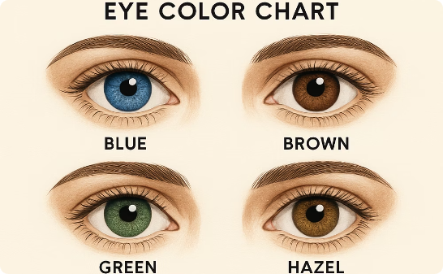
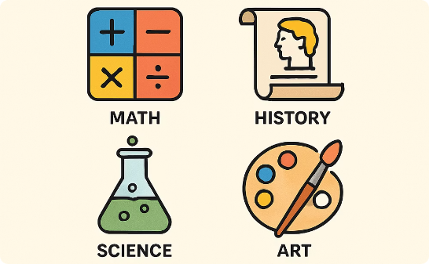
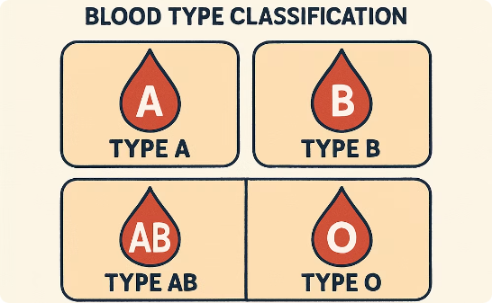
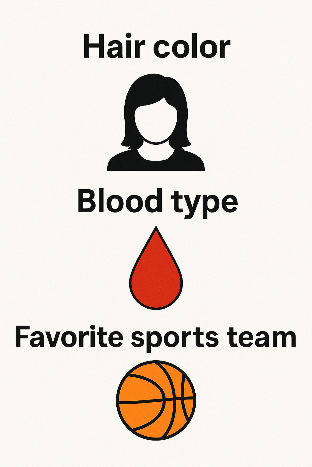
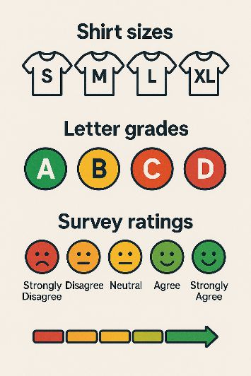
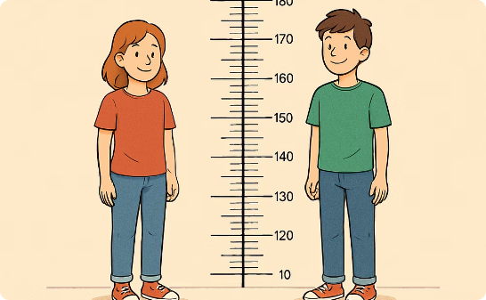
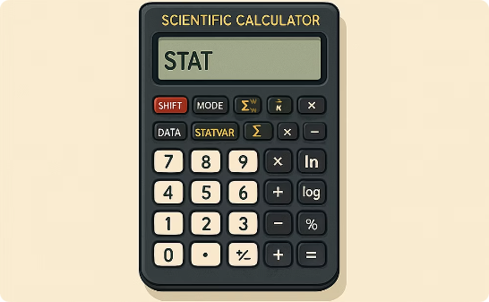
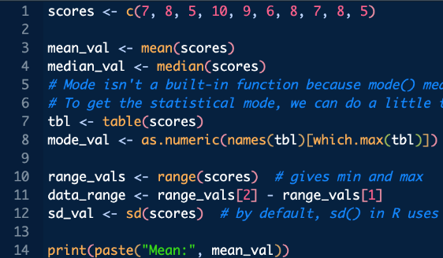

layout: true
<div style="position: absolute;left:20px;bottom:5px;color:black;font-size: 12px;">Nexellence Institute | `r rmarkdown::metadata$title` | `r format(Sys.time(), '%d %B %Y')`</div>

<!--- `r rmarkdown::metadata$subtitle` | `r format(Sys.time(), '%d %B %Y')`-->

---

class: title-slide
background-position: 10% 90%, 100% 50%
background-size: 160px, 50% 100%
background-color: #0148A4

```{r, load_refs, echo=FALSE, cache=FALSE, message=FALSE}
library(RefManageR)
BibOptions(check.entries = FALSE,
           bib.style = "authoryear",
           cite.style = 'authoryear',
           style = "markdown",
           hyperlink = FALSE,
           dashed = FALSE)
myBib <- ReadBib("assets/example.bib", check = FALSE)
top_icon = function(x) {
  icons::icon_style(
    icons::fontawesome(x),
    position = "fixed", top = 10, right = 10
  )
}
```

```{r setup, include=FALSE}
# xaringanExtra::use_scribble() ## Draw on slides. Requires dev version of xaringanExtra.
options(modelsummary_factory_latex = "kableExtra")
options(htmltools.dir.version = FALSE)
library(knitr)
opts_chunk$set(
  fig.align="center",
  fig.height=4, fig.width=6,
  out.width="748px", out.length="520.75px",
  dpi=300, #fig.path='Figs/',
  cache=T#, echo=F, warning=F, message=F
  )
```


```{r, cache=FALSE, message=FALSE, warning=FALSE, include=TRUE, eval=TRUE, results=FALSE, echo=FALSE, tidy.opts = list(width.cutoff = 50), tidy = TRUE}
## Load and install the packages that we'll be using today
if (!require("pacman")) install.packages("pacman")
pacman::p_load(tictoc, parallel, pbapply, future, future.apply, furrr, RhpcBLASctl, memoise, here, foreign, mfx, tidyverse, hrbrthemes, estimatr, ivreg, fixest, sandwich, lmtest, margins, vtable, broom, modelsummary, stargazer, fastDummies, recipes, dummy, gplots, haven, huxtable, kableExtra, gmodels, survey, gtsummary, data.table, tidyfast, dtplyr, microbenchmark, ggpubr, tibble, viridis, wesanderson, censReg, rstatix, srvyr, formatR, sysfonts, showtextdb, showtext, thematic, sampleSelection, RefManageR, DT, googleVis, png, grid)

font_add_google("Fira Sans", "firasans")
font_add_google("Fira Code", "firasans")

showtext_auto()

theme_customs <- theme(
  text = element_text(family = 'firasans', size = 16),
  plot.title.position = 'plot',
  plot.title = element_text(
    face = 'bold',
    colour = thematic::okabe_ito(8)[6],
    margin = margin(t = 2, r = 0, b = 7, l = 0, unit = "mm")
  ),
)

colors <-  thematic::okabe_ito(5)

theme_set(hrbrthemes::theme_ipsum() + theme_customs)

# COLOR PALLETES
library(paletteer)

### COLOR BLIND PALLETES
colorBlindness <- paletteer_d("colorBlindness::Blue2Orange12Steps")
cbbPalette <- c("#000000", "#E69F00", "#56B4E9", "#009E73", "#F0E442", "#0072B2", "#D55E00", "#CC79A7")

# To use for fills, add
  scale_fill_manual(values="colorBlindness::Blue2Orange12Steps")

# To use for line and point colors, add
  scale_colour_manual(values="colorBlindness::Blue2Orange12Steps")
```

```{r xaringan-panelset, echo=FALSE}
xaringanExtra::use_panelset()
```


```{css, echo=F}
    /* Table width = 100% max-width */

    .remark-slide table{
        width: auto !important; /* Adjusts table width */
    }

    /* Change the background color to white for shaded rows (even rows) */

    .remark-slide thead, .remark-slide tr:nth-child(2n) {
        background-color: white;
    }
    .remark-slide thead, .remark-slide tr:nth-child(n) {
        background-color: white;
    }

    .chev-row {
      display: flex;
      align-items: center;
      gap: 0.9em;
      margin-bottom: 0.6em;
    }
    .chev {
      flex: 0 0 62px;
      height: 78px;
      background: #c9e4f6;
      clip-path: polygon(0 0, 50% 14%, 100% 0, 100% 78%, 50% 100%, 0 78%);
      display: flex;
      align-items: center;
      justify-content: center;
      font-weight: bold;
      font-size: 1.7em;
      color: #1a1a1a;
    }
    .chev-text {
      flex: 1;
    }
    .chev-sm {
      flex: 0 0 52px;
      height: 58px;
      background: #c9e4f6;
      clip-path: polygon(0 0, 50% 14%, 100% 0, 100% 78%, 50% 100%, 0 78%);
      display: flex;
      align-items: center;
      justify-content: center;
    }
    .chev-row-sm {
      display: flex;
      align-items: center;
      gap: 0.8em;
      margin-bottom: 0.25em;
    }

    .chev-flow {
      display: flex;
      gap: 0.7em;
      margin-top: 1em;
    }
    .chev-step {
      flex: 1;
      text-align: center;
    }
    .chev-step p {
      text-align: left;
    }
    .chev-right {
      height: 58px;
      background: #c9e4f6;
      clip-path: polygon(0 0, 86% 0, 100% 50%, 86% 100%, 0 100%, 14% 50%);
      display: flex;
      align-items: center;
      justify-content: center;
      margin-bottom: 0.6em;
    }

    .three-col {
      display: flex;
      gap: 1.5em;
      margin-top: 1.5em;
    }
    .three-col .col {
      flex: 1;
      text-align: center;
    }
    .three-col .col p:first-child {
      margin-bottom: 0.4em;
    }

    .img-row {
      display: flex;
      gap: 1em;
      align-items: center;
      justify-content: center;
      margin-top: 0.8em;
    }
    .img-row img {
      max-width: 100%;
      border-radius: 6px;
    }
    .img-row .cell {
      flex: 1;
      text-align: center;
    }

    .remark-code {
      font-size: 0.75em !important;
    }

```

# .text-shadow[.white[Outline for Today]]

<ol>
    <li><h4 class="white">Getting Set Up: Anaconda & Jupyter Notebook</h4></li>
    <li><h4 class="white">Python Fundamentals: Variables, Lists, Dictionaries & Loops</h4></li>
    <li><h4 class="white">Data 101: Types of Data</h4></li>
    <li><h4 class="white">Data Formats and Structures</h4></li>
    <li><h4 class="white">Summary Statistics</h4></li>
    <li><h4 class="white">Pandas & Coding Agents for Data Analysis</h4></li>
</ol>

---
class: segue-yellow

# Introduction to Python: <br> Data Analysis in Python `r top_icon("laptop-code")`

---
### Install Anaconda (Python + Jupyter)

.pull-left[
#### `r fontawesome::fa("download", height = "1em", fill = "#4a7fb5")` &nbsp; Go to: [anaconda.com/download/success](https://www.anaconda.com/download/success)

#### `r fontawesome::fa("laptop", height = "1em", fill = "#4a7fb5")` &nbsp; Download the correct option for your system

#### `r fontawesome::fa("clock", height = "1em", fill = "#4a7fb5")` &nbsp; The file is large, it may take a few mins

#### `r fontawesome::fa("circle-check", height = "1em", fill = "#4a7fb5")` &nbsp; After the download is complete, run and install it
]

.pull-right[
```{r img02, echo=FALSE, warning=FALSE, out.width="95%", fig.show='hold', fig.align='center'}
# Read the image file
img <- readPNG("assets/02-img.png")

# Plot the image
grid.raster(img)
```
]

---
### Launch Jupyter Notebook

.pull-left[
#### `r fontawesome::fa("rocket", height = "1em", fill = "#4a7fb5")` &nbsp; Start Anaconda Navigator

#### `r fontawesome::fa("user", height = "1em", fill = "#4a7fb5")` &nbsp; Sign in is optional

#### `r fontawesome::fa("book-open", height = "1em", fill = "#4a7fb5")` &nbsp; Launch Jupyter Notebook
]

.pull-right[
```{r img03, echo=FALSE, warning=FALSE, out.width="70%", fig.show='hold', fig.align='center'}
# Read the image file
img <- readPNG("assets/03-img.png")

# Plot the image
grid.raster(img)
```
]

---
### What is Jupyter Notebook?

.pull-left[
.font90[
.content-box-blue[
**`r fontawesome::fa("laptop-code", fill = "#4a7fb5")` Interactive Environment**

Create documents that mix code, output, and explanatory text.
]

.content-box-blue[
**`r fontawesome::fa("table-cells", fill = "#4a7fb5")` Cell-Based Structure**

Break work into steps (cells), run each step, and see results immediately.
]
]]

.pull-right[.font90[
.content-box-blue[
**`r fontawesome::fa("chart-column", fill = "#4a7fb5")` Visualization Support**

Display charts and graphs directly in your notebook.
]

.content-box-blue[
**`r fontawesome::fa("share-nodes", fill = "#4a7fb5")` Shareable Format**

Easy to share your analysis and results with others.
]

```{r img04, echo=FALSE, warning=FALSE, out.width="40%", fig.show='hold', fig.align='center'}
# Read the image file
img <- readPNG("assets/04-img.png")

# Plot the image
grid.raster(img)
```
]]

---
### Navigating the Jupyter Notebook Interface

```{r img05, echo=FALSE, warning=FALSE, out.width="100%", fig.show='hold', fig.align='center'}
# Read the image file
img <- readPNG("assets/05-img.png")

# Plot the image
grid.raster(img)
```

---
### Navigating the Jupyter Notebook Interface

.pull-left[
```{r img06, echo=FALSE, warning=FALSE, out.width="100%", fig.show='hold', fig.align='center'}
# Read the image file
img <- readPNG("assets/06-img.png")

# Plot the image
grid.raster(img)
```
]

.pull-right[
#### `r fontawesome::fa("bars", height = "1em", fill = "#4a7fb5")` &nbsp; Menu bar

#### `r fontawesome::fa("toolbox", height = "1em", fill = "#4a7fb5")` &nbsp; Tool bar

#### `r fontawesome::fa("code", height = "1em", fill = "#4a7fb5")` &nbsp; Input code cells &amp; markdown cells

#### `r fontawesome::fa("play", height = "1em", fill = "#4a7fb5")` &nbsp; Run button &mdash; output appears below the cell

#### `r fontawesome::fa("hashtag", height = "1em", fill = "#4a7fb5")` &nbsp; Number of executions &amp; running engine (kernel) shown on the backend
]

---
### What Is a Variable?

.content-box-blue[
A variable is a **named reference to a value stored in memory**.
]

.font90[Python is **dynamically typed** &mdash; the type is inferred at runtime. The same variable name can be reassigned to a different type.]

**Example:**

```python
name = "Alice"    # str
age = 14          # int
gpa = 3.85        # float

age = "fourteen"  # same name, new type — dynamic typing!
```

---
### Data Types

.font90[
- **`str`** &mdash; immutable text sequence: `"Hello"`. Supports slicing, f-strings, `.split()`/`.join()`. `"Hello"[1:3] == "el"`

- **`int`** &mdash; arbitrary precision whole number: `14`, `-3`, `10**100`. No overflow. Division always returns float: `7/2 == 3.5`

- **`float`** &mdash; 64-bit IEEE 754 decimal: `3.14`. Caution: floating-point precision means `0.1 + 0.2 != 0.3`

- **`bool`** &mdash; subclass of int (`True==1`, `False==0`): `True`, `False`. Drives control flow; supports `and`/`or`/`not` operators
]

---
### Printing

.font90[`print()` writes to stdout by default. Can redirect to stderr with `file=sys.stderr`, or to a file. Accepts `sep=` and `end=` kwargs for formatting.]

**Example:**

```python
print("Hello, world!")
print("A", "B", "C", sep=" - ")   # A - B - C
print("No newline", end="")       # suppresses the trailing newline
```

---
### String Formatting (3 Ways)

**Concatenation** *(avoid &mdash; fragile with non-strings)*:

```python
name = "Alice"
print("Hello, " + name)
```

--

**f-string** *(preferred &mdash; readable and efficient)*:

```python
print(f"Hello, {name}! You are {age} years old.")
```

---
### User Input

.font90[`input()` **always returns a string** &mdash; cast to `int` or `float` for numeric input. Validate before using.]

```python
age = int(input("Enter your age: "))        # cast to int
print(f"In 5 years you will be {age + 5}")  # arithmetic now works
```

---
### Python Fundamentals: Mini Exercises

.font80[
.content-box-blue[
**Exercise A &mdash; Type Exploration:**

- Create a `float` variable, then convert it to `int`. What happens to the decimal?
- Create a string `"3.14"` and convert it to `float`. What happens with `int("3.14")`?
- Assign `x = 5`, then `x = "five"`. What does `type(x)` return each time? Why?
]

.content-box-blue[
**Exercise B &mdash; f-string formatting:**

- Store a name, age, and GPA. Print: `"Alice (age 17) has a 3.85 GPA."` using an f-string. Round GPA to 1 decimal.
]

.content-box-blue[
**Exercise C &mdash; Input + type casting:**

- Prompt for two numbers, cast to `float`, print their sum, difference, and ratio.
- Handle the case where the user types a non-number &mdash; what error do you get?
- **Bonus:** use a `try`/`except` block to catch the `ValueError` and print a helpful message instead.
]
]

---
### Lists &mdash; A Collection of Items

.content-box-blue[
A list is an **ordered, mutable sequence**. Supports mixed types, negative indexing, and slicing.
]

**Example:**

```python
colors = ["red", "blue", "green"]
print(colors)
```

---
### Accessing List Items

.font90[Python uses **zero-based indexing**. Negative indices count from the end: `colors[-1]` == last element. Slicing: `colors[1:3]` returns elements at index 1 and 2.]

```python
print(colors[-1])   # green (last)
print(colors[1:3])  # ['blue', 'green'] — slicing
```

---
### Adding and Changing List Items

.font90[Common list methods (lists are **mutable** &mdash; in-place modification):]

```python
colors.append("yellow")
print(colors)

colors[0] = "pink"
print(colors)
```

.font90[
**Key methods:** `.append()` &mdash; end, `.insert(i, x)` &mdash; at index, `.remove(x)` &mdash; first match, `.sort()` &mdash; in place, `sorted()` &mdash; returns new list
]

---
### Loops &mdash; Doing Things Repeatedly

.font90[A `for` loop iterates over any iterable. Use `enumerate()` to get index + value, `range()` for numeric sequences.]

```python
for i, color in enumerate(colors):
    print(f"{i}: I like {color}")  # i=0,1,2...
```

---
### If Statements

.font90[Use `if`/`elif`/`else` chains. Python uses `and`/`or`/`not` (not `&&`/`||`). Membership: `"blue" in colors` is O(n); use sets for O(1).]

```python
if "blue" in colors and len(colors) > 2:
    print(f"Blue found! List has {len(colors)} items.")
```

---
### Lists, Loops &amp; Conditionals: Mini Challenge

.content-box-blue[
**Create a list of 5 exam scores** (e.g., `88, 72.5, 95, 61, 83`).
]

<div class="chev-row">
  <div class="chev">A</div>
  <div class="chev-text">Loop and print each with a label: <code>"Score 1: 88"</code>, etc.</div>
</div>

<div class="chev-row">
  <div class="chev">B</div>
  <div class="chev-text">Add <code>if/elif/else</code> inside the loop to grade each score (A/B/C/Below C).</div>
</div>

<div class="chev-row">
  <div class="chev">C</div>
  <div class="chev-text">Calculate the mean <strong>without any library</strong>. Compare to <code>sum(scores)/len(scores)</code>.</div>
</div>

---
### What Is a Dictionary?

.content-box-blue[
A dictionary stores data as **key-value pairs**.
]

```python
student = {"name": "Alice", "age": 14, "grade": 9}
```

.font90[
Dicts are hash maps &mdash; O(1) average lookup. Keys must be hashable (strings, ints, tuples):

- **Key:** unique identifier &mdash; like a column name in a DataFrame
- **Value:** any Python object &mdash; int, list, dict, even a function
]

---
### Accessing Dictionary Values

.font90[Direct access raises `KeyError` if key missing. Use `.get()`:]

```python
print(student.get("gpa", 0.0))  # returns 0.0 if key missing
print(list(student.keys()))     # all keys as a list
```

---
### Adding and Updating Values

.font90[Three ways to add/update (all mutate the dict in place):]

```python
student["favorite_color"] = "blue"

student.update({"age": 15, "gpa": 3.9})  # batch update
```

.font90[Remove a key: `del student["grade"]` or `student.pop("grade", None)`]

---
### Loops with Dictionaries

.font90[Prefer `.items()` to unpack key-value pairs simultaneously. Dict comprehensions build dicts concisely:]

```python
for key, val in student.items():  # preferred
    print(f"{key} -> {val}")
```

---
class: segue-green

# Data 101: <br> Types, Formats, and Basic Statistics `r top_icon("database")`

---
### Data 101

.pull-left[
```{r img25, echo=FALSE, warning=FALSE, fig.width=4, fig.height=6, out.width="55%", fig.show='hold', fig.align='center'}
# Read the image file
img <- readPNG("assets/25-img.png")

# Plot the image
grid.raster(img)
```
]

.pull-right[
<br>

### Welcome to Data 101!

#### In this chapter, we'll explore the fundamentals of **data types, formats, and basic statistics**.

#### Think of yourself as a **data detective** learning to use essential tools to solve mysteries hidden in data points.
]

---
### Data 101: Learning Objectives

.pull-left[.font75[
**By the end of this chapter you will be able to:**

1. **Classify any variable** as nominal, ordinal, discrete, or continuous &mdash; and explain which statistical operations are valid for each type.

2. **Identify data in CSV, JSON, database, and spreadsheet formats** and explain the tradeoffs between them.

3. **Compute mean, median, mode, range, and standard deviation** by hand and in Python/R.

4. **Interpret summary statistics critically** &mdash; knowing when the mean misleads and when the median is more informative.

5. **Use Python (pandas)** to load a CSV, inspect a DataFrame, and compute descriptive statistics programmatically.

6. **Collaborate with a coding agent** to perform exploratory data analysis, verifying and interpreting the agent's outputs.
]]

.pull-right[
```{r img26, echo=FALSE, warning=FALSE, fig.width=4, fig.height=6, out.width="55%", fig.show='hold', fig.align='center'}
# Read the image file
img <- readPNG("assets/26-img.png")

# Plot the image
grid.raster(img)
```
]

---
class: segue-yellow

# Types of Data: <br> Categorical vs. Numerical `r top_icon("layer-group")`

---
### Types of Data: Categorical vs. Numerical

.font90[This taxonomy traces back to **Stanley Stevens (1946)** and underpins which statistical operations are mathematically valid:]

.pull-left[
.content-box-blue[
**`r fontawesome::fa("tags", fill = "#4a7fb5")` Categorical (qualitative)**

Identity or membership &mdash; **nominal** and **ordinal** scales.
]
]

.pull-right[
.content-box-green[
**`r fontawesome::fa("hashtag", fill = "#4a7fb5")` Numerical (quantitative)**

Magnitude &mdash; **interval** and **ratio** scales. Only numerical data supports arithmetic operations like mean and standard deviation.
]
]

---
### Categorical Data

.pull-left[.font75[
- Categorical variables encode **membership, not magnitude**. Valid operations are limited to counting, frequency tables, and mode &mdash; not mean or standard deviation.

- Even when coded as numbers (e.g., 1=Male, 2=Female), arithmetic is meaningless &mdash; *average gender is not a concept*.

- Eye color, blood type, ZIP code, student ID &mdash; all categorical despite potentially numeric encoding.

- Statistical tools for categorical data: frequency tables, bar charts, chi-square tests, contingency tables.

- Choosing the wrong operation (e.g., mean on a zip code) produces a result that looks valid but is analytically meaningless.

- **Rule of thumb:** if two values can be averaged and the result is interpretable, the variable is likely numerical.

- "20% prefer History" &mdash; note: *percentages are valid summary statistics for categorical data*.
]]

.pull-right[
```{r img29, echo=FALSE, warning=FALSE, fig.width=4, fig.height=6, out.width="55%", fig.show='hold', fig.align='center'}
# Read the image file
img <- readPNG("assets/29-img.png")

# Plot the image
grid.raster(img)
```
]

---
### Examples of Categorical Data

<div class="img-row">
  <div class="cell"><p><strong>Eye Color</strong></p></div>
  <div class="cell"><p><strong>Favorite Subject</strong></p></div>
  <div class="cell"><p><strong>Blood Type</strong></p></div>
</div>

---
### Categorical Data: Two Subtypes

.pull-left[
.content-box-blue[
**`r fontawesome::fa("tag", fill = "#4a7fb5")` Nominal**

- Meaning "in name only"
- Categories with no natural order
- Just different names with no ranking
]

.content-box-blue[
**`r fontawesome::fa("ranking-star", fill = "#4a7fb5")` Ordinal**

- Categories with a natural ranking
- Exact differences between ranks is unknown
]
]

.pull-right[
```{r img31, echo=FALSE, warning=FALSE, fig.width=4, fig.height=6, out.width="55%", fig.show='hold', fig.align='center'}
# Read the image file
img <- readPNG("assets/31-img.png")

# Plot the image
grid.raster(img)
```
]

---
### Nominal vs. Ordinal

.font100[Use **nominal** for categories with no intrinsic order (just different names). Use **ordinal** for categories that can be ranked.]

<div class="img-row" style="max-width: 55%; margin-left: auto; margin-right: auto;">
  <div class="cell"><p><strong>Nominal</strong></p></div>
  <div class="cell"><p><strong>Ordinal</strong></p></div>
</div>

---
### Numerical Data

.pull-left[.font90[
Numerical variables encode **magnitude**. Two further subtypes from Stevens' scale theory:

.content-box-blue[
**Interval scale:** differences are meaningful but ratios are not. Temperature in &deg;C is interval &mdash; 20&deg;C is not "twice as hot" as 10&deg;C.
]

.content-box-green[
**Ratio scale:** has a true zero, so ratios are meaningful. Height, weight, income &mdash; 0 means none. Most numerical data in practice is ratio scale.
]
]]

.pull-right[
```{r img33, echo=FALSE, warning=FALSE, out.width="75%", fig.show='hold', fig.align='center'}
# Read the image file
img <- readPNG("assets/33-img.png")

# Plot the image
grid.raster(img)
```
]

---
### Examples of Numerical Data

<div class="img-row">
  <div class="cell"><p><strong>Height</strong><br>.font80[Measured in centimeters or inches]</p></div>
  <div class="cell"><p><strong>Test Scores</strong><br>.font80[Points or percentages earned on assessments]</p></div>
  <div class="cell"><p><strong>Time</strong><br>.font80[Duration measured in seconds, minutes, hours]</p></div>
</div>

---
### Numerical Data: Two Subtypes

.pull-left[
.content-box-blue[
**`r fontawesome::fa("hashtag", fill = "#4a7fb5")` Discrete**

Can only take specific, separated values, usually whole numbers.

- Number of students in class
- Number of pets (you can't have 2.5 pets)
]

.content-box-green[
**`r fontawesome::fa("arrows-left-right", fill = "#4a7fb5")` Continuous**

Can take any value in a continuous range.

- Height (your height may be 1.6345215... cm)
- Time duration
]
]

.pull-right[
```{r img35, echo=FALSE, warning=FALSE, out.width="75%", fig.show='hold', fig.align='center'}
# Read the image file
img <- readPNG("assets/35a-img.png")

# Plot the image
grid.raster(img)
```
]

---
### Check Your Understanding &mdash; 1

.pull-left[
.content-box-blue[
**Student ID number** (like 1001, 1002, ... assigned as an identifier)
]

- Nominal
- Ordinal
- Discrete
- Continuous
]

.pull-right[
```{r img36, echo=FALSE, warning=FALSE, out.width="65%", fig.show='hold', fig.align='center'}
# Read the image file
img <- readPNG("assets/36-img.png")

# Plot the image
grid.raster(img)
```
]

--

.font120[`r fontawesome::fa("check", fill = "#009E73")` **Answer: Nominal** &mdash; it's an identifier, not a quantity, and has no meaningful order.]

---
### Check Your Understanding &mdash; 2

.pull-left[
.content-box-blue[
**Grade Level** (Freshman, Sophomore, Junior, Senior)
]

- Nominal
- Ordinal
- Discrete
- Continuous
]

.pull-right[
```{r img38, echo=FALSE, warning=FALSE, out.width="80%", fig.show='hold', fig.align='center'}
# Read the image file
img <- readPNG("assets/38-img.png")

# Plot the image
grid.raster(img)
```
]

--

.font120[`r fontawesome::fa("check", fill = "#009E73")` **Answer: Ordinal** &mdash; the categories have a natural ranking.]

---
### Check Your Understanding &mdash; 3

.pull-left[
.content-box-blue[
**GPA** (Grade Point Average on a scale, e.g., 0.0 to 4.0, which can have decimals)
]

- Nominal
- Ordinal
- Discrete
- Continuous
]

.pull-right[
```{r img40, echo=FALSE, warning=FALSE, out.width="65%", fig.show='hold', fig.align='center'}
# Read the image file
img <- readPNG("assets/40-img.png")

# Plot the image
grid.raster(img)
```
]

--

.font120[`r fontawesome::fa("check", fill = "#009E73")` **Answer: Continuous** &mdash; it can take any value within a range.]

---
### Check Your Understanding &mdash; 4

.pull-left[
.content-box-blue[
**Classes Enrolled** (number of classes the student is taking this semester)
]

- Nominal
- Ordinal
- Discrete
- Continuous
]

.pull-right[
```{r img42, echo=FALSE, warning=FALSE, fig.width=4, fig.height=6, out.width="48%", fig.show='hold', fig.align='center'}
# Read the image file
img <- readPNG("assets/42-img.png")

# Plot the image
grid.raster(img)
```
]

--

.font120[`r fontawesome::fa("check", fill = "#009E73")` **Answer: Discrete** &mdash; a countable whole number.]

---
### Check Your Understanding &mdash; 5

.pull-left[
.content-box-blue[
**Favorite Sports Team** (text response, e.g., "Chicago Bulls")
]

- Nominal
- Ordinal
- Discrete
- Continuous
]

.pull-right[
```{r img44, echo=FALSE, warning=FALSE, out.width="65%", fig.show='hold', fig.align='center'}
# Read the image file
img <- readPNG("assets/44-img.png")

# Plot the image
grid.raster(img)
```
]

--

.font120[`r fontawesome::fa("check", fill = "#009E73")` **Answer: Nominal** &mdash; categories with no ranking.]

---
### Why Data Types Matter

.font80[
**Data type determines what you can legitimately do with a variable.**

- **Statistical validity:** Mean and standard deviation only make sense for numerical data. Applying them to ordinal data (e.g., averaging survey ratings) produces a number that looks meaningful but may not be.

- **Visualization choice:** Categorical &rarr; bar chart, pie chart, frequency table. Numerical &rarr; histogram, box plot, scatter plot. Wrong chart for wrong type = misleading graphic.

- **Algorithm requirements:** Many machine learning models require numerical input. Categorical variables must be encoded (one-hot encoding, label encoding) before modeling.

- **Storage efficiency:** Storing a categorical variable as a string wastes memory. In pandas, declaring `dtype='category'` can reduce memory by 50&ndash;90% for variables with few unique values.
]

--

.content-box-yellow[
.font90[**Data detective rule:** Before any analysis, always inspect dtypes. A zip code stored as `int64` looks numerical but is nominal &mdash; computing its mean is nonsense.]
]

---
### Quick Wrap-up

.font80[

| Data Type   | Subtype    | Definition | Examples |
|-------------|------------|------------|----------|
| Categorical | Nominal    | Classifies data into distinct categories based on a characteristic. Cannot be ordered or measured quantitatively. | Gender, eye color, types of fruit |
| Categorical | Ordinal    | Ranks data in a specific order (e.g., from high to low). No defined interval between ranks. | Education levels (high school &lt; college &lt; graduate) |
| Numerical   | Discrete   | Quantitative data with countable values. No or minimal fractional values. | Number of children in a school, texts received in a day |
| Numerical   | Continuous | Quantitative data with infinitely divisible values. | Height, weight, time |

]

---
class: segue-green

# Data Formats and Structures: <br> Organizing the Clues `r top_icon("folder-open")`

---
### Data Formats and Structures

.three-col[
.col[
`r fontawesome::fa("table", height = "2.5em", fill = "#4a7fb5")`

**Tables**

Organizes data into rows and columns.
]
.col[
`r fontawesome::fa("file-excel", height = "2.5em", fill = "#4a7fb5")`

**Spreadsheets**

A file that allows organizing and manipulating tables.
]
.col[
`r fontawesome::fa("database", height = "2.5em", fill = "#4a7fb5")`

**Databases**

A structured collection of data.
]
]

---
### Tables

.font90[Also called **tabular format** or tabular data. Each **row** represents one observation and each **column** a variable.]

| Student ID | Classes Enrolled | GPA |
|------------|------------------|-----|
| 1001       | 3                | 3.4 |
| 1002       | 4                | 2.9 |
| 1003       | 2                | 3.8 |

---
### Spreadsheets

.pull-left[.font90[
A spreadsheet is a **file that allows you to organize and manipulate tables of data**.

**Some examples:**

- Microsoft Excel
- Google Sheets
- LibreOffice Calc
- Apple Numbers

`r fontawesome::fa("layer-group", fill = "#4a7fb5")` &nbsp; Allows having multiple sheets (tabs).

`r fontawesome::fa("wand-magic-sparkles", fill = "#4a7fb5")` &nbsp; User-friendly, easy to edit, apply formulas and make charts.
]]

.pull-right[
```{r img51, echo=FALSE, warning=FALSE, out.width="75%", fig.show='hold', fig.align='center'}
# Read the image file
img <- readPNG("assets/51-img.png")

# Plot the image
grid.raster(img)
```
]

---
### Spreadsheets &mdash; 2

.font90[Spreadsheets can include extra features beyond raw data, such as formulas and formatting. For pure data storage and seamless transfer to another software, a simpler format is often used: **CSV (Comma-Separated Values)** and text files.]

.pull-left[
**In a spreadsheet:**

| StudentID | ClassesEnrolled | GPA |
|-----------|-----------------|-----|
| 1001      | 3               | 3.4 |
| 1002      | 4               | 2.9 |
| 1003      | 2               | 3.8 |
]

.pull-right[
**In a CSV format:**

```
StudentID,ClassesEnrolled,GPA
1001,3,3.4
1002,4,2.9
1003,2,3.8
```
]

---
### Spreadsheets &mdash; 3: CSV and TSV

.pull-left[.font85[
**Formal description of CSV:** a text file format that uses commas to separate values, and newlines to separate records.

There are also other formats, such as **TSV** (tab-separated values) &mdash; instead of a comma, each variable is separated by a tab.

**Main goals of CSV and TSV:**

- Portable table data storage
- Universal compatibility &mdash; can be accessed by almost any data software
- Simple &mdash; don't carry text format or formulas, require less storage
- Simple &mdash; don't carry macros and possible viruses
]]

.pull-right[
```{r img53, echo=FALSE, warning=FALSE, fig.width=4, fig.height=6, out.width="50%", fig.show='hold', fig.align='center'}
# Read the image file
img <- readPNG("assets/53-img.png")

# Plot the image
grid.raster(img)
```
]

---
### Databases and SQL Tables

.pull-left[.font85[
- **Structured collection of data**, often organizes data into multiple tables &mdash; such as one for products, one for customer orders.

- **SQL** is the most common language to interact with a database.

- The difference between a database and spreadsheet is that the data lives in a **database engine** and you retrieve it by **querying**.

- Querying = asking for certain columns or filtering rows.

- Multiple people can work with it simultaneously.
]]

.pull-right[
```{r img54, echo=FALSE, warning=FALSE, fig.width=4, fig.height=6, out.width="55%", fig.show='hold', fig.align='center'}
# Read the image file
img <- readPNG("assets/54a-img.png")

# Plot the image
grid.raster(img)
```
]

---
### Other Data Formats

.pull-left[
**JSON** &mdash; JavaScript Object Notation, common for web data

.font60[
```json
{
  "students": [
    { "StudentID": 1001,
      "ClassesEnrolled": 3,
      "GPA": 3.4 },
    { "StudentID": 1002,
      "ClassesEnrolled": 4,
      "GPA": 2.9 }
  ]
}
```
]
]

.pull-right[
**XML** &mdash; Extensible Markup Language, structured data format

.font60[
```xml
<Students>
  <Student>
    <StudentID>1001</StudentID>
    <ClassesEnrolled>3</ClassesEnrolled>
    <GPA>3.4</GPA>
  </Student>
</Students>
```
]
]

<div style="clear: both;"></div>

.font90[JSON or XML are often used for **data interchange on the web** or storing **nested data**.]

---
### Why Formats Matter

.font75[

| Data Format | Strengths | Limitations |
|-------------|-----------|-------------|
| **Excel / Spreadsheets** | Easy for humans to enter &amp; read. Great for small-to-medium datasets. Quick manual analysis. | Poor for automated processing. Doesn't scale to very large datasets. |
| **CSV / TSV (text files)** | Language-agnostic interchange format. Handles fairly large data. Simple and portable. | All-text so huge files can be cumbersome. No schema or data integrity checks. |
| **Databases** | Efficient with very large datasets. Complex querying &amp; filtering. Concurrent access &amp; integrity. | Requires DB setup &amp; SQL knowledge. Overkill for simple/small datasets. |
| **Others (JSON / XML)** | Supports hierarchical/complex structures. Ideal for web data interchange. | Must parse before analysis. Verbose (esp. XML). |

]

---
### Metadata: Data About Data

.font90[Also called a **data dictionary**. Explains each variable and possible values.]

.font75[

| Field | Type | Description | Allowed values / Range |
|-------|------|-------------|------------------------|
| StudentID | Integer | Unique identifier for each student | Any positive integer |
| ClassesEnrolled | Integer | Number of classes the student is taking this semester | 0, 1, 2, ... |
| GPA | Continuous | Grade Point Average on a 0.0&ndash;4.0 scale (allowing decimals) | 0.0 &ndash; 4.0 |

]

--

.content-box-blue[
.font90[**Good data comes with metadata.** If you're creating your own dataset, take notes about each variable &mdash; that's metadata that will help you or others later.]
]

---
### Check Your Understanding &mdash; 1

.pull-left[
.content-box-blue[
You receive an email with an attachment **"data.xlsx"** which opens in Excel showing rows and columns. What can we call this?
]
]

.pull-right[
```{r img59, echo=FALSE, warning=FALSE, out.width="80%", fig.show='hold', fig.align='center'}
# Read the image file
img <- readPNG("assets/59-img.png")

# Plot the image
grid.raster(img)
```
]

--

.font120[`r fontawesome::fa("check", fill = "#009E73")` **An Excel spreadsheet file.**]

---
### Check Your Understanding &mdash; 2

.pull-left[
.content-box-blue[
A website allows you to download **"COVID19_cases.csv"** which when opened in a text editor shows comma-separated values. How can you identify this?
]
]

.pull-right[
```{r img61, echo=FALSE, warning=FALSE, out.width="85%", fig.show='hold', fig.align='center'}
# Read the image file
img <- readPNG("assets/61-img.png")

# Plot the image
grid.raster(img)
```
]

--

.font120[`r fontawesome::fa("check", fill = "#009E73")` **That's a CSV text file (comma-separated values).**]

---
### Check Your Understanding &mdash; 3

.pull-left[
.content-box-blue[
Your school's student records are stored in a system where you can **query** information but not directly open a file; an IT staff member exports a report for you. Can you identify this?
]
]

.pull-right[
```{r img63, echo=FALSE, warning=FALSE, out.width="65%", fig.show='hold', fig.align='center'}
# Read the image file
img <- readPNG("assets/63-img.png")

# Plot the image
grid.raster(img)
```
]

--

.font110[`r fontawesome::fa("check", fill = "#009E73")` **That implies a database** &mdash; they likely ran a query and exported a report (probably as a CSV or PDF), but the main storage is a database.]

---
### Check Your Understanding &mdash; 4

.pull-left[
.content-box-blue[
You have a text file with a bunch of `{ "name": "Alice", "age": 14, ... }` entries and curly braces, etc. Can you identify this?
]
]

.pull-right[
```{r img65, echo=FALSE, warning=FALSE, out.width="50%", fig.show='hold', fig.align='center'}
# Read the image file
img <- readPNG("assets/65-img.png")

# Plot the image
grid.raster(img)
```
]

--

.font120[`r fontawesome::fa("check", fill = "#009E73")` **That looks like JSON** &mdash; commonly used for data with keys and values.]

---
class: segue-yellow

# Summary Statistics: <br> Describing Data with Numbers `r top_icon("calculator")`

---
### Summary Statistics: Describing Data with Numbers

.content-box-blue[
Summary statistics **compress a dataset into a few numbers**.
]

**Two key dimensions:**

#### `r fontawesome::fa("crosshairs", height = "1em", fill = "#4a7fb5")` &nbsp; Central tendency &mdash; *where is the middle?*

#### `r fontawesome::fa("arrows-left-right", height = "1em", fill = "#4a7fb5")` &nbsp; Dispersion &mdash; *how spread out?*

--

.font90[These are **descriptive statistics** &mdash; later we extend this to **inferential statistics**, where we use sample statistics to estimate unknown population parameters.]

---
### Mean

.pull-left[.font80[

| Name | Score |
|--------|-------|
| Alice  | 7  |
| Ben    | 8  |
| Carlos | 5  |
| Diana  | 10 |
| Ethan  | 9  |
| Fiona  | 6  |
| George | 8  |
| Hannah | 7  |
| Isaac  | 8  |
| Julia  | 5  |

]]

.pull-right[
.content-box-blue[
The **mean (average)** is the sum of all values divided by the number of values.
]

$$\bar{x} = \frac{7+8+5+10+9+6+8+7+8+5}{10} = \frac{73}{10} = 7.3$$

.font90[The mean score is **7.3**.]
]

---
### Median

.pull-left[.font80[
**Sorted:**

| Name | Score |
|--------|-------|
| Julia  | 5  |
| Carlos | 5  |
| Fiona  | 6  |
| Hannah | 7  |
| Alice  | 7  |
| Isaac  | 8  |
| George | 8  |
| Ben    | 8  |
| Ethan  | 9  |
| Diana  | 10 |

]]

.pull-right[.font90[
.content-box-blue[
The **median** is the middle value of the dataset. Especially useful when there are **outliers** in the data.
]

**To find the median:**

1. Sort the data.
2. If *n* is odd, median = value at position (n+1)/2.
3. If *n* is even, median = average of values at positions n/2 and (n/2 + 1).

**Here:** n=10 is even. The middle two positions are 5th and 6th.

$$\text{Median} = \frac{7 + 8}{2} = 7.5$$

Half of the students scored 7.5 or below, and half scored 7.5 or above.
]]

---
### Mode

.pull-left[.font85[
**Frequency Table:**

| Score | Frequency |
|-------|-----------|
| 5     | 2         |
| 6     | 1         |
| 7     | 2         |
| 8     | **3**     |
| 9     | 1         |
| 10    | 1         |

]]

.pull-right[.font90[
.content-box-blue[
The **mode** is the most frequently occurring value in the dataset.
]

**It's possible to have:**

- **bi-modal or multi-modal** &mdash; if multiple values tie for highest frequency
- **no mode** &mdash; every value occurs equally

On the table, the most frequent score is 8, therefore **the mode is 8**.
]]

---
### Mean vs. Median vs. Mode

.font70[

| Measure | Strengths | Weaknesses |
|---------|-----------|------------|
| **Mean** | Uses all data points. Familiar to most people. Works well for symmetric distributions. Useful for further statistical analysis. | Sensitive to outliers. Can be misleading for skewed data. May not represent a "typical" value. Not applicable to categorical data. |
| **Median** | Not affected by outliers. Better for skewed distributions. Represents the "middle" observation. Works for ordinal data. | Ignores specific values (just uses position). Less familiar to some people. Less useful for further statistical analysis. Not applicable to nominal data. |
| **Mode** | Shows the most common value. Works for categorical data. Not affected by outliers. Useful for identifying peaks. | May not exist if all values are unique. Multiple modes possible. Can be unstable in small samples. Less useful for further analysis. |

]

---
### Range

.content-box-blue[
The **range** measures the spread of the data by taking the difference between the maximum and minimum values. It's a very simple measure of variability.
]

**For our 10 students' scores:**

#### Min score is 5, max score is 10.

--

.font130[$$\text{Range} = 10 - 5 = 5$$]

---
### Standard Deviation

.pull-left[.font80[
- **Standard deviation** (&sigma; for population, *s* for sample) measures **average distance from the mean**. Its square is the **variance** (&sigma;&sup2;). Variance is additive for independent variables &mdash; a property used extensively in statistics and ML.

- **Low SD:** data clustered tightly around the mean &mdash; high precision, low variability. Coefficient of variation (CV = SD/mean) is useful for comparing spread across different scales.

- **High SD:** data spread widely &mdash; signals heterogeneity in the sample. In a normal distribution, SD defines the empirical 68-95-99.7 rule.
]]

.pull-right[
```{r img75, echo=FALSE, warning=FALSE, fig.width=4, fig.height=6, out.width="55%", fig.show='hold', fig.align='center'}
# Read the image file
img <- readPNG("assets/75-img.png")

# Plot the image
grid.raster(img)
```
]

---
### Standard Deviation: How to Calculate

.pull-left[
<div class="chev-row">
  <div class="chev">1</div>
  <div class="chev-text">Calculate <strong>how far each data point is from the mean</strong>.</div>
</div>

<div class="chev-row">
  <div class="chev">2</div>
  <div class="chev-text"><strong>Square those distances</strong> (to avoid negative differences canceling out).</div>
</div>

<div class="chev-row">
  <div class="chev">3</div>
  <div class="chev-text"><strong>Take the average</strong> of those squared distances (that gives a quantity called the <strong>variance</strong>).</div>
</div>

<div class="chev-row">
  <div class="chev">4</div>
  <div class="chev-text"><strong>Take the square root</strong> of that average (that gives the <strong>standard deviation</strong>).</div>
</div>
]

.pull-right[
```{r img76, echo=FALSE, warning=FALSE, out.width="70%", fig.show='hold', fig.align='center'}
# Read the image file
img <- readPNG("assets/76-img.png")

# Plot the image
grid.raster(img)
```
]

---
### Standard Deviation: The Formula

$$s = \sqrt{\frac{1}{n}\sum_{i=1}^{n}\left(x_i - \bar{x}\right)^2}$$

.font90[
- $s$: sample standard deviation
- $\sum$: sum symbol (add up the terms)
- $i = 1$ to $n$: index from 1 to sample size
- $x_i$: score for student $i$
- $\bar{x}$: sample mean
- $n$: sample size
]

.font90[The next slide will show how we can use standard deviation for the normal distribution.]

---
### The Normal Distribution and the Empirical Rule

.pull-left[.font80[
Many natural measurements approximate a **normal distribution**. The empirical rule lets you interpret SD in practical terms:

- **68% within &plusmn;1 SD** &mdash; the "typical" range. If your score is within 1 SD of the mean, you are in the majority.

- **27% between &plusmn;1 and &plusmn;2 SD** &mdash; notable but not extreme. A data point here is unusual but not rare.

- **5% beyond &plusmn;2 SD** &mdash; these are statistical outliers by conventional definition. In quality control, values beyond &plusmn;3 SD (0.3%) trigger investigation.
]]

.pull-right[
```{r img78, echo=FALSE, warning=FALSE, out.width="100%", fig.show='hold', fig.align='center'}
# Read the image file
img <- readPNG("assets/78-img.png")

# Plot the image
grid.raster(img)
```
]

---
### Exercise: Calculate the Standard Deviation

.pull-left[.font70[

| Name | Score | Difference | Sq Difference |
|--------|----|------|------|
| Alice  | 7  | -0.3 | 0.09 |
| Ben    | 8  | 0.7  | 0.49 |
| Carlos | 5  | -2.3 | 5.29 |
| Diana  | 10 | 2.7  | 7.29 |
| Ethan  | 9  | 1.7  | 2.89 |
| Fiona  | 6  | -1.3 | 1.69 |
| George | 8  | 0.7  | 0.49 |
| Hannah | 7  | -0.3 | 0.09 |
| Isaac  | 8  | 0.7  | 0.49 |
| Julia  | 5  | -2.3 | 5.29 |
| **Sum** |   |      | **24.1** |

]]

.pull-right[.font90[
**Steps** (mean = 7.3):

1. Calculate "score &minus; mean" for each score.
2. Square those distances.
3. Sum them: **24.1**
]

.pull-right[.font90[
**Variance:**

$$\frac{24.1}{10} = 2.41$$

**Standard deviation:**

$$s = \sqrt{2.41} \approx 1.55$$
]]
]

---
### What Does 1.55 Mean?

.font90[
- Many students' scores tend to be **within about 1.55 points of the mean (7.3)**.

- We can check: 1 standard deviation above the mean is ~8.85, 1 below is ~5.75.

- Most scores (except maybe the 10 and one of the 5s) are in the range **5.75 to 8.85**.

- Standard deviation gives a sense of *typical deviation*; 2 standard deviations (~3.10) would cover a broader range ~4.20 to 10.40 which actually includes all scores here (since lowest was 5, highest 10).
]

---
### Standard Deviation &mdash; Quick Note

.font80[
**Bessel's Correction: why sample SD divides by n&minus;1 instead of n.**

- When estimating a population SD from a sample, dividing by *n* systematically **underestimates** the true spread (because the sample mean is already optimized to minimize deviations). Dividing by *n&minus;1* corrects for this bias &mdash; the "1" accounts for the one degree of freedom used estimating the mean.

- When *n* is large (say, n &gt; 30), the difference is negligible. At n=5 it is substantial: n&minus;1=4 inflates SD by 12%.

- Python `stats.stdev()` and R `sd()` both use n&minus;1 by default. Use `stats.pstdev()` / R `sd(x)*sqrt((n-1)/n)` for population SD.
]

--

.content-box-yellow[
.font90[**Convention for this course:** use *n* by hand for simplicity; always note which formula when reporting results.]
]

---
### Check Your Understanding

.pull-left[

| Name   | Time |
|--------|------|
| Alice  | 12   |
| Ben    | 9    |
| Carlos | 15   |
| Diana  | 10   |
| Ethan  | 14   |

.font90[The table provides data on the **time (in minutes) 5 friends spent on a quiz**.]
]

.pull-right[
.content-box-blue[
**Calculate: mean, median, mode, range and standard deviation!**
]
]

---
### Check Your Understanding: Answers

.font85[
- **Mean:** (12+9+15+10+14)/5 = 60/5 = **12 minutes**

- **Median:** first sort &rarr; [9, 10, **12**, 14, 15] &rarr; middle value is **12**

- **Mode:** **no mode** &mdash; all values occurred once (or you could say all are equally frequent)

- **Range:** Max = 15, Min = 9 &rarr; 15 &minus; 9 = **6**
]

--

.font85[
**Standard deviation:**

| Name   | Time | Difference | Sq Difference |
|--------|------|------------|---------------|
| Alice  | 12   | 0          | 0             |
| Ben    | 9    | -3         | 9             |
| Carlos | 15   | 3          | 9             |
| Diana  | 10   | -2         | 4             |
| Ethan  | 14   | 2          | 4             |
| **Sum**| 60   |            | **26**        |

Variance = 26/5 = 5.2 &nbsp;&nbsp; &rarr; &nbsp;&nbsp; $s = \sqrt{5.2} \approx 2.28$
]

---
### Computing Statistics: Tools of the Trade

.three-col[
.col[


**Calculators**

.font80[Many scientific calculators have built-in statistical functions.]
]
.col[


**Spreadsheets**

.font80[Excel and Google Sheets have functions like AVERAGE, MEDIAN, MODE, STDEV.]
]
.col[
`r fontawesome::fa("code", height = "5em", fill = "#4a7fb5")`

**Programming**

.font80[Languages like Python and R offer powerful statistical capabilities.]
]
]

---
### Example in R

```r
scores <- c(7, 8, 5, 10, 9, 6, 8, 7, 8, 5)

mean_val   <- mean(scores)
median_val <- median(scores)
# Mode isn't built-in because mode() means something else in R (data type).
# To get the statistical mode, we can do a little trick:
tbl      <- table(scores)
mode_val <- as.numeric(names(tbl)[which.max(tbl)])  # value with max frequency

range_vals <- range(scores)  # gives min and max
data_range <- range_vals[2] - range_vals[1]
sd_val     <- sd(scores)  # sd() in R uses sample SD (n-1 in denominator)

print(paste("Mean:", mean_val))
print(paste("Median:", median_val))
print(paste("Mode:", mode_val))
print(paste("Range:", data_range))
print(paste("Standard Deviation:", sd_val))
```

---
### Exercise: Books Read Over the Summer

.content-box-blue[
Here is the number of books read by 6 students over the summer:

.font130[**3, 0, 11, 4, 7, 5**]
]

**Calculate:**

#### `r fontawesome::fa("calculator", height = "1em", fill = "#4a7fb5")` &nbsp; The mean, the median, the mode, the range, and the standard deviation.

---
### Exercise: Books Read &mdash; Answers

.font85[
- **Mean:** (3+0+11+4+7+5)/6 = 30/6 = **5**

- **Median:** sorted [0, 3, **4, 5**, 7, 11]; n=6 is even, take 3rd and 4th values (4 and 5) &rarr; median = **4.5**

- **Mode:** **none** (all values appear only once)

- **Range:** 11 &minus; 0 = **11**

- **Standard deviation:** differences from mean [&minus;2, &minus;5, 6, &minus;1, 2, 0]; squares [4, 25, 36, 1, 4, 0]; average = 70/6 &asymp; 11.67; $s \approx \sqrt{11.67} \approx 3.42$
]

---
### Exercise: How Would You Interpret These Results?

.font85[
- **Mean and median are relatively close.** One student is pulling the mean up a bit above the median (11 books).

- **The range is quite large** (0 to 11), showing a big disparity.

- **Standard deviation ~3.4** indicates a fair spread relative to mean 5 (some well below, some well above).

- The mean might suggest "around 5 books" as typical, but note **half the students read 4 or fewer** (median 4.5).

- There is **no mode**; everyone's reading count was unique.

- In this case, the **median might be seen as a bit more representative**.
]

---
### Example in Python

.pull-left[.font75[

| Name | Score |
|--------|-------|
| Alice  | 7  |
| Ben    | 8  |
| Carlos | 5  |
| Diana  | 10 |
| Ethan  | 9  |
| Fiona  | 6  |
| George | 8  |
| Hannah | 7  |
| Isaac  | 8  |
| Julia  | 5  |

]]

.pull-right[
```python
scores = [7, 8, 5, 10, 9, 6, 8, 7, 8, 5]
import statistics as stats

mean_val   = stats.mean(scores)
median_val = stats.median(scores)
mode_val   = stats.mode(scores)   # returns one mode if tie
stdev_val  = stats.stdev(scores)  # sample SD (divide by n-1)
# stats.pstdev(scores) for population SD (divide by n)
data_range = max(scores) - min(scores)

print("Mean:", mean_val)
print("Median:", median_val)
print("Mode:", mode_val)
print("Range:", data_range)
print("Standard Deviation:", stdev_val)
```
]

---
### What is Pandas?

.font90[
.content-box-blue[
**pandas** is the standard Python library for tabular data analysis &mdash; built on top of NumPy arrays for performance.
]

**Core workflow:** load &rarr; inspect &rarr; clean &rarr; transform &rarr; analyze &rarr; visualize. pandas handles every step.

**Main data structures:**

- **Series:** 1D labeled array. Each column of a DataFrame is a Series. Supports vectorized operations.

- **DataFrame:** 2D labeled table. Rows have an index, columns have names. *The workhorse of data analysis in Python.*
]

---
### Installing &amp; Importing Pandas

```python
import pandas as pd
```

.font90[
- `pd` is the universal alias &mdash; all pandas documentation uses it.

- Install once: `pip install pandas`. pandas ships with Anaconda.
]

---
### Creating a Series

.font90[A Series is like a **list with labels**.]

```python
import pandas as pd
colors = pd.Series(["Red", "Blue", "Green"])
print(colors)
```

---
### Creating a DataFrame

.font90[A DataFrame is like a **table with rows and columns**:]

```python
import pandas as pd
data = {
    "Name": ["Alice", "Bob", "Charlie"],
    "Age": [14, 15, 16],
    "Favorite Color": ["Blue", "Green", "Red"]
}
df = pd.DataFrame(data)
print(df)
```

---
### Viewing Data

.font90[Essential DataFrame inspection commands &mdash; **always run these first** when loading new data:]

```python
df.head(10)     # first 10 rows — pass n to control how many
df.tail()       # last 5 rows
df.shape        # (rows, columns) as a tuple
df.dtypes       # data type of every column
df.describe()   # count/mean/std/min/quartiles/max for numerical cols
df.info()       # column names, dtypes, non-null counts, memory
```

---
### Reading a CSV

.font90[`pd.read_csv()` is the entry point for most real-world data. Key parameters: `sep=","` (or `"\t"` for TSV), `header=0`, `index_col`, `usecols`, `dtype`, `parse_dates`, `na_values`.]

```python
df = pd.read_csv("car_data.csv")
```

--

.font90[
**After loading:** immediately run `df.shape`, `df.dtypes`, `df.head()`, `df.describe()` to understand what you have.

Your Jupyter notebook should be in the same folder as `car_data.csv` &mdash; or provide the full path. Use `pathlib.Path` for cross-platform compatibility.
]

---
### What We've Learned Today!

.pull-left[
```{r img111, echo=FALSE, warning=FALSE, fig.width=4, fig.height=6, out.width="52%", fig.show='hold', fig.align='center'}
# Read the image file
img <- readPNG("assets/111-img.png")

# Plot the image
grid.raster(img)
```
]

.pull-right[.font90[
#### `r fontawesome::fa("layer-group", height = "1em", fill = "#4a7fb5")` &nbsp; Data Types
Categorical (nominal/ordinal) and numerical (discrete/continuous)

#### `r fontawesome::fa("folder-open", height = "1em", fill = "#4a7fb5")` &nbsp; Data Formats
Tables, spreadsheets, CSV files, and databases

#### `r fontawesome::fa("calculator", height = "1em", fill = "#4a7fb5")` &nbsp; Summary Statistics
Mean, median, mode, range, and standard deviation

#### `r fontawesome::fa("toolbox", height = "1em", fill = "#4a7fb5")` &nbsp; Calculation Tools
By hand, calculators, spreadsheets, and programming
]]

---
### Glossary: What We Have Learned So Far! (1/2)

.font60[

| Term | Definition |
|------|------------|
| **Data** | Facts, figures, or information collected about something, often in the form of numbers or text. |
| **Dataset** | An organized collection of data, usually presented in tabular form (rows = observations, columns = variables). |
| **Observation (Case)** | A single data point or record in a dataset, corresponding to one entity or individual, providing values for all variables. |
| **Variable** | A characteristic or attribute that can vary between observations, represented by a column in a dataset. |
| **Categorical Variable** | A variable that represents categories or groups (qualitative). Arithmetic operations don't apply. |
| **Nominal Variable** | A categorical variable with no inherent order among categories. |
| **Ordinal Variable** | A categorical variable with a clear order or ranking to categories, but uneven or unknown spacing between them. |
| **Numerical Variable** | A variable that represents a quantity (quantitative). Values are numeric and arithmetic operations make sense. |
| **Discrete Variable** | A numerical variable that can only take specific values (often integers or counts). |
| **Continuous Variable** | A numerical variable that can take any value in a range, infinitely fine-grained in theory. |

]

---
### Glossary: What We Have Learned So Far! (2/2)

.font60[

| Term | Definition |
|------|------------|
| **Spreadsheet** | A file or application (like Excel or Google Sheets) for organizing data in tables, often allowing formulas and easy data entry/viewing. |
| **CSV (Comma-Separated Values)** | A plain text file format for tabular data where each row is on a new line and values are separated by commas. |
| **Database** | A system for storing large or complex data, often in multiple tables with relationships. Typically accessed via queries (SQL). |
| **Mean (Average)** | The sum of all numeric values divided by the sample size. Represents the central tendency. |
| **Median** | The middle value in a sorted list of numbers (or average of two middle values if the list length is even). |
| **Mode** | The most frequently occurring value in a dataset. May have one mode, multiple modes, or none. |
| **Range** | The difference between the maximum and minimum values in a dataset. Indicates the total spread. |
| **Standard Deviation** | A measure of how spread out numbers are around the mean; the square root of the variance. |
| **Critical Thinking (in data)** | Objectively analyzing and evaluating information (data) to form a judgment. Involves curiosity (questioning) and skepticism (verification). |
| **Data Detective** | A metaphor for someone who uses critical thinking to investigate data, searching for clues (patterns, anomalies) and verifying facts. |

]

---
### Next Steps in Your Data Journey

<div class="chev-row">
  <div class="chev">1</div>
  <div class="chev-text"><strong>Data Visualization</strong><br>
  Histograms, box plots, scatter plots with matplotlib and seaborn.</div>
</div>

<div class="chev-row">
  <div class="chev">2</div>
  <div class="chev-text"><strong>Relationships Between Variables</strong><br>
  Correlation matrices, scatter plot matrices, and identifying confounders.</div>
</div>

<div class="chev-row">
  <div class="chev">3</div>
  <div class="chev-text"><strong>Statistical Inference</strong><br>
  Confidence intervals, hypothesis testing, and p-values.</div>
</div>

--

.font90[**Next up:** R as a complementary tool, then how data is collected &mdash; the source of most real-world data quality problems.]

---
class: segue-green

# Coding Agents for Data Analysis `r top_icon("robot")`

---
### Pandas + Coding Agent: Workflow

.font90[Combining pandas with a coding agent **supercharges exploratory analysis**:]

<div class="chev-row-sm">
  <div class="chev-sm">1</div>
  <div class="chev-text">You describe the dataset and your question in plain language.</div>
</div>

<div class="chev-row-sm">
  <div class="chev-sm">2</div>
  <div class="chev-text">The agent writes pandas code: load &rarr; inspect dtypes &rarr; compute stats &rarr; plot.</div>
</div>

<div class="chev-row-sm">
  <div class="chev-sm">3</div>
  <div class="chev-text">You verify the output &mdash; do the dtypes make sense? Are there unexpected nulls?</div>
</div>

<div class="chev-row-sm">
  <div class="chev-sm">4</div>
  <div class="chev-text">You iterate: "Now filter to only rows where GPA &gt; 3.0 and recompute the mean."</div>
</div>

--

.content-box-blue[
.font90[**Key principle:** the agent handles syntax, you handle analytical judgment. Always run `df.dtypes` and `df.describe()` first &mdash; a good agent will do this automatically; a great analyst checks the output critically.]
]

---
### Prompting for Data Type Analysis

.pull-left[
.content-box-yellow[
**`r fontawesome::fa("xmark", fill = "#D55E00")` Weak**

"Analyze this CSV."

&rarr; Agent may apply wrong statistics to categorical columns.
]
]

.pull-right[
.content-box-green[
**`r fontawesome::fa("check", fill = "#009E73")` Strong**

"Load students.csv. For each column, identify whether it is nominal, ordinal, discrete, or continuous. Flag any columns that appear numerical but should be treated as categorical (e.g., IDs, zip codes)."
]
]

<div style="clear: both;"></div>

.font80[
**Follow-up prompts to deepen the analysis:**

- "Which columns have more than 10% missing values? How should each be handled given its data type?"
- "For each numerical column, compute mean, median, and SD. Where mean and median differ by more than 10%, flag as potentially skewed."
- "Produce a frequency table and bar chart for each categorical column."
]

---
### Hands-On: Agent-Assisted EDA Sprint

.font90[**Activity (pairs, 20 minutes)** &mdash; use the provided `students_survey.csv`:]

.font85[
<div class="chev-row">
  <div class="chev">1</div>
  <div class="chev-text"><strong>Inspect:</strong> Prompt the agent to load the file, show <code>df.head()</code>, <code>df.shape</code>, <code>df.dtypes</code>, and <code>df.describe()</code>. Identify any type mismatches.</div>
</div>

<div class="chev-row">
  <div class="chev">2</div>
  <div class="chev-text"><strong>Type audit:</strong> For each column, classify the data type. Flag any columns the agent assigned the wrong dtype and explain why.</div>
</div>

<div class="chev-row">
  <div class="chev">3</div>
  <div class="chev-text"><strong>Stats:</strong> Prompt for mean, median, and SD on all numerical columns. Identify the column with the highest coefficient of variation (CV = SD/mean).</div>
</div>

<div class="chev-row">
  <div class="chev">4</div>
  <div class="chev-text"><strong>Challenge the output:</strong> Ask the agent "Is the mean or the median a better measure of center for each column, and why?"</div>
</div>
]

--

.font90[**Present:** which column was most surprising, and what did the agent miss that you caught?]

---
### Chapter Summary: What You Can Do Now

.pull-left[
.content-box-blue[
**`r fontawesome::fa("brain", fill = "#4a7fb5")` Analytical skills:**

- Classify any variable as nominal, ordinal, discrete, or continuous and explain which statistical operations are valid.
- Compute and interpret mean, median, mode, range, and standard deviation &mdash; including when each measure misleads.
- Apply Bessel's correction and distinguish population SD from sample SD.
]
]

.pull-right[
.content-box-green[
**`r fontawesome::fa("laptop-code", fill = "#4a7fb5")` Technical skills:**

- Load a CSV with pandas, inspect dtypes and shape, and compute descriptive statistics with `df.describe()`.
- Write Python list/dict/loop code and handle type casting and errors.
- Direct a coding agent to perform a full data type audit and descriptive statistics report, then critically evaluate its output.
]
]

```{r gen_pdf, include = FALSE, cache = FALSE, eval = FALSE}
library(renderthis)
# https://hhadah.github.io/nexellence-summer-instit/week-02-investigation-and-analysis/session-07-academic-writing-presenting-research/07-class.html

to_pdf(from = "~/Documents/GiT/nexellence-summer-instit/week-02-investigation-and-analysis/session-07-academic-writing-presenting-research/07-class.html",
       to = "~/Documents/GiT/nexellence-summer-instit/week-02-investigation-and-analysis/session-07-academic-writing-presenting-research/07-class.pdf")
to_pdf(from = "~/Documents/GiT/nexellence-summer-instit/week-02-investigation-and-analysis/session-07-academic-writing-presenting-research/07-class.html")
```
