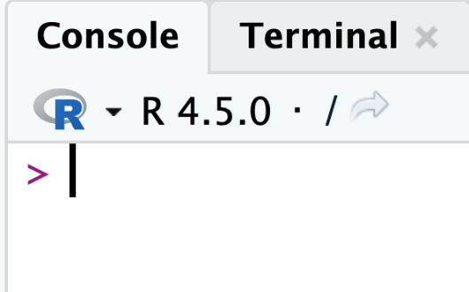
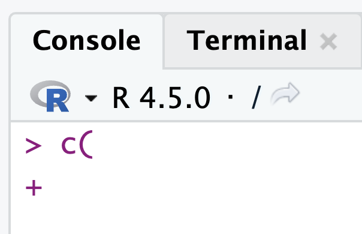
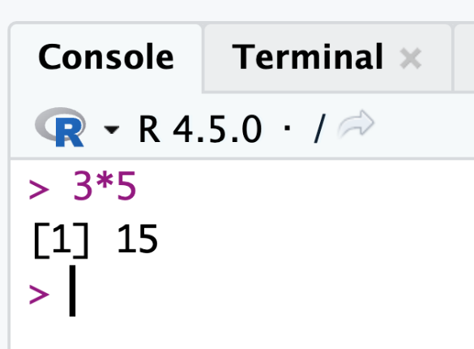
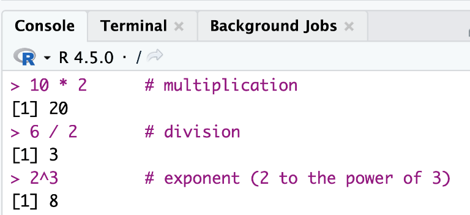
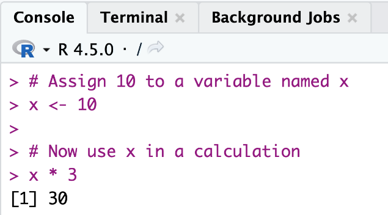

layout: true
<div style="position: absolute;left:20px;bottom:5px;color:black;font-size: 12px;">Nexellence Institute | `r rmarkdown::metadata$title` | `r format(Sys.time(), '%d %B %Y')`</div>

<!--- `r rmarkdown::metadata$subtitle` | `r format(Sys.time(), '%d %B %Y')`-->

---

class: title-slide
background-position: 10% 90%, 100% 50%
background-size: 160px, 50% 100%
background-color: #0148A4

```{r, load_refs, echo=FALSE, cache=FALSE, message=FALSE}
library(RefManageR)
BibOptions(check.entries = FALSE,
           bib.style = "authoryear",
           cite.style = 'authoryear',
           style = "markdown",
           hyperlink = FALSE,
           dashed = FALSE)
myBib <- ReadBib("assets/example.bib", check = FALSE)
top_icon = function(x) {
  icons::icon_style(
    icons::fontawesome(x),
    position = "fixed", top = 10, right = 10
  )
}
```

```{r setup, include=FALSE}
# xaringanExtra::use_scribble() ## Draw on slides. Requires dev version of xaringanExtra.
options(modelsummary_factory_latex = "kableExtra")
options(htmltools.dir.version = FALSE)
library(knitr)
opts_chunk$set(
  fig.align="center",
  fig.height=4, fig.width=6,
  out.width="748px", out.length="520.75px",
  dpi=300, #fig.path='Figs/',
  cache=T#, echo=F, warning=F, message=F
  )
```


```{r, cache=FALSE, message=FALSE, warning=FALSE, include=TRUE, eval=TRUE, results=FALSE, echo=FALSE, tidy.opts = list(width.cutoff = 50), tidy = TRUE}
## Load and install the packages that we'll be using today
if (!require("pacman")) install.packages("pacman")
pacman::p_load(tictoc, parallel, pbapply, future, future.apply, furrr, RhpcBLASctl, memoise, here, foreign, mfx, tidyverse, hrbrthemes, estimatr, ivreg, fixest, sandwich, lmtest, margins, vtable, broom, modelsummary, stargazer, fastDummies, recipes, dummy, gplots, haven, huxtable, kableExtra, gmodels, survey, gtsummary, data.table, tidyfast, dtplyr, microbenchmark, ggpubr, tibble, viridis, wesanderson, censReg, rstatix, srvyr, formatR, sysfonts, showtextdb, showtext, thematic, sampleSelection, RefManageR, DT, googleVis, png, grid)

font_add_google("Fira Sans", "firasans")
font_add_google("Fira Code", "firasans")

showtext_auto()

theme_customs <- theme(
  text = element_text(family = 'firasans', size = 16),
  plot.title.position = 'plot',
  plot.title = element_text(
    face = 'bold',
    colour = thematic::okabe_ito(8)[6],
    margin = margin(t = 2, r = 0, b = 7, l = 0, unit = "mm")
  ),
)

colors <-  thematic::okabe_ito(5)

theme_set(hrbrthemes::theme_ipsum() + theme_customs)

# COLOR PALLETES
library(paletteer)

### COLOR BLIND PALLETES
colorBlindness <- paletteer_d("colorBlindness::Blue2Orange12Steps")
cbbPalette <- c("#000000", "#E69F00", "#56B4E9", "#009E73", "#F0E442", "#0072B2", "#D55E00", "#CC79A7")

# To use for fills, add
  scale_fill_manual(values="colorBlindness::Blue2Orange12Steps")

# To use for line and point colors, add
  scale_colour_manual(values="colorBlindness::Blue2Orange12Steps")
```

```{r xaringan-panelset, echo=FALSE}
xaringanExtra::use_panelset()
```


```{css, echo=F}
    /* Table width = 100% max-width */

    .remark-slide table{
        width: auto !important; /* Adjusts table width */
    }

    /* Change the background color to white for shaded rows (even rows) */

    .remark-slide thead, .remark-slide tr:nth-child(2n) {
        background-color: white;
    }
    .remark-slide thead, .remark-slide tr:nth-child(n) {
        background-color: white;
    }

    .chev-row {
      display: flex;
      align-items: center;
      gap: 0.9em;
      margin-bottom: 0.6em;
    }
    .chev {
      flex: 0 0 62px;
      height: 78px;
      background: #c9e4f6;
      clip-path: polygon(0 0, 50% 14%, 100% 0, 100% 78%, 50% 100%, 0 78%);
      display: flex;
      align-items: center;
      justify-content: center;
      font-weight: bold;
      font-size: 1.7em;
      color: #1a1a1a;
    }
    .chev-text {
      flex: 1;
    }
    .chev-sm {
      flex: 0 0 52px;
      height: 58px;
      background: #c9e4f6;
      clip-path: polygon(0 0, 50% 14%, 100% 0, 100% 78%, 50% 100%, 0 78%);
      display: flex;
      align-items: center;
      justify-content: center;
    }
    .chev-row-sm {
      display: flex;
      align-items: center;
      gap: 0.8em;
      margin-bottom: 0.25em;
    }

    .chev-flow {
      display: flex;
      gap: 0.7em;
      margin-top: 1em;
    }
    .chev-step {
      flex: 1;
      text-align: center;
    }
    .chev-step p {
      text-align: left;
    }
    .chev-right {
      height: 58px;
      background: #c9e4f6;
      clip-path: polygon(0 0, 86% 0, 100% 50%, 86% 100%, 0 100%, 14% 50%);
      display: flex;
      align-items: center;
      justify-content: center;
      margin-bottom: 0.6em;
    }

    .three-col {
      display: flex;
      gap: 1.5em;
      margin-top: 1.5em;
    }
    .three-col .col {
      flex: 1;
      text-align: center;
    }
    .three-col .col p:first-child {
      margin-bottom: 0.4em;
    }

    .img-row {
      display: flex;
      gap: 1em;
      align-items: center;
      justify-content: center;
      margin-top: 0.8em;
    }
    .img-row img {
      max-width: 100%;
      border-radius: 6px;
    }
    .img-row .cell {
      flex: 1;
      text-align: center;
    }

    .remark-code {
      font-size: 0.75em !important;
    }

```

# .text-shadow[.white[Outline for Today]]

<ol>
    <li><h4 class="white">What Is R and Why Use It?</h4></li>
    <li><h4 class="white">Getting Started: Installing R and RStudio</h4></li>
    <li><h4 class="white">Working with Data: Reading a CSV in R</h4></li>
    <li><h4 class="white">Scripts, Comments & Reproducibility</h4></li>
    <li><h4 class="white">Data Visualization: Histograms, Bar Charts & Scatter Plots</h4></li>
    <li><h4 class="white">Coding Agents for R-Based Analysis</h4></li>
</ol>

---
class: segue-yellow

# Chapter 3: Introduction to R — <br> Your First Data Analysis `r top_icon("chart-bar")`

---
### What is R and Why Use It for Data Analysis?

.pull-left[.font85[
.content-box-blue[
**R** is an open-source statistical computing language **purpose-built for data analysis, modeling, and visualization** &mdash; used by researchers at Google, the FDA, the New York Times, and most academic journals.
]

- Created by statisticians **Ross Ihaka and Robert Gentleman (1993)**.

- Free, open-source, and backed by **CRAN** (Comprehensive R Archive Network) with 20,000+ packages.
]]

.pull-right[
```{r img02, echo=FALSE, warning=FALSE, out.width="70%", fig.show='hold', fig.align='center'}
# Read the image file
img <- readPNG("assets/02-img.png")

# Plot the image
grid.raster(img)
```
]

---
### The R Ecosystem

.pull-left[.font85[
- The R ecosystem includes **20,000+ packages on CRAN**. The most important: **tidyverse** (data wrangling), **ggplot2** (publication-quality graphics), **caret/tidymodels** (machine learning), and **Shiny** (interactive web apps).

- **R vs Python:** R was built by statisticians and excels at statistical tests, mixed models, and reproducible research. Python dominates ML pipelines. Many professional data scientists use both &mdash; *choose R when the question is statistical*.
]]

.pull-right[
```{r img03a, echo=FALSE, warning=FALSE, out.width="100%", fig.show='hold', fig.align='center'}
# Read the image file
img <- readPNG("assets/03a-img.png")

# Plot the image
grid.raster(img)
```

```{r img03b, echo=FALSE, warning=FALSE, out.width="85%", fig.show='hold', fig.align='center'}
# Read the image file
img <- readPNG("assets/03b-img.png")

# Plot the image
grid.raster(img)
```
]

---
### Real World Examples

```{r img04, echo=FALSE, warning=FALSE, out.width="68%", fig.show='hold', fig.align='center'}
# Read the image file
img <- readPNG("assets/04-img.png")

# Plot the image
grid.raster(img)
```

.font70[Source: [Reporting on NYC taxi data with RStudio and Databricks (Posit)](https://posit.co/blog/reporting-on-nyc-taxi-data-with-rstudio-and-databricks/)]

---
### Getting Started: Installing R and RStudio

.pull-left[
.content-box-blue[
**RStudio** is a user-friendly application that makes coding in R easier.
]

.font90[RStudio is an **IDE** (Integrated Development Environment), which means it provides tools like a script editor, results console, and plotting window all in one place.]
]

.pull-right[
```{r img05, echo=FALSE, warning=FALSE, out.width="95%", fig.show='hold', fig.align='center'}
# Read the image file
img <- readPNG("assets/05-img.png")

# Plot the image
grid.raster(img)
```
]

---
### Step 1: Install R

#### `r fontawesome::fa("globe", height = "1em", fill = "#4a7fb5")` &nbsp; Go to: [cran.rstudio.com](https://cran.rstudio.com/)

#### `r fontawesome::fa("laptop", height = "1em", fill = "#4a7fb5")` &nbsp; Choose your operating system (Windows, Mac, or Linux) and download the latest version of R

#### `r fontawesome::fa("download", height = "1em", fill = "#4a7fb5")` &nbsp; After it's downloaded, follow the prompts and install it on your machine

```{r img06, echo=FALSE, warning=FALSE, out.width="80%", fig.show='hold', fig.align='center'}
# Read the image file
img <- readPNG("assets/06-img.png")

# Plot the image
grid.raster(img)
```

---
### Step 2: Install RStudio

.pull-left[
#### `r fontawesome::fa("globe", height = "1em", fill = "#4a7fb5")` &nbsp; Go to: [posit.co/download/rstudio-desktop](https://posit.co/download/rstudio-desktop/)

#### `r fontawesome::fa("download", height = "1em", fill = "#4a7fb5")` &nbsp; Click on "Download RStudio..."

#### `r fontawesome::fa("list-check", height = "1em", fill = "#4a7fb5")` &nbsp; Follow the prompts

#### `r fontawesome::fa("circle-check", height = "1em", fill = "#4a7fb5")` &nbsp; Install it on your machine
]

.pull-right[
```{r img07, echo=FALSE, warning=FALSE, out.width="90%", fig.show='hold', fig.align='center'}
# Read the image file
img <- readPNG("assets/07-img.png")

# Plot the image
grid.raster(img)
```
]

---
### Step 3: In Case You Can't Install

.pull-left[
#### `r fontawesome::fa("cloud", height = "1em", fill = "#4a7fb5")` &nbsp; Go to the RStudio Cloud website: [posit.cloud](https://posit.cloud/)

#### `r fontawesome::fa("user-plus", height = "1em", fill = "#4a7fb5")` &nbsp; Sign up for a free account, and create a new project

#### `r fontawesome::fa("window-maximize", height = "1em", fill = "#4a7fb5")` &nbsp; You'll get an interface almost identical to RStudio Desktop

.font90[This way, you can follow along with R coding through your browser **without installing anything**.]
]

.pull-right[
```{r img08, echo=FALSE, warning=FALSE, out.width="90%", fig.show='hold', fig.align='center'}
# Read the image file
img <- readPNG("assets/08-img.png")

# Plot the image
grid.raster(img)
```
]

---
### Step 4: Run It!

.pull-left[
#### `r fontawesome::fa("play", height = "1em", fill = "#4a7fb5")` &nbsp; Run RStudio

#### `r fontawesome::fa("table-cells-large", height = "1em", fill = "#4a7fb5")` &nbsp; You should see 3 panes

#### `r fontawesome::fa("plus", height = "1em", fill = "#4a7fb5")` &nbsp; Click on the left top **+** sign to start a new script
]

.pull-right[
```{r img09, echo=FALSE, warning=FALSE, out.width="100%", fig.show='hold', fig.align='center'}
# Read the image file
img <- readPNG("assets/09-img.png")

# Plot the image
grid.raster(img)
```
]

---
### The Four Panes of RStudio

.font80[
.pull-left[
.content-box-blue[
**`r fontawesome::fa("file-pen", fill = "#4a7fb5")` Script Editor**

A text editor for your R scripts. You can write multiple lines of code, save, and run parts or all of it.
]

.content-box-blue[
**`r fontawesome::fa("terminal", fill = "#4a7fb5")` Console**

The console is R's command line. Type commands one at a time and press Enter to execute &mdash; or "Ctrl+Enter" on your script and it will come here.
]
]

.pull-right[
.content-box-blue[
**`r fontawesome::fa("box-archive", fill = "#4a7fb5")` Environment**

The Environment tab lists all the variables, data frames, and values you have created in your R session.
]

.content-box-blue[
**`r fontawesome::fa("folder-open", fill = "#4a7fb5")` Files / Plots / Packages / Help / Viewer**

**Files:** navigate files on your computer. **Plots:** graphs appear here. **Packages:** installed R packages. **Help:** documentation. **Viewer:** web content or interactive reports.
]
]
]

---
### R Console Notes

.font80[
.three-col[
.col[


The console shows `>` &mdash; it's **not running anything and is ready to go**.
]
.col[


Shows `+` &mdash; **I didn't close my parenthesis.** It's waiting for me to finish my line. If you see this, check your code!
]
.col[


**I just used it as a calculator.** Try it, it's fun!
]
]
]

---
### Running Your First R Commands

<div class="img-row" style="max-width: 85%; margin-left: auto; margin-right: auto;">
  <div class="cell"></div>
  <div class="cell"></div>
</div>

--

.content-box-yellow[
.font90[**Quick note:** `<-` and `=` are the same in R. But sticking to `<-` will avoid some subtle issues.]
]

---
### Exercise

.font85[
.content-box-blue[
**Part A &mdash; Arithmetic and assignment:**

Create `a <- 5` and `b <- 7`. Compute: `a+b`, `a-b`, `a*b`, `a/b`, `a^2`, `b%%a`. What does `%%` (modulo) return?
]

.content-box-blue[
**Part B &mdash; Vectors (R's basic data structure):**

`scores <- c(85, 92, 78, 95, 61)`. Compute `mean(scores)`, `median(scores)`, `sd(scores)`, `range(scores)`. What does `c()` stand for?
]

.content-box-blue[
**Part C &mdash; Vector arithmetic is vectorized:**

Try `scores * 0.9` (10% grade penalty). What happens? How does this differ from Python lists?
]
]

---
### Exercise: Solution

.pull-left[
**Create two variables:** `a = 5` and `b = 7`

**Calculate:**

```r
a <- 5
b <- 7

a + b   # 12
a - b   # -2
a * b   # 35
```
]

.pull-right[
```{r img14, echo=FALSE, warning=FALSE, out.width="100%", fig.show='hold', fig.align='center'}
# Read the image file
img <- readPNG("assets/14-img.png")

# Plot the image
grid.raster(img)
```
]

---
### Working with Data: Reading a CSV File in R

.pull-left[.font90[
- Data often comes in files, and a common format is **CSV (Comma-Separated Values)**.

- Let's use a small example dataset about cars (originally derived from the `mtcars` dataset in R).

**Contains information on a set of cars:**

- their fuel efficiency (miles per gallon),
- number of cylinders,
- horsepower
]]

.pull-right[
```{r img15, echo=FALSE, warning=FALSE, out.width="70%", fig.show='hold', fig.align='center'}
# Read the image file
img <- readPNG("assets/15-img.png")

# Plot the image
grid.raster(img)
```

.font70[.center[Source: [ebay.com](https://www.ebay.com/itm/362971887232)]]
]

---
### Set Working Directory

```{r img16, echo=FALSE, warning=FALSE, out.width="78%", fig.show='hold', fig.align='center'}
# Read the image file
img <- readPNG("assets/16-img.png")

# Plot the image
grid.raster(img)
```

---
### Read the CSV File

```r
car_data <- read.csv("car_data.csv")
```

--

### What happens when you run `read.csv`?

.font90[
1. R opens the file `car_data.csv`.

2. It **parses the contents**, assuming the first line has column names (like "mpg", "cyl", "hp", etc.) and the subsequent lines are data.

3. It creates a **data frame** object named `car_data` in memory to hold the data.

4. In the Environment panel, you'll see `car_data` listed with a preview like *obs=74 vars=12*.
]

---
### Possible Error Message

.content-box-yellow[
**If you didn't specify the data path correctly** or set your working directory correctly, R can't find the file:

```
Error in file(file, "rt") : cannot open the connection
In addition: Warning message: ... No such file or directory
```
]

--

.content-box-green[
**Solution:**

- Set your working directory again, **or**
- Change your `car_data.csv` path to the correct path.
]

---
### Still Having Trouble? Another Solution

.font90[Click **File &rarr; Import Dataset &rarr; From Text (base) &rarr;** find and select your file **(Open) &rarr; Import**]

```{r img20, echo=FALSE, warning=FALSE, out.width="70%", fig.show='hold', fig.align='center'}
# Read the image file
img <- readPNG("assets/20-img.png")

# Plot the image
grid.raster(img)
```

---
### Get Summary Statistics

```r
summary(car_data)
```

--

### Some useful functions

.font80[
- **`head(df, n=6)`**: first n rows. Run immediately after loading data. **`str(df)`** shows column types &mdash; critical for catching numeric IDs read as character.

- **`nrow(df)`** and **`ncol(df)`** return dimensions. **`dim(df)`** returns both as a vector. **`names(df)`** lists all column names.

- **`summary(df)`**: for numerical columns shows Min/Q1/Median/Mean/Q3/Max. For categorical (factor) columns shows frequency counts. *Notice when mean and median diverge &mdash; that signals skew or outliers.*

- `summary()` reveals outliers: when mean &gt;&gt; median, the distribution is right-skewed. Columns showing "NA's: N" alert you to missing values immediately.
]

---
### Check Your Knowledge

.pull-left[
.content-box-blue[
**What is the min and max mpg?**

**What is the mean and median mpg?**
]
]

.pull-right[
```{r img23, echo=FALSE, warning=FALSE, fig.width=4, fig.height=6, out.width="48%", fig.show='hold', fig.align='center'}
# Read the image file
img <- readPNG("assets/23-img.png")

# Plot the image
grid.raster(img)
```
]

---
### Check Your Knowledge: Answer

```{r img24, echo=FALSE, warning=FALSE, out.width="92%", fig.show='hold', fig.align='center'}
# Read the image file
img <- readPNG("assets/24-img.png")

# Plot the image
grid.raster(img)
```

.font90[Reading from `summary(car_data)`: min mpg = 12, max mpg = 41; mean mpg &asymp; 21.3, median mpg = 20.]

---
### Some More Functions: the `$` Operator

.pull-left[.font80[
- The **`$` operator extracts a column as a vector**. Combine with any R function: `mean()`, `median()`, `sd()`, `quantile()`, `table()`.

- Use logical indexing to filter: `car_data$mpg[car_data$foreign==1]`.

- Also valid: `car_data[["mpg"]]` (bracket notation). In tidyverse dplyr, you access columns directly inside `mutate()`, `filter()`, `summarise()` without `$`.

- Try: `quantile(car_data$mpg, probs=c(0.25, 0.75))` to get the IQR boundaries.
]

```{r img25b, echo=FALSE, warning=FALSE, out.width="60%", fig.show='hold', fig.align='center'}
# Read the image file
img <- readPNG("assets/25-img.png")

# Plot the image
grid.raster(img)
```
]

.pull-right[
```{r img23b, echo=FALSE, warning=FALSE, fig.width=4, fig.height=6, out.width="48%", fig.show='hold', fig.align='center'}
# Read the image file
img <- readPNG("assets/23-img.png")

# Plot the image
grid.raster(img)
```
]

---
### Your Turn!

.pull-left[.font85[
.content-box-blue[
**Calculate the mean, median, and standard deviation of car price.**

Then: is the mean or median a better measure of typical price? Why? Use `summary(car_data$price)` to check for outliers.
]

.content-box-yellow[
**Extension:** compute the coefficient of variation (`sd/mean * 100`). What does it tell you about price variability? These are 1974 prices &mdash; a $6,000 car in 1974 is roughly $38,000 today.
]
]]

.pull-right[
```{r img26, echo=FALSE, warning=FALSE, out.width="70%", fig.show='hold', fig.align='center'}
# Read the image file
img <- readPNG("assets/26-img.png")

# Plot the image
grid.raster(img)
```
]

---
### Your Turn: Mean Price

.font90[Calculate the mean price of a car using the `mean` function!]

```{r img27, echo=FALSE, warning=FALSE, out.width="75%", fig.show='hold', fig.align='center'}
# Read the image file
img <- readPNG("assets/27-img.png")

# Plot the image
grid.raster(img)
```

---
### Frequency: the `table` Function

.pull-left[.font90[
- The **`table` function** provides us the frequency values for each category.

- For example, there is a variable called **"foreign"**, which shows whether the car is domestic or foreign.

- We can find how many of them are domestic and how many of them are foreign using the table function.
]]

.pull-right[
```{r img28, echo=FALSE, warning=FALSE, out.width="95%", fig.show='hold', fig.align='center'}
# Read the image file
img <- readPNG("assets/28-img.png")

# Plot the image
grid.raster(img)
```
]

---
### Writing and Running R Scripts

.font90[
- It's OK to run your code in the **Console** for a quick check.

- But for a project or assignment, you'll want to **save your code** so you can run it again or share it.

- This is where the **script** comes in.
]

--

.content-box-blue[
**Creating a script:** In RStudio, go to **File &rarr; New File &rarr; R Script**.

**Saving a script:** **File &rarr; Save** (or Ctrl+S / Cmd+S) &mdash; give it a clear name like `car_analysis.R`.

**Running code from a script:** put your cursor on a line (or select several lines) and press **Ctrl+Enter** (Cmd+Enter on Mac).
]

---
### Benefits of Using Scripts

.font85[
.pull-left[
.content-box-blue[
**`r fontawesome::fa("rotate", fill = "#4a7fb5")` Reproducibility**

Scientific reproducibility: anyone with your script and data can rerun your exact analysis. This is now required by many journals and organizations.
]

.content-box-blue[
**`r fontawesome::fa("code-branch", fill = "#4a7fb5")` Organization**

Version control: scripts can be tracked with Git, so you can see every change made and roll back mistakes &mdash; essential for professional and academic work.
]
]

.pull-right[
.content-box-blue[
**`r fontawesome::fa("magnifying-glass", fill = "#4a7fb5")` Troubleshooting**

Auditability: every transformation is documented in code, not hidden in manual spreadsheet steps. Your analysis can be independently verified.
]

.content-box-blue[
**`r fontawesome::fa("share-nodes", fill = "#4a7fb5")` Sharing**

Collaboration: share your `.R` script and others can reproduce, extend, or peer-review your work &mdash; the foundation of open science.
]
]
]

---
### Using Comments in Scripts

.pull-left[
.content-box-blue[
**What Are Comments?**

Text preceded by the `#` symbol that **R ignores when running code**.

Used to explain what your code does in plain language.
]
]

.pull-right[
```{r img34, echo=FALSE, warning=FALSE, out.width="100%", fig.show='hold', fig.align='center'}
# Read the image file
img <- readPNG("assets/34-img.png")

# Plot the image
grid.raster(img)
```
]

---
### Data Visualization: Why It Matters

.pull-left[.font80[
**`r fontawesome::fa("eye", fill = "#4a7fb5")` See Patterns**

A mean of 21 MPG tells you little &mdash; a histogram instantly shows whether the distribution is symmetric, skewed, bimodal, or has outliers. *Numbers compress; plots reveal.*

**`r fontawesome::fa("book-open", fill = "#4a7fb5")` Tell Stories**

The grammar of graphics (ggplot2): every chart is built from data + aesthetic mappings + geometric layers. This mental model applies across R, Python (seaborn/plotly), and Vega-Lite.

**`r fontawesome::fa("lightbulb", fill = "#4a7fb5")` Generate Insights**

Base R plots are fast for exploration; ggplot2 is the standard for publication and presentation. We start with base R, then introduce ggplot2 syntax.
]]

.pull-right[
```{r img35, echo=FALSE, warning=FALSE, out.width="90%", fig.show='hold', fig.align='center'}
# Read the image file
img <- readPNG("assets/35-img.png")

# Plot the image
grid.raster(img)
```
]

---
### Simple Data Analysis Example: Summaries and Visualizations

.font90[We start with **base R graphics** for speed. In practice, **ggplot2** is the standard &mdash; both produce the same plots; ggplot2 scales to complex, layered visualizations.]

--

.pull-left[
.content-box-blue[
**`r fontawesome::fa("chart-area", fill = "#4a7fb5")` A Histogram**

Of a numeric variable (MPG) to see its **distribution**.
]
]

.pull-right[
.content-box-green[
**`r fontawesome::fa("chart-column", fill = "#4a7fb5")` A Bar Chart**

Of a categorical-like variable (number of foreign cars) to see **how many cars fall into each category**.
]
]

---
### Histogram of MPG

.font90[A **histogram** shows the distribution of a continuous numeric variable by grouping values into "bins" (ranges) and plotting bars for the count of observations in each bin. In base R, we use the `hist()` function:]

```r
# Plot a histogram of the MPG (Miles per Gallon) column
hist(car_data$mpg,
     main="Distribution of Car MPG",
     xlab="Miles per Gallon (MPG)",
     col="skyblue", border="black")
```

---
### Histogram of MPG

.pull-left[
```r
# Plot a histogram of the MPG column
hist(car_data$mpg,
     main="Distribution of Car MPG",
     xlab="Miles per Gallon (MPG)",
     col="skyblue", border="black")
```
]

.pull-right[
```{r img38, echo=FALSE, warning=FALSE, out.width="95%", fig.show='hold', fig.align='center'}
# Read the image file
img <- readPNG("assets/38-img.png")

# Plot the image
grid.raster(img)
```
]

---
### Histogram of MPG &mdash; Let's Break Down the Arguments

.pull-left[
```r
hist(car_data$mpg,
     main="Distribution of Car MPG",
     xlab="Miles per Gallon (MPG)",
     col="skyblue", border="black")
```

.font90[
- `car_data$mpg` &mdash; **the data we want to plot**
- `main`, `xlab` &mdash; **title and axis label**
- `col="skyblue"` &mdash; **color that fills the bars**
- `border="black"` &mdash; **color that outlines the bars**
]
]

.pull-right[
```{r img39, echo=FALSE, warning=FALSE, out.width="80%", fig.show='hold', fig.align='center'}
# Read the image file
img <- readPNG("assets/39-img.png")

# Plot the image
grid.raster(img)
```
]

---
### Histogram &mdash; Interpretation

.pull-left[.font75[
- This histogram shows the **distribution shape** of MPG. Shape reveals more than any single statistic &mdash; here we can assess skewness, outliers, and the most common value range.

- This distribution is **right-skewed**: the right tail extends further. This means mean &gt; median, and a few high-MPG outliers pull the average up.

- The **mode is in the 15&ndash;20 MPG bin**. The median is a better center than the mean for skewed data.

- **Detective question:** if you only saw the mean MPG of 21.3, would you have guessed this shape? This is exactly why visualization precedes modeling &mdash; *distributions tell stories statistics summarize away*.
]]

.pull-right[
```{r img40, echo=FALSE, warning=FALSE, out.width="95%", fig.show='hold', fig.align='center'}
# Read the image file
img <- readPNG("assets/40-img.png")

# Plot the image
grid.raster(img)
```
]

---
### Quick Tip: Read the Error

.font90[You **will** get an error message now or later. **Read the error message!**]

.content-box-yellow[
The below message says R can't find the data file. If you get this error, it means that `car_data` is not in your environment and you need to read it.
]

```{r img41, echo=FALSE, warning=FALSE, out.width="75%", fig.show='hold', fig.align='center'}
# Read the image file
img <- readPNG("assets/41-img.png")

# Plot the image
grid.raster(img)
```

---
### Bar Chart

.font90[Let's visualize the distribution of a **categorical variable**: the number of foreign cars. Base R has a `barplot()` function, which can take a vector of counts and plot bars. We can pipe the output of `table()` directly into `barplot()`:]

```r
for_counts <- table(car_data$foreign)
barplot(for_counts,
        main="Number of Cars by Production Location",
        xlab="Production",
        ylab="Number of Cars",
        col="coral")
```

---
### Bar Chart

.pull-left[
```r
for_counts <- table(car_data$foreign)
barplot(for_counts,
        main="Number of Cars by Production Location",
        xlab="Production",
        ylab="Number of Cars",
        col="coral")
```

.font90[
- `table()` &mdash; **creates a table of counts**
- `for_counts` &mdash; **we pass the table count as the data**
- `main`, `xlab`, `ylab` &mdash; **title and axis labels**
- `col="coral"` &mdash; **filling color of the bars**
]
]

.pull-right[
```{r img43, echo=FALSE, warning=FALSE, out.width="95%", fig.show='hold', fig.align='center'}
# Read the image file
img <- readPNG("assets/43-img.png")

# Plot the image
grid.raster(img)
```
]

---
### Saving Your Plots (Optional)

.font90[Two easy ways to save a plot:]

.content-box-blue[
**In RStudio:** in the Plots pane, click **Export &rarr; Save as Image...** (or *Copy to Clipboard*).
]

.content-box-green[
**In code:**

```r
png("mpg_histogram.png", width = 800, height = 600)
hist(car_data$mpg, main = "Distribution of Car MPG",
     xlab = "Miles per Gallon (MPG)", col = "skyblue")
dev.off()  # closes the file — don't forget this!
```
]

---
### Common Pitfalls and How to Troubleshoot

.font80[
**`r fontawesome::fa("triangle-exclamation", fill = "#D55E00")` File not found error** &mdash; this means R cannot find the file. Usually a file path problem. Ensure that the CSV is in your working directory or provide the correct path.

```r
getwd()                        # shows your working directory
setwd("path/to/your/folder")   # sets your working directory
```
]

--

.font80[
**`r fontawesome::fa("triangle-exclamation", fill = "#D55E00")` "could not find function" error** &mdash; means you forgot to load the package that provides that function:

```r
install.packages("ggplot2")   # install once
library(ggplot2)              # call it from the library each session
```

Finally, the function works!
]

---
### How to Use R Help?

.font100[You can get the help document for almost any function by typing a **question mark and the function name**:]

```r
?mean
?hist
?read.csv
```

.font90[The documentation will appear in the **Help** tab of the lower-right pane.]

---
### Chapter 3 Summary

.font75[
**R as an analytical environment:**

- R is a statistical computing language with 20,000+ packages. Its vectorized operations and built-in statistical functions make it purpose-built for data analysis.
- RStudio provides a four-pane IDE: script editor, console, environment, and plots/packages/help. Scripts ensure reproducibility; comments document intent.

**Working with data:**

- Data frames: 2D tabular structure. Access columns with `$`. Always run `str()`, `head()`, and `summary()` after loading data to detect type issues, missingness, and outlier signals.
- Visualization reveals what statistics compress: skewness, outliers, bimodality, and patterns only visible in shape. Base R `hist()` and `barplot()` for exploration; ggplot2 for presentation.
]

--

.content-box-yellow[
.font85[**Key mindset:** Always plot before modeling. When mean and median diverge, investigate why. A right-skewed distribution suggests outliers pulling the mean &mdash; the median tells the more typical story.]
]

---
### Your Turn!

.content-box-blue[
**Create a histogram of the price** similar to what we did for MPG. Describe the shape: is it skewed or roughly symmetric? Are there multiple peaks?
]

---
### Your Turn: Solution

.pull-left[
```r
car_data <- read.csv("car_data.csv")

hist(car_data$price,
     main="Distribution of Car Prices",
     xlab="Car Price (Dollar)",
     col="skyblue", border="black")
```

--

.content-box-green[
.font90[Most cars are between **4,000 and 6,000 dollars** and the most expensive ones are around **$16,000**.]
]
]

.pull-right[
```{r img50, echo=FALSE, warning=FALSE, out.width="95%", fig.show='hold', fig.align='center'}
# Read the image file
img <- readPNG("assets/50-img.png")

# Plot the image
grid.raster(img)
```
]

---
### Challenge

.pull-left[.font90[
.content-box-blue[
Use `plot()` to create a **scatter plot of weight vs. MPG**. Before running the code, formulate a hypothesis: what direction do you expect the relationship to go, and why?
]

**After plotting:**

1. Describe the direction, form, and strength of the relationship.
2. Are there outliers?
3. Does this look linear or curved?
4. What does this suggest about the physics of fuel efficiency?
]]

.pull-right[
```{r img52, echo=FALSE, warning=FALSE, out.width="85%", fig.show='hold', fig.align='center'}
# Read the image file
img <- readPNG("assets/52-img.png")

# Plot the image
grid.raster(img)
```
]

---
### Challenge: Getting Started

.pull-left[.font90[
**First, find which variables to use:**

- Weight and MPG

**Second, which function to use:**

- The `plot` function would work fine

**If you don't know how to do it**, you can check the help file:

```r
?plot
```

Let's run it now!
]]

.pull-right[
```{r img53, echo=FALSE, warning=FALSE, out.width="90%", fig.show='hold', fig.align='center'}
# Read the image file
img <- readPNG("assets/53-img.png")

# Plot the image
grid.raster(img)
```
]

---
### Challenge: Solution

.pull-left[
```r
plot(car_data$weight, car_data$mpg,
     main = "Scatter plot of MPG vs. Weight",
     xlab = "Car Weight (1000 lbs)",
     ylab = "Miles Per Gallon",
     pch = 19,  # solid circles
     col = "blue")
```

--

.content-box-green[
.font90[**Interpretation:** As car weight increases, miles per gallon (MPG) generally **decreases**, indicating that heavier cars tend to be less fuel efficient.]
]
]

.pull-right[
```{r img54, echo=FALSE, warning=FALSE, out.width="100%", fig.show='hold', fig.align='center'}
# Read the image file
img <- readPNG("assets/54-img.png")

# Plot the image
grid.raster(img)
```
]

---
### Reflection Questions

.pull-left[.font80[
.content-box-blue[
**`r fontawesome::fa("face-smile", fill = "#4a7fb5")` What Was Easy?**

Which R concepts map directly to Python? Which are fundamentally different? What does R's vectorized arithmetic imply about how it handles data?
]

.content-box-yellow[
**`r fontawesome::fa("mountain", fill = "#4a7fb5")` What Was Challenging?**

The `$` operator, working directory, and factor data types trip up most new R users. What mental model helped you understand them? What would you explain differently to someone new?
]

.content-box-green[
**`r fontawesome::fa("book-open", fill = "#4a7fb5")` What Story Does the Data Tell?**

Based on MPG, weight, and price distributions: what hypotheses would you form about what drove car design in the 1970s? How would you test them with the data available?
]
]]

.pull-right[
```{r img55, echo=FALSE, warning=FALSE, out.width="85%", fig.show='hold', fig.align='center'}
# Read the image file
img <- readPNG("assets/55-img.png")

# Plot the image
grid.raster(img)
```
]

---
class: segue-green

# Coding Agents for R-Based Analysis `r top_icon("robot")`

---
### Using a Coding Agent with R

.font80[
.content-box-blue[
A coding agent can **write, run, and debug R code** based on your natural language instructions &mdash; but *you* must frame the analytical question precisely.
]

- **What the agent handles:** syntax (function names, argument order, `$` notation), package loading, error messages, and iterating on plot aesthetics.

- **What you must handle:** choosing the right statistical method, interpreting whether the output answers your actual question, and catching plausible-but-wrong results.

- **Workflow:** (1) Describe your dataset and question. (2) Ask for EDA first (`str`, `summary`, `head`). (3) Request specific plots or statistics. (4) Verify the output against what you know about the data.
]

--

.content-box-yellow[
.font85[**Key risk:** agents confidently produce incorrect code. Always check &mdash; does the output match what `summary()` told you? Are the axis labels right? Is the sample size what you expected?]
]

---
### Prompting a Coding Agent for R Analysis

.pull-left[
.content-box-yellow[
**`r fontawesome::fa("xmark", fill = "#D55E00")` Weak**

"Analyze the car data."

&rarr; Agent may produce arbitrary outputs that don't answer any specific question.
]
]

.pull-right[
.content-box-green[
**`r fontawesome::fa("check", fill = "#009E73")` Strong**

"Load car_data.csv. Run `str()` and `summary()`. For the mpg column: compute mean, median, sd, and IQR. Then produce a histogram with 10 bins. Describe whether the distribution is skewed and why mean vs median differ."
]
]

<div style="clear: both;"></div>

.font75[
**Follow-up prompts that sharpen the analysis:**

- "Is the relationship between weight and mpg linear? Produce a scatter plot and overlay a regression line using `abline(lm(mpg~weight, data=car_data))`."
- "Compare the mean and median mpg for domestic vs. foreign cars separately. Which group has higher variability? Use `tapply()`."
- "Flag any car with mpg more than 2 standard deviations from the mean as an outlier. Print those rows."
]

---
### Hands-On: Agent-Assisted R Analysis

.font90[**Activity (pairs, 25 minutes)** &mdash; use `car_data.csv` with a coding agent:]

.font80[
<div class="chev-row">
  <div class="chev">1</div>
  <div class="chev-text"><strong>Data audit:</strong> Prompt the agent to run <code>str()</code>, <code>head()</code>, <code>summary()</code>, and <code>dim()</code>. Report the number of rows, columns, data types, and any columns with NA values.</div>
</div>

<div class="chev-row">
  <div class="chev">2</div>
  <div class="chev-text"><strong>Distribution analysis:</strong> Ask for histograms of mpg, weight, and price. For each, identify: is it skewed? Symmetric? Are there visible outliers? Which measure of center is most appropriate?</div>
</div>

<div class="chev-row">
  <div class="chev">3</div>
  <div class="chev-text"><strong>Group comparison:</strong> Use <code>tapply()</code> to compare mean mpg for domestic vs. foreign cars. Then ask: is this difference statistically meaningful, or could it be sampling noise?</div>
</div>

<div class="chev-row">
  <div class="chev">4</div>
  <div class="chev-text"><strong>Catch the agent:</strong> Deliberately ask a vague question ("tell me something interesting"). Evaluate whether the agent's response actually answers a meaningful analytical question.</div>
</div>
]

--

.font90[**Present:** one insight that surprised you, and one output you had to correct or reframe.]

---
### Chapter 3: What You Can Do Now

.font80[
.pull-left[
.content-box-blue[
**`r fontawesome::fa("desktop", fill = "#4a7fb5")` R environment:**

- Set up RStudio (or Posit Cloud), run scripts, and use comments to document analytical decisions.
- Load CSV data with `read.csv()`, inspect with `str()`/`head()`/`summary()`, and access columns with the `$` operator.
]

.content-box-green[
**`r fontawesome::fa("robot", fill = "#4a7fb5")` Agent-assisted analysis:**

- Write precise analytical prompts for a coding agent working in R. Verify its outputs against known summary statistics and catch plausible-but-wrong results.
]
]

.pull-right[
.content-box-blue[
**`r fontawesome::fa("chart-column", fill = "#4a7fb5")` Data analysis in R:**

- Compute mean, median, sd, `quantile()`, and `table()` on real data. Interpret `summary()` output to identify skew, outliers, and missing values.
- Create histograms, bar charts, and scatter plots in base R. Interpret distribution shape &mdash; connecting visual patterns to statistical concepts (skewness, outliers, central tendency).
]
]
]

```{r gen_pdf, include = FALSE, cache = FALSE, eval = FALSE}
library(renderthis)
# https://hhadah.github.io/nexellence-summer-instit/week-02-investigation-and-analysis/session-08-understanding-data-beginning-analysis/08-class.html

to_pdf(from = "~/Documents/GiT/nexellence-summer-instit/week-02-investigation-and-analysis/session-08-understanding-data-beginning-analysis/08-class.html",
       to = "~/Documents/GiT/nexellence-summer-instit/week-02-investigation-and-analysis/session-08-understanding-data-beginning-analysis/08-class.pdf")
to_pdf(from = "~/Documents/GiT/nexellence-summer-instit/week-02-investigation-and-analysis/session-08-understanding-data-beginning-analysis/08-class.html")
```
