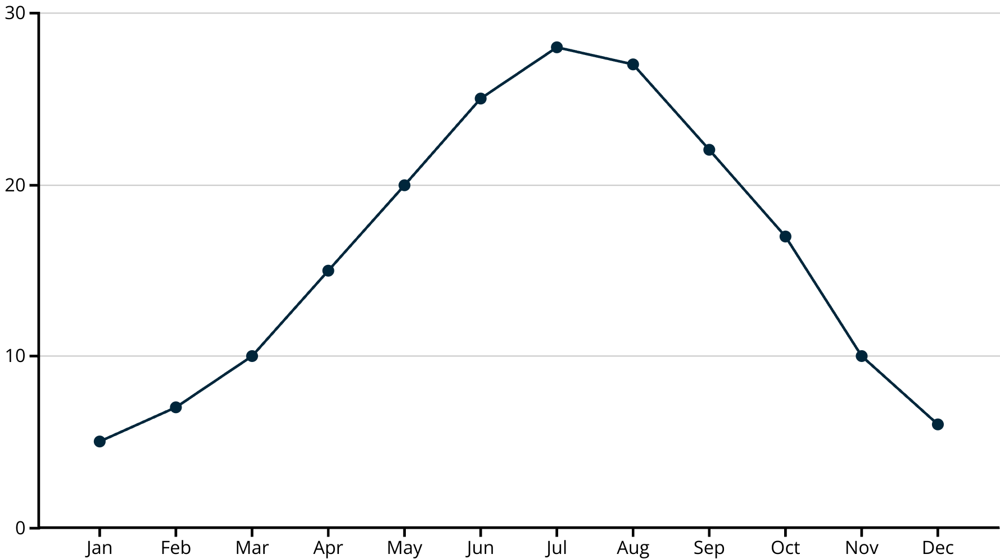
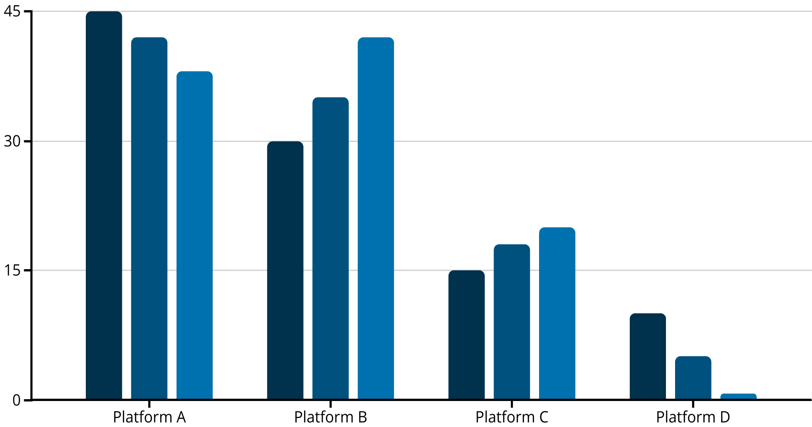
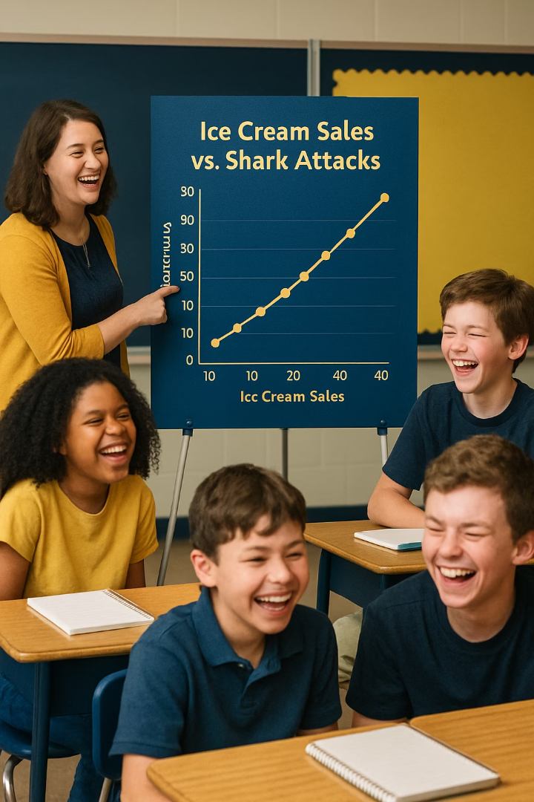

layout: true
<div style="position: absolute;left:20px;bottom:5px;color:black;font-size: 12px;">Nexellence Institute | `r rmarkdown::metadata$title` | July 9, 2026</div>

<!--- `r rmarkdown::metadata$subtitle` | July 9, 2026-->

---

```{r, load_refs, echo=FALSE, cache=FALSE, message=FALSE}
library(RefManageR)
BibOptions(check.entries = FALSE,
           bib.style = "authoryear",
           cite.style = 'authoryear',
           style = "markdown",
           hyperlink = FALSE,
           dashed = FALSE)
myBib <- ReadBib("assets/example.bib", check = FALSE)
top_icon = function(x) {
  icons::icon_style(
    icons::fontawesome(x),
    position = "fixed", top = 10, right = 10
  )
}
```

```{r setup, include=FALSE}
# xaringanExtra::use_scribble() ## Draw on slides. Requires dev version of xaringanExtra.
options(modelsummary_factory_latex = "kableExtra")
options(htmltools.dir.version = FALSE)
library(knitr)
opts_chunk$set(
  fig.align="center",
  fig.height=4, fig.width=6,
  out.width="748px", out.length="520.75px",
  dpi=300, #fig.path='Figs/',
  cache=T#, echo=F, warning=F, message=F
  )
```


```{r, cache=FALSE, message=FALSE, warning=FALSE, include=TRUE, eval=TRUE, results=FALSE, echo=FALSE, tidy.opts = list(width.cutoff = 50), tidy = TRUE}
## Load and install the packages that we'll be using today
if (!require("pacman")) install.packages("pacman")
pacman::p_load(tictoc, parallel, pbapply, future, future.apply, furrr, RhpcBLASctl, memoise, here, foreign, mfx, tidyverse, hrbrthemes, estimatr, ivreg, fixest, sandwich, lmtest, margins, vtable, broom, modelsummary, stargazer, fastDummies, recipes, dummy, gplots, haven, huxtable, kableExtra, gmodels, survey, gtsummary, data.table, tidyfast, dtplyr, microbenchmark, ggpubr, tibble, viridis, wesanderson, censReg, rstatix, srvyr, formatR, sysfonts, showtextdb, showtext, thematic, sampleSelection, RefManageR, DT, googleVis, png, grid)

font_add_google("Fira Sans", "firasans")
font_add_google("Fira Code", "firasans")

showtext_auto()

theme_customs <- theme(
  text = element_text(family = 'firasans', size = 16),
  plot.title.position = 'plot',
  plot.title = element_text(
    face = 'bold',
    colour = thematic::okabe_ito(8)[6],
    margin = margin(t = 2, r = 0, b = 7, l = 0, unit = "mm")
  ),
)

colors <-  thematic::okabe_ito(5)

theme_set(hrbrthemes::theme_ipsum() + theme_customs)

# COLOR PALLETES
library(paletteer)

### COLOR BLIND PALLETES
colorBlindness <- paletteer_d("colorBlindness::Blue2Orange12Steps")
cbbPalette <- c("#000000", "#E69F00", "#56B4E9", "#009E73", "#F0E442", "#0072B2", "#D55E00", "#CC79A7")

# To use for fills, add
  scale_fill_manual(values="colorBlindness::Blue2Orange12Steps")

# To use for line and point colors, add
  scale_colour_manual(values="colorBlindness::Blue2Orange12Steps")
```

```{r xaringan-panelset, echo=FALSE}
xaringanExtra::use_panelset()
```


```{css, echo=F}
    /* Table width = 100% max-width */

    .remark-slide table{
        width: auto !important; /* Adjusts table width */
    }

    /* Change the background color to white for shaded rows (even rows) */

    .remark-slide thead, .remark-slide tr:nth-child(2n) {
        background-color: white;
    }
    .remark-slide thead, .remark-slide tr:nth-child(n) {
        background-color: white;
    }

    .chev-row {
      display: flex;
      align-items: center;
      gap: 0.9em;
      margin-bottom: 0.6em;
    }
    .chev {
      flex: 0 0 62px;
      height: 78px;
      background: #c9e4f6;
      clip-path: polygon(0 0, 50% 14%, 100% 0, 100% 78%, 50% 100%, 0 78%);
      display: flex;
      align-items: center;
      justify-content: center;
      font-weight: bold;
      font-size: 1.7em;
      color: #1a1a1a;
    }
    .chev-text {
      flex: 1;
    }
    .chev-sm {
      flex: 0 0 52px;
      height: 58px;
      background: #c9e4f6;
      clip-path: polygon(0 0, 50% 14%, 100% 0, 100% 78%, 50% 100%, 0 78%);
      display: flex;
      align-items: center;
      justify-content: center;
    }
    .chev-row-sm {
      display: flex;
      align-items: center;
      gap: 0.8em;
      margin-bottom: 0.25em;
    }

    .chev-flow {
      display: flex;
      gap: 0.7em;
      margin-top: 1em;
    }
    .chev-step {
      flex: 1;
      text-align: center;
    }
    .chev-step p {
      text-align: left;
    }
    .chev-right {
      height: 58px;
      background: #c9e4f6;
      clip-path: polygon(0 0, 86% 0, 100% 50%, 86% 100%, 0 100%, 14% 50%);
      display: flex;
      align-items: center;
      justify-content: center;
      margin-bottom: 0.6em;
    }

    .three-col {
      display: flex;
      gap: 1.5em;
      margin-top: 1.5em;
    }
    .three-col .col {
      flex: 1;
      text-align: center;
    }
    .three-col .col p:first-child {
      margin-bottom: 0.4em;
    }

    .img-row {
      display: flex;
      gap: 1em;
      align-items: center;
      justify-content: center;
      margin-top: 0.8em;
    }
    .img-row img {
      max-width: 100%;
      border-radius: 6px;
    }
    .img-row .cell {
      flex: 1;
      text-align: center;
    }

    .remark-code {
      font-size: 0.75em !important;
    }

```


```{css, echo=F}
    /* 2x2 card grid used for "Characteristics" and "Tips" slides */
    .card-grid {
      display: flex;
      flex-wrap: wrap;
      gap: 0.8em;
      margin-top: 0.8em;
    }
    .card {
      flex: 1 1 44%;
      background: #d9ecf9;
      border-radius: 8px;
      padding: 0.5em 0.9em;
    }
    .card h4 {
      margin: 0 0 0.25em 0;
      color: #0148A4;
    }
    .card p {
      margin: 0;
      font-size: 0.85em;
    }
```

```{r countdown-setup, echo=FALSE}
library(countdown)
# Helper: a centered, inline countdown timer (click to start/pause/reset)
timer <- function(minutes = 1L, seconds = 0L, ...) {
  countdown::countdown(
    minutes = minutes, seconds = seconds,
    style = "position: relative; display: inline-block; margin: 0.6em auto;",
    color_border = "#0148A4",
    color_running_background = "#0148A4",
    color_running_text = "#FFFFFF",
    color_finished_background = "#D55E00",
    font_size = "2.2rem",
    warn_when = 30L,
    ...
  )
}
```

### Welcome to Day 9!

.pull-left[.font90[
Today you turn your dataset into **findings** &mdash; patterns, relationships, and honest conclusions.

By the end of the day you will be able to:

- Apply **descriptive and basic inferential** statistics to your research question
- Identify **patterns, relationships, and outliers** in data
- Understand what **"supporting a hypothesis"** does &mdash; and does **not** &mdash; mean
- Connect results back to your **literature review**
]]

.pull-right[

]

---
class: segue-yellow

# What Does the Data Say <br> vs. What Do We Conclude? `r top_icon("balance-scale")`

---
### Results vs. Interpretation `r fontawesome::fa("clock", fill="#fff", height="0.8em")` 20 min

.font90[The single most important distinction in writing up research:]

.pull-left[
.content-box-blue[
**`r fontawesome::fa("magnifying-glass-chart", fill = "#4a7fb5")` Results &mdash; *"The data showed X."***

What you **observed**. Neutral, factual, numeric. Lives in the **Results** section.
]
]

.pull-right[
.content-box-green[
**`r fontawesome::fa("lightbulb", fill = "#009E73")` Interpretation &mdash; *"This means Y."***

What you **think it means**. Connects to theory and your literature. Lives in the **Discussion**.
]
]

<div style="clear: both;"></div>

.content-box-yellow[
.font90[**Keep them separate.** Report the facts first; *then* argue what they mean. Mixing the two is the most common mistake in student research writing.]
]

---
### Practice: Fact or Interpretation?

.content-box-blue[
For each statement, decide: is it a **result** (fact) or an **interpretation** (discussion)?
]

.font90[
1. *"62% of surveyed students reported fewer than 7 hours of sleep."*
2. *"Students are exhausted because they spend too much time on social media."*
3. *"Average daily screen time was 4.2 hours, and mean sleep was 6.4 hours."*
]

--

.font90[
1. `r fontawesome::fa("check", fill = "#009E73")` **Result** &mdash; a measured fact.
2. `r fontawesome::fa("lightbulb", fill = "#c08a00")` **Interpretation** &mdash; a *claim about cause* that goes beyond the data.
3. `r fontawesome::fa("check", fill = "#009E73")` **Result** &mdash; two measured facts (no claim yet).
]

---
class: segue-green

# Finding Patterns, <br> Trends &amp; Outliers `r top_icon("chart-line")`

---
### Descriptive Statistics: A Quick Refresher

<div class="card-grid">
  <div class="card">
    <h4>`r fontawesome::fa("calculator", fill = "#0148A4")` Mean</h4>
    <p>Sum of all values divided by the number of values &mdash; the average.</p>
  </div>
  <div class="card">
    <h4>`r fontawesome::fa("arrows-left-right-to-line", fill = "#0148A4")` Median</h4>
    <p>The middle value when the data is ordered from smallest to largest.</p>
  </div>
  <div class="card">
    <h4>`r fontawesome::fa("ranking-star", fill = "#0148A4")` Mode</h4>
    <p>The most frequently occurring value in the dataset.</p>
  </div>
  <div class="card">
    <h4>`r fontawesome::fa("arrows-left-right", fill = "#0148A4")` Range</h4>
    <p>The difference between the largest and smallest values.</p>
  </div>
</div>

---
### Outliers: Values That Stand Out

.pull-left[.font85[
.content-box-blue[
**What are they?** Data points much **higher or lower** than most others.
]
.content-box-yellow[
**Why they matter:** they strongly pull the **mean**, but have little effect on the **median**.
]
.content-box-green[
**Handle with care:** investigate **why** an outlier exists before deciding whether to keep or drop it.
]
]]

.pull-right[

]

---
### Descriptive Example: Quiz Scores

.pull-left[.font90[
**Dataset:** `{4, 7, 8, 9, 9, 10, 10, 10}`

Compute each by hand:

- Mean = ?
- Median = ?
- Mode = ?
- Range = ?
- Possible outlier = ?
]]

--

.pull-right[.font90[
.content-box-green[
- **Mean = 8.375**
- **Median = 9**
- **Mode = 10**
- **Range = 6**
- **Possible outlier = 4**
]

.font80[Half the class scored 9+; the most common score was a perfect 10; one student (the **4**) struggled far more than the rest &mdash; that's the outlier pulling the mean below the median.]
]]

---
### Identifying Trends and Patterns

<div class="card-grid">
  <div class="card">
    <h4>`r fontawesome::fa("arrow-trend-up", fill = "#0148A4")` Trends Over Time</h4>
    <p>Upward, downward, or flat direction of change.</p>
  </div>
  <div class="card">
    <h4>`r fontawesome::fa("chart-column", fill = "#0148A4")` Patterns in Categories</h4>
    <p>Consistent relationships between different categories.</p>
  </div>
  <div class="card">
    <h4>`r fontawesome::fa("wave-square", fill = "#0148A4")` Cycles &amp; Seasonality</h4>
    <p>Repeating patterns at regular intervals.</p>
  </div>
  <div class="card">
    <h4>`r fontawesome::fa("circle-nodes", fill = "#0148A4")` Clusters &amp; Gaps</h4>
    <p>Groups of similar values, or ranges with little/no data.</p>
  </div>
</div>

---
### Trends Over Time

.pull-left[

]

.pull-right[.font90[
This temperature chart shows a clear **seasonal cycle**:

- Temperatures **rise** in spring
- **Peak** in summer
- **Fall** through autumn and winter

.content-box-blue[
This **cyclical pattern repeats annually** &mdash; a trend you'd miss from a single month's number.
]
]]

---
### Patterns in Categories

.pull-left[

]

.pull-right[.font85[
Social-media usage across **three years** (2021&ndash;2023):

- **Platform A** &mdash; declining
- **Platform B** &mdash; growing rapidly
- **Platform C** &mdash; steady growth
- **Platform D** &mdash; disappearing

.content-box-green[
Comparing categories **over time** reveals direction that a single snapshot hides.
]
]]

---
### Why Finding Patterns Matters

<div class="card-grid">
  <div class="card">
    <h4>`r fontawesome::fa("chart-line", fill = "#0148A4")` Make Predictions</h4>
    <p>Forecast future outcomes based on past patterns.</p>
  </div>
  <div class="card">
    <h4>`r fontawesome::fa("compass", fill = "#0148A4")` Inform Decisions</h4>
    <p>Use data trends to guide choices.</p>
  </div>
  <div class="card">
    <h4>`r fontawesome::fa("diagram-project", fill = "#0148A4")` Discover Relationships</h4>
    <p>Identify connections between variables.</p>
  </div>
  <div class="card">
    <h4>`r fontawesome::fa("gears", fill = "#0148A4")` Understand Systems</h4>
    <p>See how different factors interact.</p>
  </div>
</div>

---
class: segue-yellow

# Correlation, Regression <br> &amp; Causation `r top_icon("project-diagram")`

---
### Correlation vs. Causation `r fontawesome::fa("clock", fill="#fff", height="0.8em")` 25 min

.pull-left[
.content-box-blue[
**`r fontawesome::fa("link", fill = "#4a7fb5")` Correlation**

Two variables **change together** &mdash; as one moves, so does the other.

*Example:* ice cream sales and sunburns both rise on hot days.
]
]

.pull-right[
.content-box-green[
**`r fontawesome::fa("right-long", fill = "#009E73")` Causation**

Changing one variable **directly produces** a change in the other.

*Example:* pressing the gas pedal makes the car speed up.
]
]

<div style="clear: both;"></div>

.content-box-yellow[
.font90[**Things happening together does not mean one causes the other.** Proving causation usually requires a **controlled experiment**.]
]

---
### Spurious Correlations: Coincidence, Not Cause

.pull-left[.font85[
.content-box-blue[
**Ice cream &amp; shark attacks** &mdash; both rise in summer, but ice cream doesn't attract sharks.
]
.content-box-blue[
**Backpack weight &amp; math scores** &mdash; correlated through *grade level*, not because heavy bags teach math.
]
.content-box-yellow[
**Hidden variable:** often a **third factor** (hot weather, age, study habits) drives *both* variables.
]
]]

.pull-right[

]

---
### How Do We Establish Causation?

.pull-left[

]

.pull-right[.font85[
<div class="chev-row-sm"><div class="chev-sm">1</div><div class="chev-text"><strong>Controlled experiments</strong> &mdash; randomly assign subjects to treatment vs. control, holding everything else constant.</div></div>
<div class="chev-row-sm"><div class="chev-sm">2</div><div class="chev-text"><strong>Critical thinking</strong> &mdash; is there a logical reason X could influence Y?</div></div>
<div class="chev-row-sm"><div class="chev-sm">3</div><div class="chev-text"><strong>Reverse causation</strong> &mdash; could Y actually be causing X?</div></div>
<div class="chev-row-sm"><div class="chev-sm">4</div><div class="chev-text"><strong>Third factors</strong> &mdash; could something else drive both?</div></div>
]]

---
### When *Can* We Make Causal Claims?

.pull-left[.font85[
.content-box-blue[
**The gold standard:** a **randomized experiment**. Random assignment makes the groups comparable, so a difference in outcomes can be credited to the treatment.
]
.content-box-green[
**But observational studies still matter.** When experiments are impossible or unethical, careful design and repeated evidence can still build a strong causal case.
]
]]

.pull-right[.font85[
.content-box-yellow[
**`r fontawesome::fa("lungs", fill = "#c08a00")` Smoking &amp; cancer**

Decades of **correlational** evidence &mdash; across many studies, populations, and dose-response patterns &mdash; established causality *without* a randomized trial.
]
.content-box-yellow[
**`r fontawesome::fa("chart-line", fill = "#c08a00")` Natural experiments**

Economists exploit policy changes and cutoffs as "found" experiments to estimate causal effects from observational data.
]
]]

---
class: segue-green

# Team Analysis &amp; <br> Instructor Conferences `r top_icon("users")`

---
### Team Analysis Time + Conferences `r fontawesome::fa("clock", fill="#fff", height="0.8em")` 60 min

.content-box-blue[
Work on your **data analysis** while the instructor circulates. Each team gets a **5-minute check-in**.
]

.pull-left[.font90[
**Your conference, three questions:**

<div class="chev-row-sm"><div class="chev-sm">1</div><div class="chev-text">What have you <strong>found</strong>?</div></div>
<div class="chev-row-sm"><div class="chev-sm">2</div><div class="chev-text">What <strong>question</strong> does it raise?</div></div>
<div class="chev-row-sm"><div class="chev-sm">3</div><div class="chev-text">What is your <strong>next step</strong>?</div></div>
]]

.pull-right[
.content-box-yellow[
.font85[`r fontawesome::fa("book", fill = "#c08a00")` &nbsp; **Document every finding in your DataCORE journal** &mdash; even the dead ends. They're part of the story.]
]

.center[`r timer(60L)`]
]

---
class: segue-yellow

# Scientific Storytelling: <br> Results Sentences `r top_icon("pen")`

---
### Write Three Results Sentences `r fontawesome::fa("clock", fill="#fff", height="0.8em")` 15 min

.content-box-blue[
Write **three result sentences** about your data &mdash; with **precise numbers** and **no interpretation yet.**
]

.font88[
<div class="chev-row"><div class="chev">1</div><div class="chev-text"><strong>A descriptive finding</strong> &mdash; e.g. <em>"The average commute was 27.4 minutes (SD = 8.1)."</em></div></div>
<div class="chev-row"><div class="chev">2</div><div class="chev-text"><strong>A comparison across groups</strong> &mdash; e.g. <em>"Urban students averaged 1.3 fewer hours of sleep than rural students."</em></div></div>
<div class="chev-row"><div class="chev">3</div><div class="chev-text"><strong>A relationship between variables</strong> &mdash; e.g. <em>"Screen time and sleep were negatively correlated (r = &minus;0.38)."</em></div></div>
]

.center[`r timer(15L)`]


```{r gen_pdf, include = FALSE, cache = FALSE, eval = TRUE}
library(renderthis)
to_pdf(from = "09-class.html", to = "09-class.pdf")
```
