layout: true
<div style="position: absolute;left:20px;bottom:5px;color:black;font-size: 12px;">Nexellence Institute | `r rmarkdown::metadata$title` | `r format(Sys.time(), '%d %B %Y')`</div>

<!--- `r rmarkdown::metadata$subtitle` | `r format(Sys.time(), '%d %B %Y')`-->

---

class: title-slide
background-position: 10% 90%, 100% 50%
background-size: 160px, 50% 100%
background-color: #0148A4

```{r, load_refs, echo=FALSE, cache=FALSE, message=FALSE}
library(RefManageR)
BibOptions(check.entries = FALSE,
           bib.style = "authoryear",
           cite.style = 'authoryear',
           style = "markdown",
           hyperlink = FALSE,
           dashed = FALSE)
myBib <- ReadBib("assets/example.bib", check = FALSE)
top_icon = function(x) {
  icons::icon_style(
    icons::fontawesome(x),
    position = "fixed", top = 10, right = 10
  )
}
```

```{r setup, include=FALSE}
# xaringanExtra::use_scribble() ## Draw on slides. Requires dev version of xaringanExtra.
options(modelsummary_factory_latex = "kableExtra")
options(htmltools.dir.version = FALSE)
library(knitr)
opts_chunk$set(
  fig.align="center",
  fig.height=4, fig.width=6,
  out.width="748px", out.length="520.75px",
  dpi=300, #fig.path='Figs/',
  cache=T#, echo=F, warning=F, message=F
  )
```


```{r, cache=FALSE, message=FALSE, warning=FALSE, include=TRUE, eval=TRUE, results=FALSE, echo=FALSE, tidy.opts = list(width.cutoff = 50), tidy = TRUE}
## Load and install the packages that we'll be using today
if (!require("pacman")) install.packages("pacman")
pacman::p_load(tictoc, parallel, pbapply, future, future.apply, furrr, RhpcBLASctl, memoise, here, foreign, mfx, tidyverse, hrbrthemes, estimatr, ivreg, fixest, sandwich, lmtest, margins, vtable, broom, modelsummary, stargazer, fastDummies, recipes, dummy, gplots, haven, huxtable, kableExtra, gmodels, survey, gtsummary, data.table, tidyfast, dtplyr, microbenchmark, ggpubr, tibble, viridis, wesanderson, censReg, rstatix, srvyr, formatR, sysfonts, showtextdb, showtext, thematic, sampleSelection, RefManageR, DT, googleVis, png, grid)

font_add_google("Fira Sans", "firasans")
font_add_google("Fira Code", "firasans")

showtext_auto()

theme_customs <- theme(
  text = element_text(family = 'firasans', size = 16),
  plot.title.position = 'plot',
  plot.title = element_text(
    face = 'bold',
    colour = thematic::okabe_ito(8)[6],
    margin = margin(t = 2, r = 0, b = 7, l = 0, unit = "mm")
  ),
)

colors <-  thematic::okabe_ito(5)

theme_set(hrbrthemes::theme_ipsum() + theme_customs)

# COLOR PALLETES
library(paletteer)

### COLOR BLIND PALLETES
colorBlindness <- paletteer_d("colorBlindness::Blue2Orange12Steps")
cbbPalette <- c("#000000", "#E69F00", "#56B4E9", "#009E73", "#F0E442", "#0072B2", "#D55E00", "#CC79A7")

# To use for fills, add
  scale_fill_manual(values="colorBlindness::Blue2Orange12Steps")

# To use for line and point colors, add
  scale_colour_manual(values="colorBlindness::Blue2Orange12Steps")
```

```{r xaringan-panelset, echo=FALSE}
xaringanExtra::use_panelset()
```


```{css, echo=F}
    /* Table width = 100% max-width */

    .remark-slide table{
        width: auto !important; /* Adjusts table width */
    }

    /* Change the background color to white for shaded rows (even rows) */

    .remark-slide thead, .remark-slide tr:nth-child(2n) {
        background-color: white;
    }
    .remark-slide thead, .remark-slide tr:nth-child(n) {
        background-color: white;
    }

    .chev-row {
      display: flex;
      align-items: center;
      gap: 0.9em;
      margin-bottom: 0.6em;
    }
    .chev {
      flex: 0 0 62px;
      height: 78px;
      background: #c9e4f6;
      clip-path: polygon(0 0, 50% 14%, 100% 0, 100% 78%, 50% 100%, 0 78%);
      display: flex;
      align-items: center;
      justify-content: center;
      font-weight: bold;
      font-size: 1.7em;
      color: #1a1a1a;
    }
    .chev-text {
      flex: 1;
    }
    .chev-sm {
      flex: 0 0 52px;
      height: 58px;
      background: #c9e4f6;
      clip-path: polygon(0 0, 50% 14%, 100% 0, 100% 78%, 50% 100%, 0 78%);
      display: flex;
      align-items: center;
      justify-content: center;
    }
    .chev-row-sm {
      display: flex;
      align-items: center;
      gap: 0.8em;
      margin-bottom: 0.25em;
    }

    .chev-flow {
      display: flex;
      gap: 0.7em;
      margin-top: 1em;
    }
    .chev-step {
      flex: 1;
      text-align: center;
    }
    .chev-step p {
      text-align: left;
    }
    .chev-right {
      height: 58px;
      background: #c9e4f6;
      clip-path: polygon(0 0, 86% 0, 100% 50%, 86% 100%, 0 100%, 14% 50%);
      display: flex;
      align-items: center;
      justify-content: center;
      margin-bottom: 0.6em;
    }

    .three-col {
      display: flex;
      gap: 1.5em;
      margin-top: 1.5em;
    }
    .three-col .col {
      flex: 1;
      text-align: center;
    }
    .three-col .col p:first-child {
      margin-bottom: 0.4em;
    }

    .img-row {
      display: flex;
      gap: 1em;
      align-items: center;
      justify-content: center;
      margin-top: 0.8em;
    }
    .img-row img {
      max-width: 100%;
      border-radius: 6px;
    }
    .img-row .cell {
      flex: 1;
      text-align: center;
    }

    .remark-code {
      font-size: 0.72em !important;
    }

```

# .text-shadow[.white[Outline for Today]]

<ol>
    <li><h4 class="white">What Is Exploratory Data Analysis (EDA)?</h4></li>
    <li><h4 class="white">Basic Tools: Sorting, Filtering & Grouping</h4></li>
    <li><h4 class="white">Univariate Exploration: One Variable at a Time</h4></li>
    <li><h4 class="white">Bivariate Exploration: Relationships Between Variables</h4></li>
    <li><h4 class="white">Visual Tools for EDA & the EDA Process</h4></li>
    <li><h4 class="white">Meet Your Coding Agent + Correlation &ne; Causation</h4></li>
</ol>

---
class: segue-yellow

# Chapter 8: Exploring the Clues — <br> Intro to Exploratory Data Analysis `r top_icon("search")`

### .white[From Raw Numbers to Real Insights — The Art of Asking the Right Questions]

---
### Exploring the Clues: Intro to Exploratory Data Analysis

.pull-left[
<br>

.content-box-blue[
Welcome to the world of **data detective work**! In this chapter, we'll learn how to explore and understand data *before* jumping to conclusions.
]
]

.pull-right[
```{r img02, echo=FALSE, warning=FALSE, out.width="85%", fig.show='hold', fig.align='center'}
# Read the image file
img <- readPNG("assets/02-img.png")

# Plot the image
grid.raster(img)
```
]

---
### What Is Exploratory Data Analysis?

.pull-left[.font90[
.content-box-blue[
**`r fontawesome::fa("magnifying-glass", fill = "#4a7fb5")` Detective Work**

EDA is like using a magnifying glass to inspect data and understand its story.
]

.content-box-blue[
**`r fontawesome::fa("chart-column", fill = "#4a7fb5")` Visual Methods**

We use charts and graphs to see patterns that might be hidden in numbers.
]

.content-box-blue[
**`r fontawesome::fa("map", fill = "#4a7fb5")` Creating a Map**

EDA gives us a "map" of the data landscape before we dive deeper.
]
]]

.pull-right[
```{r img03, echo=FALSE, warning=FALSE, fig.width=4, fig.height=6, out.width="52%", fig.show='hold', fig.align='center'}
# Read the image file
img <- readPNG("assets/03-img.png")

# Plot the image
grid.raster(img)
```
]

---
### The Purpose of EDA

.pull-left[
.content-box-blue[
**`r fontawesome::fa("sliders", fill = "#4a7fb5")` Understand Variables**

What data do we have and what does it represent?
]

.content-box-blue[
**`r fontawesome::fa("chart-area", fill = "#4a7fb5")` Examine Distributions**

How are values spread out? Are scores mostly high, low, or even?
]
]

.pull-right[
.content-box-blue[
**`r fontawesome::fa("link", fill = "#4a7fb5")` Find Relationships**

Do students who study more tend to have higher grades?
]

.content-box-yellow[
**`r fontawesome::fa("triangle-exclamation", fill = "#4a7fb5")` Spot Errors**

Is a student's age listed as 200? That's clearly wrong!
]
]

---
class: segue-green

# Getting Started: Sorting, <br> Filtering, and Grouping Data `r top_icon("filter")`

---
### Let's Sort It Out!

.pull-left[
**Here is the data:**

| Name   | Class | Exam Score |
|--------|-------|------------|
| Alice  | A     | 88         |
| Brian  | B     | 72         |
| Carlos | A     | 95         |
| Diana  | B     | 85         |
| Eva    | A     | 91         |
| Frank  | B     | 78         |
]

.pull-right[
<br>

.content-box-blue[
**Use R and Python to sort by Exam Scores.**
]
]

---
### Sort It with R

.pull-left[
```r
# Create the data
df <- data.frame(
  Name = c("Alice", "Brian", "Carlos",
           "Diana", "Eva", "Frank"),
  Class = c("A", "B", "A", "B", "A", "B"),
  Exam_Score = c(88, 72, 95, 85, 91, 78)
)

# Option 1
df[order(df$Exam_Score, decreasing=TRUE), ]

# Option 2
library(dplyr)
df %>% arrange(desc(Exam_Score))
```
]

.pull-right[
```{r img11, echo=FALSE, warning=FALSE, out.width="80%", fig.show='hold', fig.align='center'}
# Read the image file
img <- readPNG("assets/11-img.png")

# Plot the image
grid.raster(img)
```
]

---
### Sort It with Python

.pull-left[
```python
import pandas as pd
students = [
    {"Name": "Alice",  "Class": "A", "Score": 88},
    {"Name": "Brian",  "Class": "B", "Score": 72},
    {"Name": "Carlos", "Class": "A", "Score": 95},
    {"Name": "Diana",  "Class": "B", "Score": 85},
    {"Name": "Eva",    "Class": "A", "Score": 91},
    {"Name": "Frank",  "Class": "B", "Score": 78}
]
df = pd.DataFrame(students)
print("Not Sorted Data")
print(df)

# Sort by Score in descending order
sorted_df = df.sort_values(by="Score",
                           ascending=False)
print("Sorted Data")
print(sorted_df)
```
]

.pull-right[
```{r img12, echo=FALSE, warning=FALSE, fig.width=4, fig.height=6, out.width="58%", fig.show='hold', fig.align='center'}
# Read the image file
img <- readPNG("assets/12-img.png")

# Plot the image
grid.raster(img)
```
]

---
### Basic Tools: Filtering

.pull-left[.font90[
#### `r fontawesome::fa("filter", height = "1em", fill = "#4a7fb5")` &nbsp; What is Filtering?
Selecting only rows that meet certain conditions.

#### `r fontawesome::fa("bullseye", height = "1em", fill = "#4a7fb5")` &nbsp; Why Filter?
Focus on relevant subsets of data (e.g., only Class A students).

#### `r fontawesome::fa("list", height = "1em", fill = "#4a7fb5")` &nbsp; Example Uses
Show only failing grades that need attention; focus on responses from a specific time period.
]]

.pull-right[
```{r img13, echo=FALSE, warning=FALSE, fig.width=4, fig.height=6, out.width="52%", fig.show='hold', fig.align='center'}
# Read the image file
img <- readPNG("assets/13-img.png")

# Plot the image
grid.raster(img)
```
]

---
### Let's Filter with R

.pull-left[
.font90[You can use either `subset` or `filter` (under the dplyr package):]

```r
# Option 1
subset(df, Class == "A")

# Option 2
df %>% filter(Class == "A")
```

.font90[You can also filter based on **multiple conditions**:]

```r
# Option 1
subset(df, Class == "A" & Exam_Score > 90)

# Option 2
df %>% filter(Class == "A", Exam_Score > 90)
```
]

.pull-right[
```{r img15, echo=FALSE, warning=FALSE, out.width="95%", fig.show='hold', fig.align='center'}
# Read the image file
img <- readPNG("assets/15-img.png")

# Plot the image
grid.raster(img)
```
]

---
### Let's Filter with Python

```python
class_a_df = df[df["Class"] == "A"]
print(class_a_df)
```

```{r img16a, echo=FALSE, warning=FALSE, out.width="40%", fig.show='hold', fig.align='center'}
# Read the image file
img <- readPNG("assets/16a-img.png")

# Plot the image
grid.raster(img)
```

```python
class_a_df_over90 = df[(df["Class"]=="A") & (df["Score"] > 90)]
print(class_a_df_over90)
```

```{r img16b, echo=FALSE, warning=FALSE, out.width="42%", fig.show='hold', fig.align='center'}
# Read the image file
img <- readPNG("assets/16b-img.png")

# Plot the image
grid.raster(img)
```

---
### Basic Tools: Grouping &amp; Summarizing

.font85[
<div class="chev-flow">
  <div class="chev-step">
    <div class="chev-right">`r fontawesome::fa("layer-group", height = "1.6em", fill = "#0148A4")`</div>
    <p><strong>1. Group</strong><br>
    Split data into categories.</p>
  </div>
  <div class="chev-step">
    <div class="chev-right">`r fontawesome::fa("calculator", height = "1.6em", fill = "#0148A4")`</div>
    <p><strong>2. Summarize</strong><br>
    Calculate statistics for each group.</p>
  </div>
  <div class="chev-step">
    <div class="chev-right">`r fontawesome::fa("scale-balanced", height = "1.6em", fill = "#0148A4")`</div>
    <p><strong>3. Compare</strong><br>
    See differences between groups.</p>
  </div>
  <div class="chev-step">
    <div class="chev-right">`r fontawesome::fa("lightbulb", height = "1.6em", fill = "#0148A4")`</div>
    <p><strong>4. Insight</strong><br>
    Draw conclusions from patterns.</p>
  </div>
</div>
]

---
### Let's Get Averages by Class &mdash; R

.pull-left[
.font90[Use `group_by` within dplyr to group, then `summarize` to get the mean scores:]

```r
# Group and Summarize
df %>%
  group_by(Class) %>%
  summarize(mean_score = mean(Exam_Score),
            count = n())
```
]

.pull-right[
```{r img19, echo=FALSE, warning=FALSE, out.width="100%", fig.show='hold', fig.align='center'}
# Read the image file
img <- readPNG("assets/19-img.png")

# Plot the image
grid.raster(img)
```
]

---
### Let's Get Averages by Class &mdash; Python

**Option 1**

```python
# Group by Class and calculate mean Score
mean_scores = df.groupby("Class")["Score"].mean()
print(mean_scores)
```

**Option 2**

```python
# Group by Class and calculate mean Score using agg()
mean_scores = df.groupby("Class").agg({"Score": "mean"})
print(mean_scores)
```

```{r img20a, echo=FALSE, warning=FALSE, out.width="40%", fig.show='hold', fig.align='center'}
# Read the image file
img <- readPNG("assets/20a-img.png")

# Plot the image
grid.raster(img)
```

---
### Your Turn!

.font85[Use the **`student_community_service.csv`** data:]

.font85[
<div class="chev-row">
  <div class="chev">1</div>
  <div class="chev-text"><strong>Sort by service hours:</strong> Which student has the highest hours? Which has the lowest?</div>
</div>

<div class="chev-row">
  <div class="chev">2</div>
  <div class="chev-text"><strong>Filter by grade:</strong> How many seniors are there in the dataset? What is the range of service hours among seniors?</div>
</div>

<div class="chev-row">
  <div class="chev">3</div>
  <div class="chev-text"><strong>Group by grade and summarize:</strong> Calculate the average service hours for each grade (9, 10, 11, 12). Which grade level, on average, has done the most community service?</div>
</div>

<div class="chev-row">
  <div class="chev">4</div>
  <div class="chev-text"><strong>Challenge:</strong> Can you find a variable that might explain the pattern you see? Write a hypothesis: "I think [X] is associated with higher service hours because..." How would you test it?</div>
</div>
]

--

.content-box-blue[
.font85[**Check your answers:** R &rarr; `Ch8_HandsOnActivitySortingFiltering.R`; Python &rarr; `Ch8_HandsOnActivitySortingFiltering.ipynb`]
]

---
class: segue-yellow

# Univariate Exploration: <br> Looking at One Variable at a Time `r top_icon("chart-bar")`

---
### Univariate Analysis: One Variable at a Time

.pull-left[.font90[
#### `r fontawesome::fa("magnifying-glass", height = "1em", fill = "#4a7fb5")` &nbsp; Examine One Clue
Look at one variable in isolation.

#### `r fontawesome::fa("chart-area", height = "1em", fill = "#4a7fb5")` &nbsp; Understand Distribution
See how values are spread out.

#### `r fontawesome::fa("calculator", height = "1em", fill = "#4a7fb5")` &nbsp; Calculate Statistics
Find center, spread, shape, outliers.
]]

.pull-right[
```{r img24, echo=FALSE, warning=FALSE, fig.width=4, fig.height=6, out.width="50%", fig.show='hold', fig.align='center'}
# Read the image file
img <- readPNG("assets/24-img.png")

# Plot the image
grid.raster(img)
```
]

---
### Key Questions for One Variable

.pull-left[.font90[
#### `r fontawesome::fa("star", height = "1em", fill = "#4a7fb5")` &nbsp; What values are most common?
Which categories appear most often? Where do most numeric values fall?

#### `r fontawesome::fa("crosshairs", height = "1em", fill = "#4a7fb5")` &nbsp; Where is the center?
What's the average or median value? What's typical?

#### `r fontawesome::fa("arrows-left-right", height = "1em", fill = "#4a7fb5")` &nbsp; How spread out is the data?
Are values clustered together or widely scattered?

#### `r fontawesome::fa("triangle-exclamation", height = "1em", fill = "#4a7fb5")` &nbsp; Any unusual values?
Are there outliers that stand far from the rest?
]]

.pull-right[
```{r img25, echo=FALSE, warning=FALSE, fig.width=4, fig.height=6, out.width="50%", fig.show='hold', fig.align='center'}
# Read the image file
img <- readPNG("assets/25-img.png")

# Plot the image
grid.raster(img)
```
]

---
### Categorical vs. Numerical Variables

.pull-left[
.content-box-blue[
**`r fontawesome::fa("tags", fill = "#4a7fb5")` Categorical**

Groups or labels (favorite music genre, club membership).

**Explore with:** frequency tables, bar charts, and proportions &mdash; *count how many fall in each category*.
]
]

.pull-right[
.content-box-green[
**`r fontawesome::fa("hashtag", fill = "#4a7fb5")` Numerical**

Quantities you can measure (scores, hours, height).

**Explore with:** summary statistics, histograms, and boxplots &mdash; *describe center, spread, and shape*.
]
]

--

.content-box-yellow[
.font90[**Example:** suppose we surveyed 30 students on their favorite type of music. A bar chart of the counts shows **Pop is the most popular** genre in this sample, and **Classical the least**.]
]

---
### Exploring Numerical Data: Summary Statistics

.pull-left[.font80[
**Measures of Center**

- **Mean** (average): sum divided by count &mdash; *sensitive to outliers*
- **Median:** middle value when ordered &mdash; *robust to outliers (use for skewed data)*
- **Mode:** most common value

**Measures of Spread**

- **Range:** maximum &minus; minimum
- **Standard deviation (SD):** avg distance from mean &mdash; ~68% of data falls within 1 SD
- **Interquartile range (IQR):** middle 50% spread

**Example: Exam Scores**

- Mean: 83 &bull; Median: 82.5 &bull; Range: 25 (max 94 &minus; min 69) &bull; SD: ~10 (most scores within 73&ndash;93)
]]

.pull-right[
```{r img29, echo=FALSE, warning=FALSE, fig.width=4, fig.height=6, out.width="52%", fig.show='hold', fig.align='center'}
# Read the image file
img <- readPNG("assets/29-img.png")

# Plot the image
grid.raster(img)
```
]

---
### Exploring Numerical Data: Histogram

.pull-left[.font90[
A histogram shows the **distribution** of numeric data by dividing it into bins (ranges) and counting how many values fall in each bin.

.content-box-blue[
**Bell-shaped** &mdash; symmetric around the middle (normal distribution)
]

.content-box-blue[
**Right-skewed** &mdash; tail extends to the right (most values low, few high values)
]

.content-box-blue[
**Left-skewed** &mdash; tail extends to the left (most values high, few low values)
]
]]

.pull-right[
```{r img30, echo=FALSE, warning=FALSE, fig.width=4, fig.height=5, out.width="62%", fig.show='hold', fig.align='center'}
# Read the image file
img <- readPNG("assets/30-img.png")

# Plot the image
grid.raster(img)
```
]

---
### Histogram in R

.pull-left[
```r
scores <- c(83, 77, 84, 93, 76, 76, 94, 86,
            73, 83, 73, 73, 80, 59, 61, 72,
            68, 81, 69, 64, 93, 76, 79, 64,
            73, 79, 66, 82, 72, 75)

hist(scores, breaks=10,
     main="Distribution of Exam Scores",
     xlab="Score",
     ylab="Number of Students",
     col = "lightblue",
     border = "black")
```
]

.pull-right[
```{r img32, echo=FALSE, warning=FALSE, out.width="95%", fig.show='hold', fig.align='center'}
# Read the image file
img <- readPNG("assets/32-img.png")

# Plot the image
grid.raster(img)
```
]

---
### Histogram in Python

.pull-left[
```python
import matplotlib.pyplot as plt

scores = [83, 77, 84, 93, 76, 76, 94, 86,
          73, 83, 73, 73, 80, 59, 61, 72,
          68, 81, 69, 64, 93, 76, 79, 64,
          73, 79, 66, 82, 72, 75]
plt.hist(scores, bins=10, edgecolor='black')
plt.title("Distribution of Exam Scores")
plt.xlabel("Score")
plt.ylabel("Number of Students")
plt.show()
```
]

.pull-right[
```{r img33, echo=FALSE, warning=FALSE, out.width="95%", fig.show='hold', fig.align='center'}
# Read the image file
img <- readPNG("assets/32-img.png")

# Plot the image
grid.raster(img)
```
]

---
### Interpreting a Histogram

.font85[
- **Histogram Summary:** Most students scored between 70 and 90, forming a clear cluster.

- **Peak Performance:** The highest bar (mode) is around 80&ndash;85, showing the most common scores.

- **Shape of the Distribution:** The data is roughly symmetric around 80 &mdash; meaning no major skew.

- **Outlier Alert:** One student scored much lower, in the 50&ndash;60 range &mdash; an example of an outlier.

- **What It Suggests:** Most students performed reasonably well, but one student may have struggled.
]

--

.content-box-blue[
.font90[**Takeaway:** A histogram helps tell the story of the data &mdash; where most students are, and who stands out.]
]

---
### Exploring Numerical Data: Boxplot

.pull-left[.font90[
.content-box-blue[
**Box** &mdash; shows the middle 50% of data (interquartile range)
]

.content-box-blue[
**Line in Box** &mdash; represents the median (middle value)
]

.content-box-blue[
**Whiskers** &mdash; extend to show the range of typical values
]

.content-box-yellow[
**Dots** &mdash; individual points show outliers (unusual values)
]
]]

.pull-right[
```{r img35, echo=FALSE, warning=FALSE, fig.width=4, fig.height=6, out.width="52%", fig.show='hold', fig.align='center'}
# Read the image file
img <- readPNG("assets/35-img.png")

# Plot the image
grid.raster(img)
```
]

---
### Hands-On Activity: Univariate Exploration

.content-box-blue[
**Objective:** Develop skills in summarizing and visualizing one variable at a time.
]

.font90[
- Use the **`combined_class.csv`** data from the previous session.

- Pick the **Club** column. Tally the frequencies of each category. Create a bar chart.

- Write a sentence about which category was most common and which was least.
]

---
### Solution &mdash; R

.pull-left[
```r
# Hands-on Activity
combined_class <- read.csv("combined_class.csv")
# Convert to factor
club <- factor(combined_class$Club)

# Use table to count frequencies
club_table <- table(club)
club_table

# Plot using barplot
# (not hist — hist is for numeric data)
barplot(club_table,
        col = "skyblue",
        border = "black",
        main = "Favorite Clubs Students",
        xlab = "Club",
        ylab = "Number of Students")
```
]

.pull-right[
```{r img38, echo=FALSE, warning=FALSE, out.width="95%", fig.show='hold', fig.align='center'}
# Read the image file
img <- readPNG("assets/38-img.png")

# Plot the image
grid.raster(img)
```
]

---
### Solution &mdash; Python

.pull-left[
```python
import pandas as pd
import matplotlib.pyplot as plt

# Read the CSV file
combined_class = pd.read_csv("combined_class.csv")

# Count frequencies of the 'Club' column
club_counts = combined_class['Club'].value_counts()

# Plot the bar chart
club_counts.plot(kind='bar', color='skyblue',
                 edgecolor='black')

# Add labels and title
plt.title("Favorite Clubs Students")
plt.xlabel("Club")
plt.ylabel("Number of Students")
plt.tight_layout()
plt.show()
```
]

.pull-right[
```{r img39, echo=FALSE, warning=FALSE, out.width="95%", fig.show='hold', fig.align='center'}
# Read the image file
img <- readPNG("assets/39-img.png")

# Plot the image
grid.raster(img)
```
]

---
### Hands-On Activity: Univariate Exploration &mdash; 2

.content-box-blue[
Use **`students_scores.csv`** and explore the **Math_Score** column:

1. Calculate the mean, median, and range.
2. Create a histogram.
3. Does the data look symmetric or skewed? Identify any outliers.
]

---
### Solution &mdash; R and Python

.pull-left[
```r
students_scores <- read.csv("students_scores.csv")

cat("Mean Score:", mean(students_scores$Math_Score))
cat("Median Score:", median(students_scores$Math_Score))
cat("Score Range:",
    max(students_scores$Math_Score) -
    min(students_scores$Math_Score))

hist(students_scores$Math_Score, breaks=10,
     main="Distribution of Math Scores",
     xlab="Score", ylab="Number of Students",
     col = "lightblue", border = "black")
```
]

.pull-right[
```{r img41, echo=FALSE, warning=FALSE, out.width="92%", fig.show='hold', fig.align='center'}
# Read the image file
img <- readPNG("assets/41-img.png")

# Plot the image
grid.raster(img)
```
]

---
class: segue-green

# Bivariate Exploration: Investigating <br> Relationships Between Two Variables `r top_icon("project-diagram")`

---
### Bivariate Analysis: Relationships Between Variables

.pull-left[.font90[
#### `r fontawesome::fa("link", height = "1em", fill = "#4a7fb5")` &nbsp; Connections
How two variables relate to each other.

#### `r fontawesome::fa("chart-line", height = "1em", fill = "#4a7fb5")` &nbsp; Patterns
Trends, correlations, or groupings.

#### `r fontawesome::fa("scale-balanced", height = "1em", fill = "#4a7fb5")` &nbsp; Comparisons
Differences between groups.
]]

.pull-right[
```{r img44, echo=FALSE, warning=FALSE, fig.width=4, fig.height=6, out.width="50%", fig.show='hold', fig.align='center'}
# Read the image file
img <- readPNG("assets/44-img.png")

# Plot the image
grid.raster(img)
```
]

---
### Types of Bivariate Analysis

.three-col[
.col[
`r fontawesome::fa("chart-line", height = "2.5em", fill = "#4a7fb5")`

**Numeric vs. Numeric**

.font85[Study hours vs. exam score.<br>**Use:** scatterplots, correlation.]
]
.col[
`r fontawesome::fa("table", height = "2.5em", fill = "#4a7fb5")`

**Categorical vs. Categorical**

.font85[Gender vs. club preference.<br>**Use:** contingency tables, bar charts.]
]
.col[
`r fontawesome::fa("chart-column", height = "2.5em", fill = "#4a7fb5")`

**Categorical vs. Numeric**

.font85[Class (A/B) vs. test score.<br>**Use:** side-by-side boxplots, group means.]
]
]

---
### Numeric vs. Numeric: Scatterplots

.pull-left[.font90[
.content-box-blue[
**Each Point** &mdash; represents one observation with two values (x, y).
]

.content-box-blue[
**Trend** &mdash; upward trend shows positive correlation, downward shows negative.
]

.content-box-blue[
**Strength** &mdash; tight cluster around a line = strong relationship; scattered = weak.
]

.content-box-yellow[
**Outliers** &mdash; points that don't follow the general pattern.
]
]]

.pull-right[
```{r img46, echo=FALSE, warning=FALSE, fig.width=4, fig.height=6, out.width="52%", fig.show='hold', fig.align='center'}
# Read the image file
img <- readPNG("assets/46-img.png")

# Plot the image
grid.raster(img)
```
]

---
### Correlation

.pull-left[.font90[
.content-box-green[
.font120[**+1.0**] **Perfect Positive**

As one variable increases, the other increases exactly proportionally.
]

.content-box-blue[
.font120[**0**] **No Correlation**

No linear relationship between the variables.
]

.content-box-yellow[
.font120[**&minus;1.0**] **Perfect Negative**

As one variable increases, the other decreases exactly proportionally.
]
]]

.pull-right[
```{r img47, echo=FALSE, warning=FALSE, out.width="95%", fig.show='hold', fig.align='center'}
# Read the image file
img <- readPNG("assets/47-img.png")

# Plot the image
grid.raster(img)
```
]

---
### Reading a Scatterplot

.font80[
- **What is a Scatterplot?** A graph where each point represents one observation with two values &mdash; one on the x-axis and one on the y-axis (e.g., Hours Studied vs. Exam Score).

- **Trend / Correlation:** Upward trend = positive correlation (more study, higher score). Downward trend = negative correlation. No trend = no clear relationship.

- **Strength of Relationship:** Points tightly packed = strong relationship. Points widely scattered = weak relationship.

- **Outliers:** Look for students who don't fit the pattern &mdash; like studying a lot but scoring low (or the opposite).

- **Shape of Relationship:** Linear = points form a straight line. Non-linear = relationship curves or flattens (e.g., diminishing returns on study time).
]

---
### Let's Try It! &mdash; R

.pull-left[
.content-box-blue[
Read **`Student_Data_Ch8.csv`** and create a scatterplot for Study Hours and Exam Score.
]

```r
# Scatterplot
df <- read.csv("Student_Data_Ch8.csv")
plot(df$Study_Hours, df$Exam_Score,
     xlab="Hours Studied",
     ylab="Exam Score",
     main="Study Time vs Exam Score")
```
]

.pull-right[
```{r img49, echo=FALSE, warning=FALSE, out.width="90%", fig.show='hold', fig.align='center'}
# Read the image file
img <- readPNG("assets/49-img.png")

# Plot the image
grid.raster(img)
```
]

---
### Try with Python!

.pull-left[
```python
import pandas as pd
import matplotlib.pyplot as plt

# Load the dataset
df = pd.read_csv("Student_Data_Ch8.csv")

# Create scatterplot
plt.figure(figsize=(8, 6))
plt.scatter(df["Study_Hours"], df["Exam_Score"])
plt.xlabel("Hours Studied")
plt.ylabel("Exam Score")
plt.title("Study Time vs Exam Score")
plt.grid(True)
plt.show()
```
]

.pull-right[
```{r img50, echo=FALSE, warning=FALSE, out.width="92%", fig.show='hold', fig.align='center'}
# Read the image file
img <- readPNG("assets/50-img.png")

# Plot the image
grid.raster(img)
```
]

---
### Categorical vs. Categorical

.pull-left[
.font90[This is often explored via **contingency tables** or bar charts:]

| | Sports | Arts | Academic |
|--------|--------|------|----------|
| Male   | 15     | 5    | 10       |
| Female | 8      | 12   | 10       |

.font90[To visualize, a **grouped bar chart, stacked bar chart, or mosaic plot** could be used.]
]

.pull-right[
<div class="img-row">
  <div class="cell">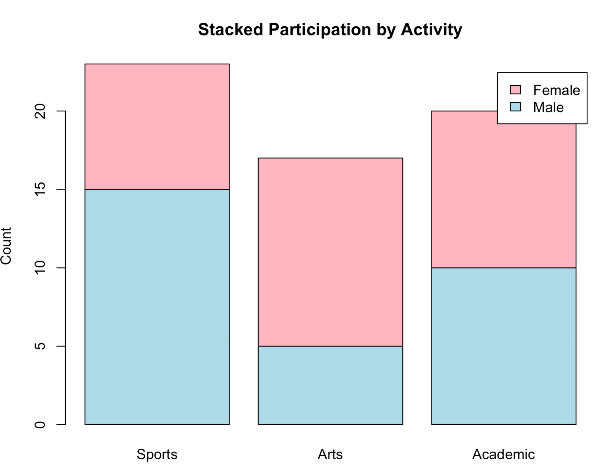<p>.font80[**Bar Chart**]</p></div>
  <div class="cell">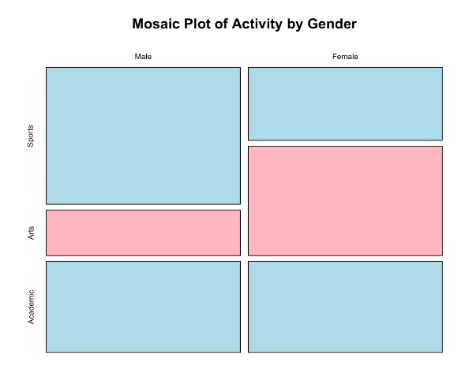<p>.font80[**Stacked Bar Chart**]</p></div>
</div>
]

---
### Categorical vs. Numeric

.pull-left[.font90[
**Examples:**

- Compare test scores (numeric) between two classes A and B (categorical).
- Compare heights between boys and girls.
- Compare some measurement across different categories (like income across different education levels).

.content-box-blue[
A **side-by-side boxplot** is the preferred choice.
]
]]

.pull-right[
```{r img53, echo=FALSE, warning=FALSE, fig.width=4, fig.height=6, out.width="52%", fig.show='hold', fig.align='center'}
# Read the image file
img <- readPNG("assets/53-img.png")

# Plot the image
grid.raster(img)
```
]

---
### Let's Try! &mdash; R

.pull-left[
.content-box-blue[
Read **`Student_Data_Ch8.csv`** and create a side-by-side box plot for Grade and Exam Scores.
]

```r
# Read the data
df <- read.csv("Student_Data_Ch8.csv")

# Boxplot: Exam Score by Grade
boxplot(Exam_Score ~ Grade, data = df,
        xlab = "Grade",
        ylab = "Exam Score",
        main = "Exam Scores by Grade",
        col = c("lightblue","blue",
                "darkgreen","purple"))
```
]

.pull-right[
```{r img54, echo=FALSE, warning=FALSE, out.width="92%", fig.show='hold', fig.align='center'}
# Read the image file
img <- readPNG("assets/54-img.png")

# Plot the image
grid.raster(img)
```
]

---
### Let's Try! &mdash; Python

.pull-left[
```python
import pandas as pd
import seaborn as sns
import matplotlib.pyplot as plt

# Load the dataset
df = pd.read_csv("Student_Data_Ch8.csv")

plt.figure(figsize=(8, 6))
sns.boxplot(x="Grade", y="Exam_Score",
            hue="Grade", data=df,
            palette="pastel", legend=False)
plt.xlabel("Grade")
plt.ylabel("Exam Score")
plt.title("Exam Scores by Grade")
plt.grid(True)
plt.show()
```
]

.pull-right[
```{r img55, echo=FALSE, warning=FALSE, out.width="92%", fig.show='hold', fig.align='center'}
# Read the image file
img <- readPNG("assets/55-img.png")

# Plot the image
grid.raster(img)
```
]

---
### Patterns in Bivariate Analysis

.pull-left[.font85[
.content-box-green[
**`r fontawesome::fa("arrow-trend-up", fill = "#4a7fb5")` Positive Association**

As one variable increases, the other tends to increase (more study time, higher scores).
]

.content-box-yellow[
**`r fontawesome::fa("arrow-trend-down", fill = "#4a7fb5")` Negative Association**

As one variable increases, the other tends to decrease (more absences, lower grades).
]

.content-box-blue[
**`r fontawesome::fa("shuffle", fill = "#4a7fb5")` No Association**

No clear relationship between variables (random cloud in scatterplot).
]

.content-box-blue[
**`r fontawesome::fa("people-group", fill = "#4a7fb5")` Group Differences**

One category consistently has higher/lower values than another.
]
]]

.pull-right[
```{r img56, echo=FALSE, warning=FALSE, out.width="80%", fig.show='hold', fig.align='center'}
# Read the image file
img <- readPNG("assets/56-img.png")

# Plot the image
grid.raster(img)
```
]

---
### Your Turn!

.content-box-blue[
Explore the **`Student_Data_Ch8.csv`** dataset with the bivariate tools you just learned &mdash; scatterplots, contingency tables, and side-by-side boxplots.
]

#### `r fontawesome::fa("code", height = "1em", fill = "#4a7fb5")` &nbsp; Example code is under **`Ch8.R`** and **`Ch8.ipynb`**

#### `r fontawesome::fa("pen", height = "1em", fill = "#4a7fb5")` &nbsp; For each exploration, write a brief summary of what you found

---
class: segue-yellow

# Visual Tools for EDA: <br> Charts that Tell a Story `r top_icon("chart-pie")`

---
### Visual Tools for EDA

.font95[Different charts help us see different aspects of our data. **Choose the right visual for your data type and question.**]

<div class="img-row" style="max-width: 95%; margin-left: auto; margin-right: auto;">
  <div class="cell">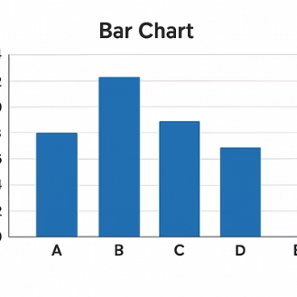<p>.font80[**Bar Chart**]</p></div>
  <div class="cell">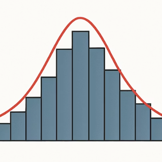<p>.font80[**Histogram**]</p></div>
  <div class="cell">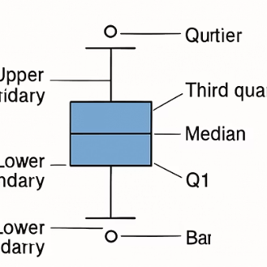<p>.font80[**Boxplot**]</p></div>
  <div class="cell">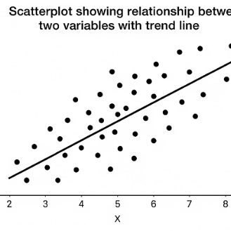<p>.font80[**Scatterplot**]</p></div>
  <div class="cell">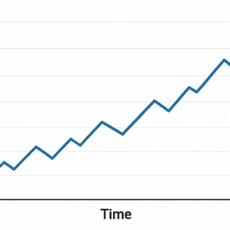<p>.font80[**Line Chart**]</p></div>
</div>

---
### Bar Chart

.pull-left[
.content-box-blue[
**`r fontawesome::fa("circle-check", fill = "#4a7fb5")` When to Use**

- For categorical data
- To show frequencies or counts
- To compare categories
]

.content-box-green[
**`r fontawesome::fa("lightbulb", fill = "#4a7fb5")` Tips**

- Label categories clearly
- Consider sorting by height
- Use grouped bars for multiple categories
]
]

.pull-right[
```{r img63, echo=FALSE, warning=FALSE, out.width="95%", fig.show='hold', fig.align='center'}
# Read the image file
img <- readPNG("assets/63-img.png")

# Plot the image
grid.raster(img)
```
]

---
### Histogram

.pull-left[
.content-box-blue[
**`r fontawesome::fa("circle-check", fill = "#4a7fb5")` When to Use**

- For numerical data
- To show distribution
- To see shape, center, spread
]

.content-box-green[
**`r fontawesome::fa("lightbulb", fill = "#4a7fb5")` Tips**

- Choose appropriate bin width
- Label axes clearly
- Look for patterns in shape
]
]

.pull-right[
```{r img64, echo=FALSE, warning=FALSE, out.width="95%", fig.show='hold', fig.align='center'}
# Read the image file
img <- readPNG("assets/64-img.png")

# Plot the image
grid.raster(img)
```
]

---
### Boxplot

.pull-left[
.content-box-blue[
**`r fontawesome::fa("circle-check", fill = "#4a7fb5")` When to Use**

- For numerical data
- To show distribution summary
- To compare groups
]

.content-box-green[
**`r fontawesome::fa("lightbulb", fill = "#4a7fb5")` Tips**

- Note the median (middle line)
- Check for outliers (dots)
- Compare box sizes for spread
]
]

.pull-right[
```{r img65, echo=FALSE, warning=FALSE, out.width="95%", fig.show='hold', fig.align='center'}
# Read the image file
img <- readPNG("assets/65-img.png")

# Plot the image
grid.raster(img)
```
]

---
### Scatterplot

.pull-left[
.content-box-blue[
**`r fontawesome::fa("circle-check", fill = "#4a7fb5")` When to Use**

- For two numerical variables
- To show relationships
- To identify correlation
]

.content-box-green[
**`r fontawesome::fa("lightbulb", fill = "#4a7fb5")` Tips**

- Look for trends (up/down)
- Check for outliers
- Consider adding a trend line
]
]

.pull-right[
```{r img66, echo=FALSE, warning=FALSE, out.width="95%", fig.show='hold', fig.align='center'}
# Read the image file
img <- readPNG("assets/66-img.png")

# Plot the image
grid.raster(img)
```
]

---
### Line Chart

.pull-left[
.content-box-blue[
**`r fontawesome::fa("circle-check", fill = "#4a7fb5")` When to Use**

- For data over time or sequence
- To show trends
- To track changes
]

.content-box-green[
**`r fontawesome::fa("lightbulb", fill = "#4a7fb5")` Tips**

- Only use when x-axis has natural order
- Label time points clearly
- Consider multiple lines for comparison
]
]

.pull-right[
```{r img67, echo=FALSE, warning=FALSE, out.width="95%", fig.show='hold', fig.align='center'}
# Read the image file
img <- readPNG("assets/67-img.png")

# Plot the image
grid.raster(img)
```
]

---
### Visualization Best Practices

.pull-left[.font90[
#### `r fontawesome::fa("tag", height = "1em", fill = "#4a7fb5")` &nbsp; Label Everything
Include clear titles, axis labels, and legends.

#### `r fontawesome::fa("minimize", height = "1em", fill = "#4a7fb5")` &nbsp; Keep It Simple
Don't overload one chart with too much information.

#### `r fontawesome::fa("palette", height = "1em", fill = "#4a7fb5")` &nbsp; Use Color Wisely
Colors should enhance understanding, not confuse.

#### `r fontawesome::fa("circle-check", height = "1em", fill = "#4a7fb5")` &nbsp; Double-Check
If something looks odd, verify the data.
]]

.pull-right[
```{r img68, echo=FALSE, warning=FALSE, fig.width=4, fig.height=6, out.width="50%", fig.show='hold', fig.align='center'}
# Read the image file
img <- readPNG("assets/68-img.png")

# Plot the image
grid.raster(img)
```
]

---
class: segue-green

# Case Study: EDA in Action `r top_icon("clipboard-check")`

---
### The Four Steps of an EDA Case Study

.font85[
<div class="chev-flow">
  <div class="chev-step">
    <div class="chev-right">`r fontawesome::fa("magnifying-glass", height = "1.6em", fill = "#0148A4")`</div>
    <p><strong>1. Overview &amp; Quality Check</strong><br>
    Read in the data, check the head, calculate basic summary stats for numeric columns and frequencies for categorical ones. Report/adjust if you see any weird values.</p>
  </div>
  <div class="chev-step">
    <div class="chev-right">`r fontawesome::fa("chart-area", height = "1.6em", fill = "#0148A4")`</div>
    <p><strong>2. Univariate EDA</strong><br>
    Explore each variable on its own: histograms, boxplots, bar charts, summary statistics.</p>
  </div>
  <div class="chev-step">
    <div class="chev-right">`r fontawesome::fa("project-diagram", height = "1.6em", fill = "#0148A4")`</div>
    <p><strong>3. Bivariate EDA</strong><br>
    Explore relationships between pairs of variables: scatterplots, grouped boxplots, contingency tables.</p>
  </div>
  <div class="chev-step">
    <div class="chev-right">`r fontawesome::fa("lightbulb", height = "1.6em", fill = "#0148A4")`</div>
    <p><strong>4. Patterns &amp; Anomalies</strong><br>
    Note trends, clusters, outliers, gaps, and anything unexpected &mdash; then form your story.</p>
  </div>
</div>
]

---
### Form Your Story!

.content-box-blue[
.font85[**Example:**

*"It appears that as students progress through grades, their homework load increases. Despite spending more time, their sleep tends to decrease slightly by senior year. We found that those involved in extracurricular activities tended to maintain slightly higher GPAs on average, though the causal relationship isn't clear. Most students have moderate sleep (~7 hours), but a few are getting dangerously low amounts of sleep which is a concern. We also saw that study habits vary widely &mdash; even among those with similar GPAs, homework hours ranged a lot, suggesting different work strategies or course loads."*
]
]

#### `r fontawesome::fa("pen", height = "1em", fill = "#4a7fb5")` &nbsp; Write down YOUR story from the data you explored.

---
### Common Patterns to Look For

<div class="img-row" style="max-width: 85%; margin-left: auto; margin-right: auto;">
  <div class="cell">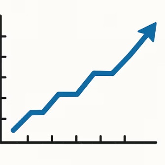<p>.font85[**Trends**<br>General direction in data]</p></div>
  <div class="cell">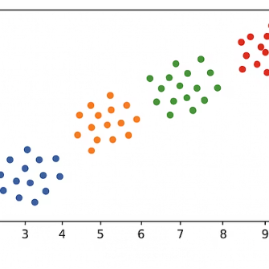<p>.font85[**Clusters**<br>Groupings of observations]</p></div>
  <div class="cell">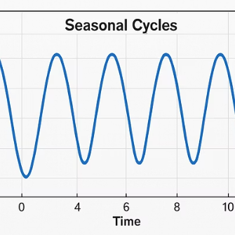<p>.font85[**Cycles**<br>Repeating patterns]</p></div>
  <div class="cell">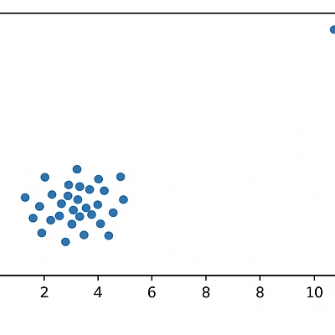<p>.font85[**Outliers**<br>Points that stand apart]</p></div>
</div>

---
background-image: url("assets/76-strip.png")
background-position: 5% 10%
background-size: 100% 20%
class: center, middle

<br>

<br>

<br>

### Common Anomalies to Watch For

.font85[
.pull-left[
.content-box-yellow[
**`r fontawesome::fa("triangle-exclamation", fill = "#4a7fb5")` Outliers**

Values far from the rest. Could be errors or interesting exceptions.
]

.content-box-yellow[
**`r fontawesome::fa("grip-lines-vertical", fill = "#4a7fb5")` Gaps**

Ranges where no observations fall. Might indicate an interesting divide.
]
]

.pull-right[
.content-box-yellow[
**`r fontawesome::fa("circle-question", fill = "#4a7fb5")` Unexpected Patterns**

Relationships that don't match what you'd expect based on theory.
]

.content-box-yellow[
**`r fontawesome::fa("bug", fill = "#4a7fb5")` Data Errors**

Impossible values (negative heights) or duplicate records that don't make sense.
]
]
]

---
### The EDA Process

.font85[
<div class="chev-flow">
  <div class="chev-step">
    <div class="chev-right">`r fontawesome::fa("circle-question", height = "1.6em", fill = "#0148A4")`</div>
    <p><strong>1. Ask Questions</strong><br>
    What do I want to know?</p>
  </div>
  <div class="chev-step">
    <div class="chev-right">`r fontawesome::fa("magnifying-glass", height = "1.6em", fill = "#0148A4")`</div>
    <p><strong>2. Explore</strong><br>
    Look at variables and relationships.</p>
  </div>
  <div class="chev-step">
    <div class="chev-right">`r fontawesome::fa("lightbulb", height = "1.6em", fill = "#0148A4")`</div>
    <p><strong>3. Discover</strong><br>
    Find patterns and anomalies.</p>
  </div>
  <div class="chev-step">
    <div class="chev-right">`r fontawesome::fa("rotate", height = "1.6em", fill = "#0148A4")`</div>
    <p><strong>4. Refine</strong><br>
    Adjust and ask new questions.</p>
  </div>
</div>
]

--

.content-box-blue[
.font95[**EDA is iterative** &mdash; one finding often leads to new questions and further exploration.]
]

---
### Key Takeaways

.pull-left[.font85[
<div class="chev-row">
  <div class="chev">1</div>
  <div class="chev-text"><strong>EDA is Essential</strong><br>
  Always explore your data before jumping to conclusions or complex models.</div>
</div>

<div class="chev-row">
  <div class="chev">2</div>
  <div class="chev-text"><strong>Use Basic Operations</strong><br>
  Sorting, filtering, and grouping help answer simple but important questions.</div>
</div>

<div class="chev-row">
  <div class="chev">3</div>
  <div class="chev-text"><strong>Examine One Variable at a Time</strong><br>
  Understand distributions using summary statistics and visualizations.</div>
</div>

<div class="chev-row">
  <div class="chev">4</div>
  <div class="chev-text"><strong>Look for Relationships</strong><br>
  Explore how pairs of variables relate to each other.</div>
</div>
]]

.pull-right[
```{r img78, echo=FALSE, warning=FALSE, fig.width=4, fig.height=6, out.width="50%", fig.show='hold', fig.align='center'}
# Read the image file
img <- readPNG("assets/78-img.png")

# Plot the image
grid.raster(img)
```
]

---
background-image: url("assets/79-strip.png")
background-position: 5% 10%
background-size: 100% 20%

<br>

<br>

<br>

<br>

### More Key Takeaways

.font85[
<div class="chev-row-sm">
  <div class="chev-sm">1</div>
  <div class="chev-text"><strong>Visualize</strong> &mdash; a well-chosen plot can reveal insights at a glance that might be buried in numbers.</div>
</div>

<div class="chev-row-sm">
  <div class="chev-sm">2</div>
  <div class="chev-text"><strong>Watch for Patterns and Anomalies</strong> &mdash; look for trends, clusters, outliers, and other interesting features.</div>
</div>

<div class="chev-row-sm">
  <div class="chev-sm">3</div>
  <div class="chev-text"><strong>Be Iterative</strong> &mdash; EDA is not a strict recipe but an exploration that follows your curiosity.</div>
</div>

<div class="chev-row-sm">
  <div class="chev-sm">4</div>
  <div class="chev-text"><strong>Document Findings</strong> &mdash; keep track of what you discover to inform later analysis.</div>
</div>
]

---
class: segue-yellow

# Meet Your Coding Agent — <br> AI-Assisted Data Analysis `r top_icon("robot")`

---
### What is a Coding Agent?

.pull-left[.font80[
.content-box-blue[
**`r fontawesome::fa("robot", fill = "#4a7fb5")` An AI Programming Partner**

A coding agent is an AI (like Claude, GitHub Copilot, or ChatGPT) that understands your data goal, writes code, and explains results &mdash; like having a knowledgeable teammate.
]

.content-box-blue[
**`r fontawesome::fa("laptop-code", fill = "#4a7fb5")` What Can It Do?**

- Generate R or Python code from plain English
- Explain what code does, line by line
- Debug errors when things go wrong
- Suggest which charts to use and why
- Summarize findings in plain language
]
]]

.pull-right[.font80[
.content-box-yellow[
**`r fontawesome::fa("triangle-exclamation", fill = "#4a7fb5")` What It Is NOT**

Not a replacement for your thinking! You still need to understand the data, ask good questions, and critically evaluate the output. **Agents make mistakes &mdash; you are the expert.**
]

.content-box-green[
**`r fontawesome::fa("globe", fill = "#4a7fb5")` Real Examples**

- **Claude.ai** &mdash; conversational, explains concepts
- **GitHub Copilot** &mdash; autocompletes in VS Code
- **ChatGPT / Gemini** &mdash; general-purpose assistants

All can write and explain data analysis code when given clear, specific instructions.
]
]]

---
### How Coding Agents Help Your EDA

.pull-left[.font85[
#### `r fontawesome::fa("bolt", height = "1em", fill = "#4a7fb5")` &nbsp; Instant Code Generation
Describe your goal in plain English: *"Plot a histogram of Math scores colored by grade."* The agent writes the code instantly.

#### `r fontawesome::fa("bug", height = "1em", fill = "#4a7fb5")` &nbsp; Error Debugging
Paste an error message and the agent explains what went wrong and how to fix it.

#### `r fontawesome::fa("chart-column", height = "1em", fill = "#4a7fb5")` &nbsp; Chart Recommendations
Ask *"What chart should I use to compare GPA across grade levels?"* and get a justified answer.

#### `r fontawesome::fa("comments", height = "1em", fill = "#4a7fb5")` &nbsp; Interpretation Help
Share output or a plot description and ask *"What does this pattern tell us about the data?"*
]]

.pull-right[
```{r img25b, echo=FALSE, warning=FALSE, fig.width=4, fig.height=6, out.width="50%", fig.show='hold', fig.align='center'}
# Read the image file
img <- readPNG("assets/25-img.png")

# Plot the image
grid.raster(img)
```
]

---
### Prompting a Coding Agent: The Art of Good Instructions

.pull-left[
.content-box-yellow[
**`r fontawesome::fa("xmark", fill = "#D55E00")` Weak Prompt (Vague)**

*"Plot my data"*

**Problems:** No file mentioned. No column names. No chart type. No goal. The agent has to guess &mdash; and usually guesses wrong.
]

.content-box-green[
**`r fontawesome::fa("check", fill = "#009E73")` Strong Prompt (Specific)**

*"I have students.csv with columns Grade (9&ndash;12), Math_Score, and Sleep_Hours. Using Python, create a boxplot comparing Math_Score distributions for each grade level. Use seaborn and label axes clearly."*
]
]

.pull-right[.font85[
**Prompt Recipe (4 Ingredients):**

1. **Data:** Name the file and key columns
2. **Language:** Specify R or Python
3. **Goal:** Say exactly what you want to see or compute
4. **Format:** Mention chart type, labels, colors if needed

.content-box-blue[
**Pro tip:** If the code fails, paste the error back and say "I got this error &mdash; can you fix it?"
]

.content-box-yellow[
**Critical rule:** Always read and understand the code before running it. *Never paste blindly!*
]
]]

---
### Working WITH a Coding Agent (Not FOR It)

.font85[
#### `r fontawesome::fa("circle-question", height = "1em", fill = "#4a7fb5")` &nbsp; You Bring the Questions
Agents are powerful, but YOU decide what to investigate. Formulate your own hypotheses first, then ask the agent to help test them.

#### `r fontawesome::fa("magnifying-glass", height = "1em", fill = "#4a7fb5")` &nbsp; Verify Every Output
Check that results are plausible &mdash; do the numbers match what `summary()` told you? Is the sample size right?

#### `r fontawesome::fa("rotate", height = "1em", fill = "#4a7fb5")` &nbsp; Iterate and Refine
Good EDA is a conversation: run code, look at output, ask a follow-up. *"The histogram is right-skewed &mdash; what might explain this?"*

#### `r fontawesome::fa("quote-right", height = "1em", fill = "#4a7fb5")` &nbsp; Cite Your Work
When you use agent-generated code in a project, note it. Understand it well enough to explain every line if asked.
]

---
### Hands-On: Use a Coding Agent to Analyze Data

.font90[Open **Claude.ai** (or GitHub Copilot). Use `Student_Data_Ch8.csv` as your dataset for this activity.]

.font85[
<div class="chev-row">
  <div class="chev">1</div>
  <div class="chev-text"><strong>Write a prompt:</strong> Ask the agent to calculate summary statistics for Math_Score and Study_Hours. Run the code, check if results make sense.</div>
</div>

<div class="chev-row">
  <div class="chev">2</div>
  <div class="chev-text"><strong>Visualize:</strong> Prompt the agent to create a scatterplot of Study_Hours vs. Math_Score, colored by Grade. Describe what you see.</div>
</div>

<div class="chev-row">
  <div class="chev">3</div>
  <div class="chev-text"><strong>Dig deeper:</strong> Ask: "Does the relationship between study hours and scores look different for different grades?" Prompt the agent to help investigate.</div>
</div>

<div class="chev-row">
  <div class="chev">4</div>
  <div class="chev-text"><strong>Reflect:</strong> Write 3&ndash;5 sentences summarizing your findings. What did the agent do well? What did you have to correct or clarify? What would you ask next?</div>
</div>
]

---
### Correlation &ne; Causation: The Detective's Most Important Warning

.content-box-yellow[
.font95[**Just because two variables move together does NOT mean one causes the other!**]
]

.pull-left[.font80[
**Classic "Spurious" Correlations:**

- 🍨 **Ice cream sales &amp; shark attacks** &mdash; both rise in summer, but eating ice cream doesn't attract sharks. The hidden cause is *hot weather*.

- 🎬 **Nicolas Cage films &amp; pool drownings** &mdash; a real statistical correlation, and completely meaningless. Pure coincidence.

- 👟 **Shoe size &amp; reading ability in children** &mdash; both increase with age; *age* is the real driver.
]]

.pull-right[.font80[
**How to Think About It:**

- Ask: **Could there be a lurking variable?** A hidden third variable that drives both (like "age" or "season").

- Ask: **Does the direction make sense?** Causation requires a plausible mechanism &mdash; can you explain *how* A actually causes B?

- In EDA, always say **"associated with"** not "causes" unless you ran a controlled experiment.
]]

--

.content-box-blue[
.font85[**Discussion:** In our student data, study hours and exam scores are correlated. Does studying *cause* higher scores? How would you test this?]
]

---
### Chapter 8 Complete &mdash; You Are Now an EDA Detective!

.font85[
**Skills you've mastered in Chapter 8:**

- Sorting, filtering, and grouping data with R and Python
- Univariate analysis: histograms, boxplots, summary statistics
- Bivariate analysis: scatterplots, correlation, grouped boxplots
- Correlation &ne; causation &mdash; thinking critically about relationships
- Using a coding agent as a helper &mdash; prompting, verifying, and iterating
]

--

.content-box-green[
.font90[**Coming Up:** Making Inferences (from Sample to Population) &mdash; we'll go beyond describing data to making conclusions: confidence intervals, hypothesis testing, and statistical significance.]
]

```{r gen_pdf, include = FALSE, cache = FALSE, eval = FALSE}
library(renderthis)
# https://hhadah.github.io/nexellence-summer-instit/week-03-synthesis-communication-presentation/session-13-full-rehearsal-peer-feedback/13-class.html

to_pdf(from = "~/Documents/GiT/nexellence-summer-instit/week-03-synthesis-communication-presentation/session-13-full-rehearsal-peer-feedback/13-class.html",
       to = "~/Documents/GiT/nexellence-summer-instit/week-03-synthesis-communication-presentation/session-13-full-rehearsal-peer-feedback/13-class.pdf")
to_pdf(from = "~/Documents/GiT/nexellence-summer-instit/week-03-synthesis-communication-presentation/session-13-full-rehearsal-peer-feedback/13-class.html")
```
