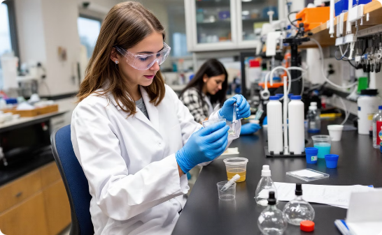
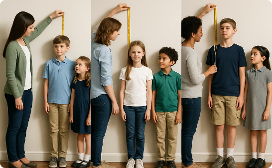
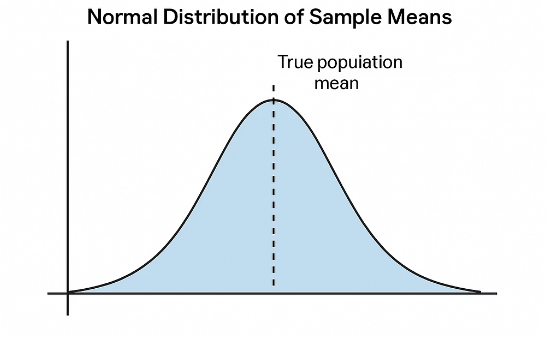
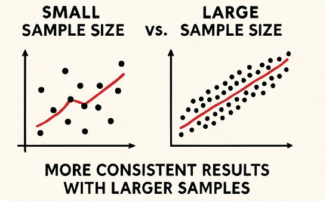
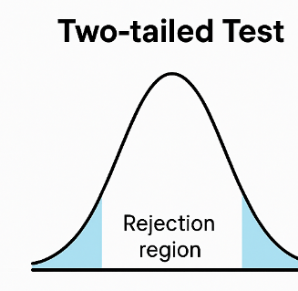
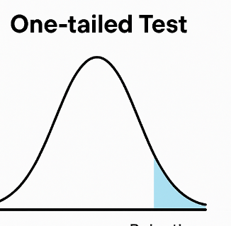

layout: true
<div style="position: absolute;left:20px;bottom:5px;color:black;font-size: 12px;">Nexellence Institute | `r rmarkdown::metadata$title` | `r format(Sys.time(), '%d %B %Y')`</div>

<!--- `r rmarkdown::metadata$subtitle` | `r format(Sys.time(), '%d %B %Y')`-->

---

class: title-slide
background-position: 10% 90%, 100% 50%
background-size: 160px, 50% 100%
background-color: #0148A4

```{r, load_refs, echo=FALSE, cache=FALSE, message=FALSE}
library(RefManageR)
BibOptions(check.entries = FALSE,
           bib.style = "authoryear",
           cite.style = 'authoryear',
           style = "markdown",
           hyperlink = FALSE,
           dashed = FALSE)
myBib <- ReadBib("assets/example.bib", check = FALSE)
top_icon = function(x) {
  icons::icon_style(
    icons::fontawesome(x),
    position = "fixed", top = 10, right = 10
  )
}
```

```{r setup, include=FALSE}
# xaringanExtra::use_scribble() ## Draw on slides. Requires dev version of xaringanExtra.
options(modelsummary_factory_latex = "kableExtra")
options(htmltools.dir.version = FALSE)
library(knitr)
opts_chunk$set(
  fig.align="center",
  fig.height=4, fig.width=6,
  out.width="748px", out.length="520.75px",
  dpi=300, #fig.path='Figs/',
  cache=T#, echo=F, warning=F, message=F
  )
```


```{r, cache=FALSE, message=FALSE, warning=FALSE, include=TRUE, eval=TRUE, results=FALSE, echo=FALSE, tidy.opts = list(width.cutoff = 50), tidy = TRUE}
## Load and install the packages that we'll be using today
if (!require("pacman")) install.packages("pacman")
pacman::p_load(tictoc, parallel, pbapply, future, future.apply, furrr, RhpcBLASctl, memoise, here, foreign, mfx, tidyverse, hrbrthemes, estimatr, ivreg, fixest, sandwich, lmtest, margins, vtable, broom, modelsummary, stargazer, fastDummies, recipes, dummy, gplots, haven, huxtable, kableExtra, gmodels, survey, gtsummary, data.table, tidyfast, dtplyr, microbenchmark, ggpubr, tibble, viridis, wesanderson, censReg, rstatix, srvyr, formatR, sysfonts, showtextdb, showtext, thematic, sampleSelection, RefManageR, DT, googleVis, png, grid)

font_add_google("Fira Sans", "firasans")
font_add_google("Fira Code", "firasans")

showtext_auto()

theme_customs <- theme(
  text = element_text(family = 'firasans', size = 16),
  plot.title.position = 'plot',
  plot.title = element_text(
    face = 'bold',
    colour = thematic::okabe_ito(8)[6],
    margin = margin(t = 2, r = 0, b = 7, l = 0, unit = "mm")
  ),
)

colors <-  thematic::okabe_ito(5)

theme_set(hrbrthemes::theme_ipsum() + theme_customs)

# COLOR PALLETES
library(paletteer)

### COLOR BLIND PALLETES
colorBlindness <- paletteer_d("colorBlindness::Blue2Orange12Steps")
cbbPalette <- c("#000000", "#E69F00", "#56B4E9", "#009E73", "#F0E442", "#0072B2", "#D55E00", "#CC79A7")

# To use for fills, add
  scale_fill_manual(values="colorBlindness::Blue2Orange12Steps")

# To use for line and point colors, add
  scale_colour_manual(values="colorBlindness::Blue2Orange12Steps")
```

```{r xaringan-panelset, echo=FALSE}
xaringanExtra::use_panelset()
```


```{css, echo=F}
    /* Table width = 100% max-width */

    .remark-slide table{
        width: auto !important; /* Adjusts table width */
    }

    /* Change the background color to white for shaded rows (even rows) */

    .remark-slide thead, .remark-slide tr:nth-child(2n) {
        background-color: white;
    }
    .remark-slide thead, .remark-slide tr:nth-child(n) {
        background-color: white;
    }

    .chev-row {
      display: flex;
      align-items: center;
      gap: 0.9em;
      margin-bottom: 0.6em;
    }
    .chev {
      flex: 0 0 62px;
      height: 78px;
      background: #c9e4f6;
      clip-path: polygon(0 0, 50% 14%, 100% 0, 100% 78%, 50% 100%, 0 78%);
      display: flex;
      align-items: center;
      justify-content: center;
      font-weight: bold;
      font-size: 1.7em;
      color: #1a1a1a;
    }
    .chev-text {
      flex: 1;
    }
    .chev-sm {
      flex: 0 0 52px;
      height: 58px;
      background: #c9e4f6;
      clip-path: polygon(0 0, 50% 14%, 100% 0, 100% 78%, 50% 100%, 0 78%);
      display: flex;
      align-items: center;
      justify-content: center;
    }
    .chev-row-sm {
      display: flex;
      align-items: center;
      gap: 0.8em;
      margin-bottom: 0.25em;
    }

    .chev-flow {
      display: flex;
      gap: 0.7em;
      margin-top: 1em;
    }
    .chev-step {
      flex: 1;
      text-align: center;
    }
    .chev-step p {
      text-align: left;
    }
    .chev-right {
      height: 58px;
      background: #c9e4f6;
      clip-path: polygon(0 0, 86% 0, 100% 50%, 86% 100%, 0 100%, 14% 50%);
      display: flex;
      align-items: center;
      justify-content: center;
      margin-bottom: 0.6em;
    }

    .three-col {
      display: flex;
      gap: 1.5em;
      margin-top: 1.5em;
    }
    .three-col .col {
      flex: 1;
      text-align: center;
    }
    .three-col .col p:first-child {
      margin-bottom: 0.4em;
    }

    .img-row {
      display: flex;
      gap: 1em;
      align-items: center;
      justify-content: center;
      margin-top: 0.8em;
    }
    .img-row img {
      max-width: 100%;
      border-radius: 6px;
    }
    .img-row .cell {
      flex: 1;
      text-align: center;
    }

    .remark-code {
      font-size: 0.72em !important;
    }

```

# .text-shadow[.white[Outline for Today]]

<ol>
    <li><h4 class="white">What Is Statistical Inference? Population vs. Sample</h4></li>
    <li><h4 class="white">Sampling Variability & Sampling Distributions</h4></li>
    <li><h4 class="white">Confidence Intervals</h4></li>
    <li><h4 class="white">Hypothesis Testing: Making Decisions with Data</h4></li>
    <li><h4 class="white">Practice Problems & Simulations</h4></li>
    <li><h4 class="white">Coding Agents for Statistical Inference</h4></li>
</ol>

---
class: segue-yellow

# Chapter 9: Making Inferences — <br> From Sample to Population `r top_icon("chart-line")`

### .white[How do you know what you don't know? Using data to draw confident conclusions about the world.]

---
### Making Inferences: From Sample to Population

.content-box-blue[
Welcome to our exploration of **statistical inference**! We'll learn how to draw conclusions about entire populations using just sample data. This powerful approach allows us to make educated statements with **quantified uncertainty**.
]

---
### What Is Statistical Inference?

.pull-left[.font90[
.content-box-blue[
**`r fontawesome::fa("arrow-right", fill = "#4a7fb5")` From Sample to Population**

Statistical inference uses sample data to draw conclusions about broader populations.
]

.content-box-blue[
**`r fontawesome::fa("percent", fill = "#4a7fb5")` Quantifying Uncertainty**

We can make educated statements with measured confidence (like "we are 95% confident that...").
]

.content-box-blue[
**`r fontawesome::fa("wrench", fill = "#4a7fb5")` Practical Necessity**

Sampling is necessary when studying entire populations is impractical or impossible.
]
]]

.pull-right[
```{r img03, echo=FALSE, warning=FALSE, fig.width=4, fig.height=6, out.width="50%", fig.show='hold', fig.align='center'}
# Read the image file
img <- readPNG("assets/03-img.png")

# Plot the image
grid.raster(img)
```
]

---
### Why Do We Need Inference?

.font80[
.three-col[
.col[


**School Height Example**

Measuring 50 students gives a sample average of 5'6". Inference helps estimate the true school average with a margin of error.
]
.col[


**Teaching Methods Comparison**

Testing methods on some classes helps determine if observed differences likely reflect true differences across all students.
]
.col[


**Scientific Research**

Limited experiments allow scientists to make broader conclusions about phenomena when properly analyzed.
]
]
]

---
### In This Session You Will Learn

.pull-left[.font90[
#### `r fontawesome::fa("users", height = "1em", fill = "#4a7fb5")` &nbsp; Populations vs. Samples
Understanding the relationship between the whole group and the subset we study.

#### `r fontawesome::fa("shuffle", height = "1em", fill = "#4a7fb5")` &nbsp; Sampling Variability
How different samples might give different results and what that means.

#### `r fontawesome::fa("arrows-left-right", height = "1em", fill = "#4a7fb5")` &nbsp; Confidence Intervals
Creating ranges of plausible values for population parameters.

#### `r fontawesome::fa("scale-balanced", height = "1em", fill = "#4a7fb5")` &nbsp; Hypothesis Testing
A formal framework for testing claims about populations.
]]

.pull-right[
```{r img05, echo=FALSE, warning=FALSE, fig.width=4, fig.height=6, out.width="50%", fig.show='hold', fig.align='center'}
# Read the image file
img <- readPNG("assets/05-img.png")

# Plot the image
grid.raster(img)
```
]

---
### Population vs. Sample

.pull-left[
.content-box-blue[
**`r fontawesome::fa("earth-americas", fill = "#4a7fb5")` Population**

The entire group we're interested in studying.

- All students in your school
- All voters in a city
- Every manufactured item from a factory

We denote population quantities as **parameters** ( &mu;, p ).
]
]

.pull-right[
.content-box-green[
**`r fontawesome::fa("user-group", fill = "#4a7fb5")` Sample**

A subset of the population that we actually observe.

- 50 surveyed students
- 1000 polled voters
- 200 tested items

We denote sample quantities as **statistics** ( $\bar{x}$, $\hat{p}$ ).
]
]

---
### Why Not Study the Entire Population?

.pull-left[.font90[
#### `r fontawesome::fa("users", height = "1em", fill = "#4a7fb5")` &nbsp; Too Large
Many populations contain thousands or millions of individuals, making complete measurement impractical.

#### `r fontawesome::fa("coins", height = "1em", fill = "#4a7fb5")` &nbsp; Too Expensive
Collecting data from every member of a population often costs too much time and money.

#### `r fontawesome::fa("ban", height = "1em", fill = "#4a7fb5")` &nbsp; Sometimes Impossible
Measuring every fish in the sea or every potential customer is simply not feasible.
]]

.pull-right[
```{r img07, echo=FALSE, warning=FALSE, fig.width=4, fig.height=6, out.width="50%", fig.show='hold', fig.align='center'}
# Read the image file
img <- readPNG("assets/07-img.png")

# Plot the image
grid.raster(img)
```
]

---
### Random Sampling

.font95[Not just any sample will do! To make valid inferences, we need **random samples**.]

.pull-left[.font85[
.content-box-blue[
**`r fontawesome::fa("scale-balanced", fill = "#4a7fb5")` Equal Chance**

Every member of the population should have an equal chance of being selected.
]

.content-box-blue[
**`r fontawesome::fa("people-group", fill = "#4a7fb5")` Representativeness**

Random sampling helps ensure the sample is a "mini version" of the population.
]
]]

.pull-right[.font85[
.content-box-blue[
**`r fontawesome::fa("shield-halved", fill = "#4a7fb5")` Avoiding Bias**

Random selection helps prevent systematic biases that could skew results.
]

.content-box-blue[
**`r fontawesome::fa("check-double", fill = "#4a7fb5")` Statistical Validity**

Probability theory only applies correctly when samples are truly random.
]
]]

---
### Types of Sampling Bias

.pull-left[.font85[
.content-box-yellow[
**`r fontawesome::fa("hand", fill = "#4a7fb5")` Voluntary Response Bias**

When only those who feel strongly about an issue respond to a survey, skewing results.
]

.content-box-yellow[
**`r fontawesome::fa("hand-point-right", fill = "#4a7fb5")` Convenience Sampling**

Selecting easily accessible individuals rather than a true random sample.
]

.content-box-yellow[
**`r fontawesome::fa("filter", fill = "#4a7fb5")` Selection Bias**

When certain groups are systematically more likely to be included than others.
]

.content-box-yellow[
**`r fontawesome::fa("user-slash", fill = "#4a7fb5")` Undercoverage**

When portions of the population have little or no chance of being sampled.
]
]]

.pull-right[
```{r img09, echo=FALSE, warning=FALSE, fig.width=4, fig.height=6, out.width="50%", fig.show='hold', fig.align='center'}
# Read the image file
img <- readPNG("assets/09-img.png")

# Plot the image
grid.raster(img)
```
]

---
### Sample Size Matters

.pull-left[
.content-box-blue[
.font140[<strong style="color:#0148A4;">30</strong>] **Minimum**

Generally considered the minimum sample size for many statistical methods.
]

.content-box-green[
.font140[<strong style="color:#0148A4;">100</strong>] **Better**

Provides more precise estimates with narrower confidence intervals.
]

.font85[Larger samples give more precise information. The margin of error shrinks proportional to $1/\sqrt{n}$ &mdash; doubling precision requires **4x the sample size**. A small sample might lead to wrong conclusions due to random chance.]
]

.pull-right[
```{r img10, echo=FALSE, warning=FALSE, out.width="72%", fig.show='hold', fig.align='center'}
# Read the image file
img <- readPNG("assets/10-img.png")

# Plot the image
grid.raster(img)
```
]

---
class: segue-green

# Sampling Variability and <br> Sampling Distributions `r top_icon("dice")`

---
### Sampling Variability

.font95[Different random samples will give different results &mdash; **this is natural and expected!**]

.font80[
.three-col[
.col[


**Multiple Samples**

Each sample of 50 students might give a different average height: 5'6", 5'7", 5'5".
]
.col[


**Predictable Variation**

Sample statistics will cluster around the true population parameter in a predictable way.
]
.col[


**Sample Size Effect**

Larger samples show less variability and provide more consistent estimates.
]
]
]

---
### Sampling Distribution

.content-box-blue[
The **sampling distribution** is the distribution of a sample statistic (like the mean) across **all possible samples** of the same size from the population.
]

.font90[
- Imagine taking thousands of samples and computing the mean of each &mdash; the histogram of those means *is* the sampling distribution.

- It tells us **how much a statistic typically varies** from sample to sample.

- Its standard deviation is called the **standard error**: $SE = \sigma/\sqrt{n}$.
]

---
### Central Limit Theorem

.pull-left[.font85[
.content-box-blue[
**`r fontawesome::fa("bullseye", fill = "#4a7fb5")` Accurate Results**

For reasonably large samples, the sampling distribution of the sample mean is approximately **normal**.
]

.content-box-blue[
**`r fontawesome::fa("shapes", fill = "#4a7fb5")` True Regardless of Original Shape**

Even if the original data are skewed, the means will follow a normal distribution if n is large enough.
]

.content-box-blue[
**`r fontawesome::fa("crosshairs", fill = "#4a7fb5")` Centers at &mu;**

The sampling distribution centers at the true population mean.
]

.content-box-blue[
**`r fontawesome::fa("arrows-left-right", fill = "#4a7fb5")` Spread = &sigma;/&radic;n**

The standard error decreases as sample size increases.
]
]]

.pull-right[
```{r img14, echo=FALSE, warning=FALSE, fig.width=4, fig.height=6, out.width="52%", fig.show='hold', fig.align='center'}
# Read the image file
img <- readPNG("assets/14-img.png")

# Plot the image
grid.raster(img)
```
]

---
### Example &mdash; Simulation of a Sampling Distribution

.pull-left[.font85[
**Scenario:**

- True proportion preferring online learning: **50%**
- Sample size: **100 students** per sample
- Number of samples: **10,000**

This histogram shows 10,000 sample proportions from samples of size n=100, with true p=0.5. Notice the **bell shape** and how most values cluster around 0.50.

.content-box-blue[
See `Ch9.R` and `Ch9.ipynb` for the code.
]
]]

.pull-right[
```{r img15, echo=FALSE, warning=FALSE, out.width="92%", fig.show='hold', fig.align='center'}
# Read the image file
img <- readPNG("assets/15-img.png")

# Plot the image
grid.raster(img)
```
]

---
### What We Learn from Sampling Distributions

<div class="chev-row">
  <div class="chev">1</div>
  <div class="chev-text"><strong>Quantify Uncertainty</strong><br>
  They tell us how much sample statistics typically vary from the true parameter.</div>
</div>

<div class="chev-row">
  <div class="chev">2</div>
  <div class="chev-text"><strong>Evaluate Unusual Results</strong><br>
  Help determine if an observed statistic is within typical variation or unusually extreme.</div>
</div>

<div class="chev-row">
  <div class="chev">3</div>
  <div class="chev-text"><strong>Create Confidence Intervals</strong><br>
  Allow us to construct ranges likely to contain the true parameter.</div>
</div>

<div class="chev-row">
  <div class="chev">4</div>
  <div class="chev-text"><strong>Test Hypotheses</strong><br>
  Provide a foundation for determining if results are statistically significant.</div>
</div>

---
class: segue-yellow

# Confidence Intervals: The Basics `r top_icon("arrows-alt-h")`

---
### Confidence Interval Formulas

.pull-left[.font90[
**For a Mean (Large Sample):**

$$\bar{x} \pm 1.96 \cdot \frac{s}{\sqrt{n}}$$

*Where 1.96 is the z-score for 95% confidence.*

**For a Proportion:**

$$\hat{p} \pm 1.96 \cdot \sqrt{\frac{\hat{p}(1-\hat{p})}{n}}$$

*Where* $\hat{p}$ *is the sample proportion.*

**Different Confidence Levels:**

- 90%: use **1.645** instead of 1.96
- 99%: use **2.576** instead of 1.96
]]

.pull-right[
```{r img18, echo=FALSE, warning=FALSE, fig.width=4, fig.height=6, out.width="55%", fig.show='hold', fig.align='center'}
# Read the image file
img <- readPNG("assets/18-img.png")

# Plot the image
grid.raster(img)
```
]

---
### Interpreting Confidence Intervals

.font85[
.content-box-green[
**`r fontawesome::fa("check", fill = "#009E73")` Correct Interpretation**

"We are 95% confident that the true average height lies between 5'4" and 5'8"."
]

.content-box-blue[
**`r fontawesome::fa("gears", fill = "#4a7fb5")` About the Method**

If we took many samples and computed a 95% CI from each, about 95% would contain the true mean.
]

.content-box-yellow[
**`r fontawesome::fa("xmark", fill = "#D55E00")` Common Misinterpretation**

It does NOT mean there's a 95% probability the true mean is in this specific interval.
]

.content-box-blue[
**`r fontawesome::fa("lightbulb", fill = "#4a7fb5")` Simplified View**

A range that likely covers the true value, with "likely" quantified as 95% confidence.
]
]

---
### Example: Election Poll Confidence Interval

.font90[A poll of **n = 1000 voters** finds **520 (52%)** support Candidate X. What's the 95% CI for the true proportion?]

--

$$\hat{p} \pm 1.96\sqrt{\frac{\hat{p}(1-\hat{p})}{n}} = 0.52 \pm 1.96\sqrt{\frac{0.52 \times 0.48}{1000}}$$

--

$$= 0.52 \pm 1.96 \times 0.0158 = 0.52 \pm 0.031$$

--

.content-box-green[
.font95[**95% CI: [0.489, 0.551]** &mdash; that is, between 48.9% and 55.1%. Since the interval **includes 50%**, we can't be confident Candidate X is really ahead &mdash; *it's too close to call*.]
]

---
### Confidence Level Trade-offs

<div class="chev-row">
  <div class="chev">90</div>
  <div class="chev-text"><strong>90% Confidence</strong><br>
  Narrower interval, less confident it contains the true value.</div>
</div>

<div class="chev-row">
  <div class="chev">95</div>
  <div class="chev-text"><strong>95% Confidence</strong><br>
  Standard level, balancing precision and confidence.</div>
</div>

<div class="chev-row">
  <div class="chev">99</div>
  <div class="chev-text"><strong>99% Confidence</strong><br>
  Wider interval, more confident it contains the true value.</div>
</div>

--

.content-box-blue[
.font95[Higher confidence requires a wider interval. **To be sure you capture the true value, you need to cast a wider net.**]
]

---
### Calculate CI with R

```r
prop.test(520, 1000, conf.level=0.95, correct=FALSE)
```

--

```{r img23, echo=FALSE, warning=FALSE, out.width="72%", fig.show='hold', fig.align='center'}
# Read the image file
img <- readPNG("assets/23-img.png")

# Plot the image
grid.raster(img)
```

---
### Calculate CI with Python

```python
import scipy.stats as stats

# sample data
p_hat = 0.52  # sample proportion
n = 1000      # sample size
confidence_level = 0.95

# Compute confidence interval using scipy
ci_low, ci_upp = stats.binomtest(int(p_hat * n), n).proportion_ci(
    confidence_level=confidence_level)

print(f"SciPy Confidence Interval: ({ci_low:.3f}, {ci_upp:.3f})")
```

--

```{r img24, echo=FALSE, warning=FALSE, out.width="60%", fig.show='hold', fig.align='center'}
# Read the image file
img <- readPNG("assets/24-img.png")

# Plot the image
grid.raster(img)
```

---
class: segue-green

# Hypothesis Testing: <br> Making Decisions with Data `r top_icon("balance-scale")`

---
### Null and Alternative Hypotheses

.pull-left[.font85[
.content-box-blue[
**Null Hypothesis (H&#8320;)**

Statement of "no effect," "no difference," or status quo. What we assume true unless evidence suggests otherwise.

*Examples: "coin is fair (p = 0.5)" or "teaching methods have equal effects"*
]

.content-box-green[
**Alternative Hypothesis (H&#8321;)**

What we're seeking evidence for &mdash; a new effect or difference.

*Examples: "coin is biased (p &ne; 0.5)" or "new method changes scores"*
]

.content-box-yellow[
**Types of Alternatives**

- **Two-sided:** different in either direction (&ne;)
- **One-sided:** different in a specific direction (&gt; or &lt;)
]
]]

.pull-right[
```{r img27, echo=FALSE, warning=FALSE, fig.width=4, fig.height=6, out.width="50%", fig.show='hold', fig.align='center'}
# Read the image file
img <- readPNG("assets/27-img.png")

# Plot the image
grid.raster(img)
```
]

---
### The p-value

.font85[
.content-box-blue[
**`r fontawesome::fa("book", fill = "#4a7fb5")` Definition**

Probability of observing a result as extreme as (or more extreme than) what we got, **assuming H&#8320; is true**. It does NOT measure how likely H&#8320; is.
]

.content-box-blue[
**`r fontawesome::fa("face-surprise", fill = "#4a7fb5")` Interpretation**

Measures how *surprised* we should be by our data if H&#8320; were true.
]

.content-box-green[
**`r fontawesome::fa("arrow-down", fill = "#4a7fb5")` Small p-value (p &lt; &alpha;)**

Data would be very rare if H&#8320; were true &mdash; strong evidence to reject H&#8320;. But "rare" under H&#8320; is not the same as "impossible."
]

.content-box-yellow[
**`r fontawesome::fa("arrow-up", fill = "#4a7fb5")` Large p-value (p &ge; &alpha;)**

Data is plausible under H&#8320;. We *fail to reject* H&#8320; &mdash; but this does NOT mean H&#8320; is true.
]
]

---
### Coin Flipping Test

.pull-left[
**Scenario:**

- We flipped a coin **16 times**
- Got **15 heads**
- Is the coin biased?

.content-box-blue[
We can answer this question via hypothesis testing:

- **H&#8320;: p = 0.5** (coin is fair)
- **H&#8321;: p &ne; 0.5** (coin is biased)
]
]

.pull-right[
```{r img29, echo=FALSE, warning=FALSE, out.width="55%", fig.show='hold', fig.align='center'}
# Read the image file
img <- readPNG("assets/29-img.png")

# Plot the image
grid.raster(img)
```
]

---
### Coin Flipping Test: The Result

.font95[Under H&#8320; (a fair coin), how likely is a result as extreme as 15 heads out of 16? We compute the two-sided p-value with a binomial test:]

```r
binom.test(15, 16, p = 0.5)
```

--

.content-box-green[
.font100[The p-value is about **0.00026** &mdash; way below 0.05.]
]

--

#### `r fontawesome::fa("gavel", height = "1em", fill = "#4a7fb5")` &nbsp; We reject H&#8320; strongly and accept H&#8321;.

#### `r fontawesome::fa("coins", height = "1em", fill = "#4a7fb5")` &nbsp; The coin is almost certainly **not fair**.

---
### Comparing Means (Two-Sample)

.pull-left[
**Class A (New Curriculum):**

- Sample size = 30
- Mean = 78
- Standard deviation = 10

**Class B (Old Curriculum):**

- Sample size = 30
- Mean = 74
- Standard deviation = 11
]

.pull-right[
```{r img32, echo=FALSE, warning=FALSE, out.width="70%", fig.show='hold', fig.align='center'}
# Read the image file
img <- readPNG("assets/32-img.png")

# Plot the image
grid.raster(img)
```
]

--

.font90[**Question:** is the 4-point difference real, or could it be sampling noise? A **two-sample t-test** gives t &asymp; 1.47 and p &asymp; 0.15 &mdash; *not significant at &alpha; = 0.05.* We don't have enough evidence that the new curriculum is better.]

---
### What Affects Significance?

.three-col[
.col[
`r fontawesome::fa("arrows-up-down", height = "2.5em", fill = "#4a7fb5")`

**Effect Size**

.font85[Bigger differences between groups are easier to detect.]
]
.col[
`r fontawesome::fa("users", height = "2.5em", fill = "#4a7fb5")`

**Sample Size**

.font85[Larger samples shrink the standard error and make real effects visible.]
]
.col[
`r fontawesome::fa("arrows-left-right", height = "2.5em", fill = "#4a7fb5")`

**Variability**

.font85[Less spread within groups makes differences between groups stand out.]
]
]

---
### Significance Level (&alpha;)

.pull-left[.font85[
.content-box-blue[
**Definition**

Threshold for deciding if a p-value is "small enough" to reject H&#8320;.

If p &le; &alpha;, reject H&#8320;. If p &gt; &alpha;, don't reject H&#8320;.
]

.content-box-blue[
**Common Levels**

- **&alpha; = 0.05 (5%):** standard in many fields
- **&alpha; = 0.01 (1%):** more stringent
- **&alpha; = 0.10 (10%):** less stringent
]

.content-box-yellow[
**Interpretation**

&alpha; = 0.05 means we accept up to a 5% chance of falsely rejecting H&#8320; when it's actually true.
]
]]

.pull-right[
```{r img36, echo=FALSE, warning=FALSE, fig.width=4, fig.height=6, out.width="50%", fig.show='hold', fig.align='center'}
# Read the image file
img <- readPNG("assets/36-img.png")

# Plot the image
grid.raster(img)
```
]

---
### Type I and Type II Errors

.pull-left[.font85[

| Decision &darr; / Reality &rarr; | H&#8320; is True | H&#8320; is False |
|---------------------------------|------------------|-------------------|
| **Reject H&#8320;** | Type I Error (False Positive) | Correct Decision (True Positive) |
| **Don't Reject H&#8320;** | Correct Decision (True Negative) | Type II Error (False Negative) |

.content-box-blue[
No decision rule is perfect because we are dealing with **probability and uncertainty**.
]
]]

.pull-right[
```{r img37, echo=FALSE, warning=FALSE, fig.width=4, fig.height=6, out.width="52%", fig.show='hold', fig.align='center'}
# Read the image file
img <- readPNG("assets/37-img.png")

# Plot the image
grid.raster(img)
```
]

---
### Understanding Type I and Type II Errors

.pull-left[
**Type I Error (False Positive)**

```{r img38, echo=FALSE, warning=FALSE, out.width="62%", fig.show='hold', fig.align='center'}
# Read the image file
img <- readPNG("assets/38-img.png")

# Plot the image
grid.raster(img)
```
]

.pull-right[
**Type II Error (False Negative)**

```{r img39, echo=FALSE, warning=FALSE, out.width="62%", fig.show='hold', fig.align='center'}
# Read the image file
img <- readPNG("assets/39-img.png")

# Plot the image
grid.raster(img)
```
]

---
### Justice System Analogy

.pull-left[.font90[
.content-box-blue[
In a trial, the **presumption of innocence** is the null hypothesis: H&#8320; = "the defendant is innocent."
]

- **Type I error:** convicting an innocent person (rejecting a true H&#8320;).

- **Type II error:** acquitting a guilty person (failing to reject a false H&#8320;).

- The system sets a high bar &mdash; *"beyond a reasonable doubt"* &mdash; just like a small &alpha;, to keep Type I errors rare.
]]

.pull-right[
```{r img40, echo=FALSE, warning=FALSE, out.width="70%", fig.show='hold', fig.align='center'}
# Read the image file
img <- readPNG("assets/40-img.png")

# Plot the image
grid.raster(img)
```
]

---
### Statistical Power

.pull-left[.font85[
.content-box-blue[
**`r fontawesome::fa("book", fill = "#4a7fb5")` Definition**

The probability of correctly rejecting H&#8320; when H&#8321; is true (1 &minus; &beta;).
]

.content-box-blue[
**`r fontawesome::fa("lightbulb", fill = "#4a7fb5")` Interpretation**

How likely we are to detect a true effect when it exists.
]

.content-box-green[
**`r fontawesome::fa("arrow-up", fill = "#4a7fb5")` Increasing Power**

Larger sample size, larger effect size, higher &alpha;, less variability.
]

.content-box-blue[
**`r fontawesome::fa("bullseye", fill = "#4a7fb5")` Desired Level**

Typically aim for power of at least **0.80** (80% chance of detecting an effect).
]
]]

.pull-right[
```{r img41, echo=FALSE, warning=FALSE, fig.width=4, fig.height=6, out.width="50%", fig.show='hold', fig.align='center'}
# Read the image file
img <- readPNG("assets/41-img.png")

# Plot the image
grid.raster(img)
```
]

---
### Reporting Hypothesis Test Results

.pull-left[.font85[
.content-box-blue[
**Complete Report**

"We conducted a hypothesis test for [scenario]. The p-value was 0.02. At &alpha; = 0.05, this is statistically significant, so we reject the null hypothesis."
]

.content-box-green[
**Contextual Interpretation**

"We conclude that the new curriculum leads to higher average scores than the old one."
]

.content-box-yellow[
**Non-Significant Result**

"The p-value was 0.20, which is not significant at the 0.05 level. We do not have enough evidence to say the curriculum makes a difference."
]
]]

.pull-right[
```{r img42, echo=FALSE, warning=FALSE, fig.width=4, fig.height=6, out.width="50%", fig.show='hold', fig.align='center'}
# Read the image file
img <- readPNG("assets/42-img.png")

# Plot the image
grid.raster(img)
```
]

---
### Common Misinterpretations

.font80[
.content-box-yellow[
**"Failing to reject H&#8320;" &ne; "Proving H&#8320;"**

A large p-value doesn't prove H&#8320; is true &mdash; absence of evidence is not evidence of absence. *Example: a small study failing to detect a drug effect doesn't mean the drug doesn't work.*
]

.content-box-yellow[
**Statistical &ne; Practical Significance**

A tiny effect can be statistically significant with large samples but may not matter in practice. *Example: a new app increases test scores by 0.1 points &mdash; significant with n=100,000, but meaningless in reality.*
]

.content-box-yellow[
**p-value &ne; Probability H&#8320; Is True**

The p-value is not the probability that the null hypothesis is correct.
]

.content-box-yellow[
**p = 0.06 &ne; "Almost Significant"**

Significance is binary based on your pre-set &alpha;; "almost significant" is not a valid conclusion.
]
]

---
### One-tailed vs. Two-tailed Tests

.pull-left[
.content-box-blue[
**Two-tailed (&ne;)**

Tests for a difference in *either* direction. The &alpha; is split between both tails of the distribution.
]

.content-box-green[
**One-tailed (&gt; or &lt;)**

Tests for a difference in *one specific* direction. All of &alpha; sits in one tail &mdash; more power, but you must justify the direction **before** seeing the data.
]
]

.pull-right[
<div class="img-row" style="max-width: 80%; margin-left: auto; margin-right: auto;">
  <div class="cell"></div>
  <div class="cell"></div>
</div>
]

---
class: segue-yellow

# Practice Problems & Simulations `r top_icon("pencil-alt")`

---
### Practice 1: Simulating Sample Means

.content-box-blue[
Imagine a population where heights follow a normal curve: **average 66 inches, spread of 4 inches**.
]

.font90[
**Try two scenarios:**

1. Draw 1000 sample means of size **n = 10**
2. Draw 1000 sample means of size **n = 50**

For each sample, calculate the mean height. **Plot those means. What difference do you see?**
]

--

.font85[*Example codes are in `Ch9.R` and `Ch9.ipynb`.*]

---
### Practice 1: What You Should See

.pull-left[
.content-box-green[
This shows a key idea: **larger samples = more stable, less spread out sample means**.
]

.font90[The spread of these means is called the **standard error** &mdash; and it gets smaller with bigger n.]
]

.pull-right[
```{r img48, echo=FALSE, warning=FALSE, out.width="92%", fig.show='hold', fig.align='center'}
# Read the image file
img <- readPNG("assets/48-img.png")

# Plot the image
grid.raster(img)
```
]

---
### Practice 2: Estimate a CI

.font85[
<div class="chev-row-sm">
  <div class="chev-sm">1</div>
  <div class="chev-text"><strong>Collect Your Data:</strong> Measure the height of 10 classmates in centimeters. Record each person's height clearly in a list or table.</div>
</div>

<div class="chev-row-sm">
  <div class="chev-sm">2</div>
  <div class="chev-text"><strong>Analyze the Data:</strong> Calculate the mean and standard deviation of the 10 heights. Assume the data is approximately normal and calculate a 95% confidence interval for the true average height of students at your school.</div>
</div>

<div class="chev-row-sm">
  <div class="chev-sm">3</div>
  <div class="chev-text"><strong>Interpret the Result:</strong> Write one sentence that explains what your confidence interval means. <em>Example: "We are 95% confident that the average height of students at our school is between ___ and ___ cm."</em></div>
</div>

<div class="chev-row-sm">
  <div class="chev-sm">4</div>
  <div class="chev-text"><strong>Reflect:</strong> What could you do to make your confidence interval narrower (more precise)? List two strategies and briefly explain why they would help.</div>
</div>
]

---
### Practice 3: Coin Flip

.pull-left[.font80[
<div class="chev-row-sm">
  <div class="chev-sm">1</div>
  <div class="chev-text"><strong>Flip a Coin:</strong> Flip a coin 30 times and count how many times it lands on heads. (Example: suppose you get 18 heads.)</div>
</div>

<div class="chev-row-sm">
  <div class="chev-sm">2</div>
  <div class="chev-text"><strong>State the Hypotheses:</strong> H&#8320;: the coin is fair (p = 0.5). H&#8321;: the coin is not fair (p &ne; 0.5).</div>
</div>

<div class="chev-row-sm">
  <div class="chev-sm">3</div>
  <div class="chev-text"><strong>Conduct the Test:</strong> Use a binomial test or simulate: count how often you get 18 or more heads or 12 or fewer (both ends are equally extreme for a two-sided test). Set &alpha; = 0.05 and calculate the p-value.</div>
</div>

<div class="chev-row-sm">
  <div class="chev-sm">4</div>
  <div class="chev-text"><strong>Make a Decision:</strong> If p &lt; 0.05, reject the null (coin is likely unfair). If p &ge; 0.05, do not reject (no strong evidence the coin is unfair).</div>
</div>

<div class="chev-row-sm">
  <div class="chev-sm">5</div>
  <div class="chev-text"><strong>Interpret the Result.</strong></div>
</div>

.content-box-blue[
Can your R and Python flip the coins for you? **Yes, they can!** (Answer is in `Ch9.R` and `Ch9.ipynb`)
]
]]

.pull-right[
```{r img50, echo=FALSE, warning=FALSE, fig.width=4, fig.height=6, out.width="52%", fig.show='hold', fig.align='center'}
# Read the image file
img <- readPNG("assets/50-img.png")

# Plot the image
grid.raster(img)
```
]

---
### Practice 4: Class Survey Inference Project

.font85[
<div class="chev-row-sm">
  <div class="chev-sm">5</div>
  <div class="chev-text"><strong>Construct a Confidence Interval:</strong> Use your sample proportion to calculate a 90% or 95% confidence interval for the true population proportion.</div>
</div>

<div class="chev-row-sm">
  <div class="chev-sm">6</div>
  <div class="chev-text"><strong>Interpret the Results:</strong> Does your confidence interval include 0.5 (50%)? If yes, it suggests the preference could be evenly split. If no, it suggests one preference may be more popular in the population.</div>
</div>

<div class="chev-row-sm">
  <div class="chev-sm">7</div>
  <div class="chev-text"><strong>Make a Judgment:</strong> Based on your interval, do you think the majority prefers one option? Explain your reasoning, even informally.</div>
</div>
]

--

.content-box-blue[
.font90[Can your R and Python simulate a survey? **Yes, they can!** (Answer is in `Ch9.R` and `Ch9.ipynb`)]
]

---
### From Data Detectives to Storytellers

.font85[
<div class="chev-flow">
  <div class="chev-step">
    <div class="chev-right">`r fontawesome::fa("magnifying-glass", height = "1.6em", fill = "#0148A4")`</div>
    <p><strong>1. Explore Data (EDA)</strong><br>
    Uncover patterns and generate hypotheses.</p>
  </div>
  <div class="chev-step">
    <div class="chev-right">`r fontawesome::fa("scale-balanced", height = "1.6em", fill = "#0148A4")`</div>
    <p><strong>2. Test Hypotheses</strong><br>
    Determine if patterns are real or due to chance.</p>
  </div>
  <div class="chev-step">
    <div class="chev-right">`r fontawesome::fa("percent", height = "1.6em", fill = "#0148A4")`</div>
    <p><strong>3. Quantify Uncertainty</strong><br>
    Express confidence in our conclusions.</p>
  </div>
  <div class="chev-step">
    <div class="chev-right">`r fontawesome::fa("comments", height = "1.6em", fill = "#0148A4")`</div>
    <p><strong>4. Tell the Story</strong><br>
    Communicate findings with appropriate caution.</p>
  </div>
</div>
]

--

.content-box-blue[
.font90[**EDA finds patterns; inference helps confirm if those patterns are signal or noise.** Both are crucial for effective data analysis.]
]

---
### The Case of the Exam Scores: A Data Detective Story

.pull-left[.font85[
Once upon a time in Data High School, you were given a mysterious dataset filled with students' exam scores. You put on your detective hat and started exploring. As you sifted through the numbers, one clue stood out: **Class A seemed to score higher on exams than Class B.** Hmmm... interesting.

But you're not just a data detective anymore &mdash; **you're becoming a data storyteller.** And a good storyteller doesn't jump to conclusions.

You ask yourself: *"Could Class A really be better? Or is this just random chance?"*

.content-box-blue[
- **H&#8320;:** Class A and Class B have the same average score.
- **H&#8321;:** Class A and Class B have different average scores.
]
]]

.pull-right[
```{r img55, echo=FALSE, warning=FALSE, out.width="72%", fig.show='hold', fig.align='center'}
# Read the image file
img <- readPNG("assets/55-img.png")

# Plot the image
grid.raster(img)
```
]

---
### You Run the Test and Find a p-value

.pull-left[
**If the p-value is high (like 0.30):**

```{r img57a, echo=FALSE, warning=FALSE, out.width="70%", fig.show='hold', fig.align='center'}
# Read the image file
img <- readPNG("assets/57a-img.png")

# Plot the image
grid.raster(img)
```
]

.pull-right[
**If the p-value is low (like 0.01):**

```{r img57b, echo=FALSE, warning=FALSE, out.width="85%", fig.show='hold', fig.align='center'}
# Read the image file
img <- readPNG("assets/57b-img.png")

# Plot the image
grid.raster(img)
```
]

--

.content-box-green[
.font90[And just like that, you've turned a statistical clue into a thoughtful, **evidence-based conclusion** &mdash; just what a great storyteller would do!]
]

---
### Example: Election Poll Analysis

.pull-left[
.content-box-blue[
**`r fontawesome::fa("magnifying-glass", fill = "#4a7fb5")` As a Data Detective (EDA)**

In your poll, Candidate X is leading with 52% support. Is this lead meaningful or could it be sampling error?
]
]

.pull-right[
.content-box-green[
**`r fontawesome::fa("comments", fill = "#4a7fb5")` As a Data Storyteller (Inference)**

You create a 95% confidence interval: **[49%, 55%]**.

Since this interval includes 50%, your conclusion is cautious: *"It's too close to call; we can't be confident X is really ahead."*

If the interval was [52%, 60%], you could say: *"Candidate X is likely ahead in the population."*
]
]

---
### Longer Project Ideas

.pull-left[
**`r fontawesome::fa("clipboard-list", fill = "#4a7fb5")` Survey and Polling**

```{r img60, echo=FALSE, warning=FALSE, fig.width=4, fig.height=6, out.width="48%", fig.show='hold', fig.align='center'}
# Read the image file
img <- readPNG("assets/60-img.png")

# Plot the image
grid.raster(img)
```
]

.pull-right[
**`r fontawesome::fa("flask", fill = "#4a7fb5")` Experimental Comparison**

```{r img61, echo=FALSE, warning=FALSE, fig.width=4, fig.height=6, out.width="48%", fig.show='hold', fig.align='center'}
# Read the image file
img <- readPNG("assets/61-img.png")

# Plot the image
grid.raster(img)
```
]

---
class: segue-green

# Recap and Key Takeaways `r top_icon("flag-checkered")`

---
### Descriptive vs. Inferential

.pull-left[
.content-box-blue[
**`r fontawesome::fa("chart-column", fill = "#4a7fb5")` Descriptive Statistics**

Summarize the data you **have**: means, medians, frequencies, charts.

*"The average score in our sample was 78."*
]
]

.pull-right[
.content-box-green[
**`r fontawesome::fa("arrow-trend-up", fill = "#4a7fb5")` Inferential Statistics**

Draw conclusions about the population you **don't fully observe**: confidence intervals, hypothesis tests.

*"We are 95% confident the true school average is between 75 and 81."*
]
]

---
### Sampling and Variability

.pull-left[.font85[
.content-box-blue[
**Random Sampling**

A good sample is representative of the population, achieved by random selection. This avoids bias and makes statistical methods valid.
]

.content-box-blue[
**Sampling Variability**

Different random samples give different results &mdash; this is expected. This variability can be described by a sampling distribution.
]

.content-box-blue[
**Central Limit Theorem**

For large enough samples, the sampling distribution of means is approximately normal &mdash; regardless of the original population distribution.
]
]]

.pull-right[
```{r img65, echo=FALSE, warning=FALSE, fig.width=4, fig.height=6, out.width="50%", fig.show='hold', fig.align='center'}
# Read the image file
img <- readPNG("assets/65-img.png")

# Plot the image
grid.raster(img)
```
]

---
### Confidence Intervals: Recap

.pull-left[.font90[
#### `r fontawesome::fa("arrows-left-right", height = "1em", fill = "#4a7fb5")` &nbsp; Range of Plausible Values
CIs provide a range likely to contain the true population parameter.

#### `r fontawesome::fa("plus-minus", height = "1em", fill = "#4a7fb5")` &nbsp; Standard Format
Estimate &plusmn; margin of error (e.g., "52% &plusmn; 3%").

#### `r fontawesome::fa("scale-balanced", height = "1em", fill = "#4a7fb5")` &nbsp; Key Trade-offs
Higher confidence &rarr; wider interval; larger sample &rarr; narrower interval.

#### `r fontawesome::fa("check", height = "1em", fill = "#4a7fb5")` &nbsp; Correct Interpretation
"We're X% confident the true value lies in this range" &mdash; a statement about the **method's reliability**.
]]

.pull-right[
```{r img66, echo=FALSE, warning=FALSE, out.width="72%", fig.show='hold', fig.align='center'}
# Read the image file
img <- readPNG("assets/66-img.png")

# Plot the image
grid.raster(img)
```
]

---
### Hypothesis Testing: Recap

<div class="chev-flow">
  <div class="chev-step">
    <div class="chev-right">`r fontawesome::fa("file-lines", height = "1.6em", fill = "#0148A4")`</div>
    <p><strong>1. State H&#8320; and H&#8321;</strong><br>
    .font80[Null = no effect; alternative = what you seek evidence for.]</p>
  </div>
  <div class="chev-step">
    <div class="chev-right">`r fontawesome::fa("calculator", height = "1.6em", fill = "#0148A4")`</div>
    <p><strong>2. Compute the Test</strong><br>
    .font80[Choose the right test and calculate the p-value.]</p>
  </div>
  <div class="chev-step">
    <div class="chev-right">`r fontawesome::fa("scale-balanced", height = "1.6em", fill = "#0148A4")`</div>
    <p><strong>3. Compare to &alpha;</strong><br>
    .font80[If p &le; &alpha;, reject H&#8320;; otherwise fail to reject.]</p>
  </div>
  <div class="chev-step">
    <div class="chev-right">`r fontawesome::fa("comments", height = "1.6em", fill = "#0148A4")`</div>
    <p><strong>4. Interpret in Context</strong><br>
    .font80[State the conclusion in plain language with appropriate caution.]</p>
  </div>
</div>

---
### Errors in Testing

.pull-left[
.content-box-yellow[
**Type I Error (False Positive)**

- Rejecting H&#8320; when H&#8320; is actually true
- Probability = &alpha; (controlled by setting significance level)
- *Example: concluding a teaching method works when it doesn't*
]
]

.pull-right[
.content-box-yellow[
**Type II Error (False Negative)**

- Not rejecting H&#8320; when H&#8321; is true
- Probability = &beta; (reduced with larger samples or effect sizes)
- *Example: missing a beneficial teaching method*
]
]

<div style="clear: both;"></div>

.content-box-blue[
.font90[**There's a trade-off:** making &alpha; very low (strict) reduces Type I but can raise Type II (harder to detect real effects).]
]

---
### Beyond the Basics

.pull-left[.font85[
.content-box-blue[
**`r fontawesome::fa("chart-line", fill = "#4a7fb5")` Regression Analysis** &mdash; modeling relationships between variables and making predictions.
]

.content-box-blue[
**`r fontawesome::fa("layer-group", fill = "#4a7fb5")` ANOVA** &mdash; comparing means across more than two groups.
]

.content-box-blue[
**`r fontawesome::fa("table", fill = "#4a7fb5")` Chi-Square Tests** &mdash; analyzing categorical data and associations.
]

.content-box-blue[
**`r fontawesome::fa("shapes", fill = "#4a7fb5")` Non-Parametric Methods** &mdash; techniques that don't assume normal distributions.
]

These advanced methods all rest on the same foundational ideas you now understand: sampling variation, hypothesis testing, p-values, and confidence levels.
]]

.pull-right[
```{r img70, echo=FALSE, warning=FALSE, fig.width=4, fig.height=6, out.width="50%", fig.show='hold', fig.align='center'}
# Read the image file
img <- readPNG("assets/70-img.png")

# Plot the image
grid.raster(img)
```
]

---
### Becoming a Data Storyteller

.pull-left[.font90[
You've now built a strong foundation in both exploring data and making statistical inferences. With these tools, you're well on your way from being a "data detective" to a full-fledged **"data storyteller."**

#### `r fontawesome::fa("circle-question", height = "1em", fill = "#4a7fb5")` &nbsp; Ask Good Questions
Start with clear, answerable questions about your population.

#### `r fontawesome::fa("clipboard-list", height = "1em", fill = "#4a7fb5")` &nbsp; Collect Quality Data
Use random sampling and appropriate sample sizes.

#### `r fontawesome::fa("magnifying-glass-chart", height = "1em", fill = "#4a7fb5")` &nbsp; Analyze Thoughtfully
Combine EDA with appropriate inferential methods.

#### `r fontawesome::fa("comments", height = "1em", fill = "#4a7fb5")` &nbsp; Communicate Clearly
Share findings with appropriate confidence and context.
]]

.pull-right[
```{r img71, echo=FALSE, warning=FALSE, fig.width=4, fig.height=6, out.width="50%", fig.show='hold', fig.align='center'}
# Read the image file
img <- readPNG("assets/71-img.png")

# Plot the image
grid.raster(img)
```
]

---
class: segue

# Coding Agents for Statistical Inference `r top_icon("robot")`

---
### Using a Coding Agent for Hypothesis Testing

.pull-left[.font75[
**`r fontawesome::fa("comments", fill = "#4a7fb5")` What to Ask the Agent**

- "Run a one-sample proportion test in R. My data: 520 out of 1000 support X. Test if the true proportion is different from 0.5."

- "Using Python scipy, run a two-sample t-test comparing these two lists of exam scores. Interpret the p-value at &alpha; = 0.05."

- "What does a p-value of 0.03 mean in plain English? Write an interpretation suitable for a school report."

- "Explain what a Type I error would mean in this specific context."
]]

.pull-right[.font75[
**`r fontawesome::fa("check", fill = "#009E73")` Example R Code the Agent Gives You**

```r
prop.test(520, 1000,
  p = 0.5,
  alternative = "two.sided",
  conf.level = 0.95)
```

**What to verify:**

- Does the null hypothesis match your question?
- One-sided or two-sided &mdash; is the agent's choice correct?
- Does the p-value match what the agent says it means?
- Is the conclusion correctly worded (reject vs. fail to reject)?
]]

---
### Using a Coding Agent for Confidence Intervals

.pull-left[.font75[
**`r fontawesome::fa("comments", fill = "#4a7fb5")` Strong CI Prompts**

- "I measured heights of 30 students. Mean = 168 cm, SD = 8 cm. Calculate a 95% CI for the population mean in R using the t.test function."

- "Show me how the CI gets narrower as sample size increases. Plot CIs for n = 10, 30, 100 using Python."

- "I got the 95% CI [0.489, 0.551]. Write a one-sentence interpretation for a non-statistician audience."

- "What happens to the CI if I change from 95% to 99% confidence? Explain why."
]]

.pull-right[.font75[
**`r fontawesome::fa("triangle-exclamation", fill = "#D55E00")` Agent Mistakes to Watch For**

- **Wrong interpretation:** "95% probability the true mean is in this interval" &mdash; *this is incorrect!* The CI is a statement about the method, not this one interval.

- **Using z instead of t:** For small samples (n &lt; 30), the t-distribution should be used. An agent might default to z &mdash; always check.

- **Confusing SE with SD:** Standard Error = SD/&radic;n. An agent might mix these up in its explanation.

.content-box-yellow[
**Rule:** Always sanity-check the numbers *and* the language. Numbers should be plausible; language should match the correct definition.
]
]]

---
### Hands-On: Run an Inference Project with an Agent

.font90[**Your Mission: Investigate a Class Hypothesis**]

.font80[
<div class="chev-row-sm">
  <div class="chev-sm">1</div>
  <div class="chev-text"><strong>Choose a claim to test:</strong> "The average student sleeps fewer than 8 hours a night" &bull; "More than half of students prefer online learning" &bull; "Students who study more than 2 hours score above 80% on average".</div>
</div>

<div class="chev-row-sm">
  <div class="chev-sm">2</div>
  <div class="chev-text"><strong>Write hypotheses (before using the agent):</strong> State H&#8320; and H&#8321; yourself. Don't let the agent do it &mdash; this is YOUR thinking.</div>
</div>

<div class="chev-row-sm">
  <div class="chev-sm">3</div>
  <div class="chev-text"><strong>Use the agent to run the test:</strong> Give it your data (from Student_Data_Ch8.csv or class survey), your hypotheses, and ask for R or Python code. Run it.</div>
</div>

<div class="chev-row-sm">
  <div class="chev-sm">4</div>
  <div class="chev-text"><strong>Interpret, don't just copy:</strong> Write your own 3-sentence conclusion: (1) state the p-value, (2) decision at &alpha;=0.05, (3) what this means in real life.</div>
</div>

<div class="chev-row-sm">
  <div class="chev-sm">5</div>
  <div class="chev-text"><strong>Challenge question:</strong> Ask the agent: "What would a Type I error mean here?" Then verify its answer is correct.</div>
</div>
]

---
### Critical Thinking: When to Trust an Agent's Output

.font90[Agents are powerful but not infallible. **Statistical inference requires human judgment &mdash; especially in the interpretation step.**]

.pull-left[.font75[
**`r fontawesome::fa("check", fill = "#009E73")` Trust When...**

- The code runs without errors
- The p-value and CI are in a sensible range (0&ndash;1 and plausible)
- The function matches the test type (`t.test` for means, `prop.test` for proportions)
- You can explain what every line does
]]

.pull-right[.font75[
**`r fontawesome::fa("triangle-exclamation", fill = "#D55E00")` Verify When...**

- The agent says "95% probability the true mean is in the interval" &mdash; rephrase this
- The p-value seems too good (p = 0.000001) &mdash; double-check the data and setup
- The agent uses "prove" or "confirms" &mdash; statistics never proves; it provides evidence
- You don't understand a line of code it wrote
]]

<div style="clear: both;"></div>

.content-box-blue[
.font80[
**The Golden Rules:** always state H&#8320; and H&#8321; yourself &bull; write your own interpretation in plain English &bull; ask "could this be wrong?" for every result &bull; agents handle computation; you provide the scientific reasoning. **The agent is your calculator &mdash; not your brain.**
]
]

---
### Chapter 9 Complete &mdash; You Are Now a Data Storyteller!

.font85[
**Skills you've mastered in Chapter 9:**

- Population vs. sample, parameters vs. statistics
- Sampling variability and the Central Limit Theorem
- Confidence intervals: constructing, interpreting, and the 95% meaning
- Hypothesis testing: H&#8320;, H&#8321;, p-values, significance levels
- Type I &amp; Type II errors &mdash; and why no test is perfect
- Using coding agents to run inference in R and Python
]

--

.content-box-green[
.font90[**Coming Up: Mini Project — Solving a Data Mystery.** You'll put everything together &mdash; EDA, inference, and storytelling &mdash; to solve a real-world data mystery from start to finish.]
]

```{r gen_pdf, include = FALSE, cache = FALSE, eval = FALSE}
library(renderthis)
# https://hhadah.github.io/nexellence-summer-instit/week-03-synthesis-communication-presentation/session-14-final-preparations-reflection/14-class.html

to_pdf(from = "~/Documents/GiT/nexellence-summer-instit/week-03-synthesis-communication-presentation/session-14-final-preparations-reflection/14-class.html",
       to = "~/Documents/GiT/nexellence-summer-instit/week-03-synthesis-communication-presentation/session-14-final-preparations-reflection/14-class.pdf")
to_pdf(from = "~/Documents/GiT/nexellence-summer-instit/week-03-synthesis-communication-presentation/session-14-final-preparations-reflection/14-class.html")
```
