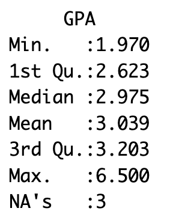
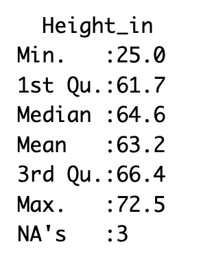
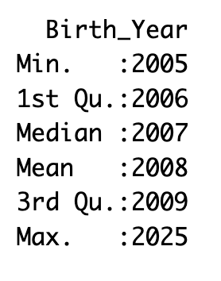

layout: true
<div style="position: absolute;left:20px;bottom:5px;color:black;font-size: 12px;">Nexellence Institute | `r rmarkdown::metadata$title` | `r format(Sys.time(), '%d %B %Y')`</div>

<!--- `r rmarkdown::metadata$subtitle` | `r format(Sys.time(), '%d %B %Y')`-->

---

class: title-slide
background-position: 10% 90%, 100% 50%
background-size: 160px, 50% 100%
background-color: #0148A4

```{r, load_refs, echo=FALSE, cache=FALSE, message=FALSE}
library(RefManageR)
BibOptions(check.entries = FALSE,
           bib.style = "authoryear",
           cite.style = 'authoryear',
           style = "markdown",
           hyperlink = FALSE,
           dashed = FALSE)
myBib <- ReadBib("assets/example.bib", check = FALSE)
top_icon = function(x) {
  icons::icon_style(
    icons::fontawesome(x),
    position = "fixed", top = 10, right = 10
  )
}
```

```{r setup, include=FALSE}
# xaringanExtra::use_scribble() ## Draw on slides. Requires dev version of xaringanExtra.
options(modelsummary_factory_latex = "kableExtra")
options(htmltools.dir.version = FALSE)
library(knitr)
opts_chunk$set(
  fig.align="center",
  fig.height=4, fig.width=6,
  out.width="748px", out.length="520.75px",
  dpi=300, #fig.path='Figs/',
  cache=T#, echo=F, warning=F, message=F
  )
```


```{r, cache=FALSE, message=FALSE, warning=FALSE, include=TRUE, eval=TRUE, results=FALSE, echo=FALSE, tidy.opts = list(width.cutoff = 50), tidy = TRUE}
## Load and install the packages that we'll be using today
if (!require("pacman")) install.packages("pacman")
pacman::p_load(tictoc, parallel, pbapply, future, future.apply, furrr, RhpcBLASctl, memoise, here, foreign, mfx, tidyverse, hrbrthemes, estimatr, ivreg, fixest, sandwich, lmtest, margins, vtable, broom, modelsummary, stargazer, fastDummies, recipes, dummy, gplots, haven, huxtable, kableExtra, gmodels, survey, gtsummary, data.table, tidyfast, dtplyr, microbenchmark, ggpubr, tibble, viridis, wesanderson, censReg, rstatix, srvyr, formatR, sysfonts, showtextdb, showtext, thematic, sampleSelection, RefManageR, DT, googleVis, png, grid)

font_add_google("Fira Sans", "firasans")
font_add_google("Fira Code", "firasans")

showtext_auto()

theme_customs <- theme(
  text = element_text(family = 'firasans', size = 16),
  plot.title.position = 'plot',
  plot.title = element_text(
    face = 'bold',
    colour = thematic::okabe_ito(8)[6],
    margin = margin(t = 2, r = 0, b = 7, l = 0, unit = "mm")
  ),
)

colors <-  thematic::okabe_ito(5)

theme_set(hrbrthemes::theme_ipsum() + theme_customs)

# COLOR PALLETES
library(paletteer)

### COLOR BLIND PALLETES
colorBlindness <- paletteer_d("colorBlindness::Blue2Orange12Steps")
cbbPalette <- c("#000000", "#E69F00", "#56B4E9", "#009E73", "#F0E442", "#0072B2", "#D55E00", "#CC79A7")

# To use for fills, add
  scale_fill_manual(values="colorBlindness::Blue2Orange12Steps")

# To use for line and point colors, add
  scale_colour_manual(values="colorBlindness::Blue2Orange12Steps")
```

```{r xaringan-panelset, echo=FALSE}
xaringanExtra::use_panelset()
```


```{css, echo=F}
    /* Table width = 100% max-width */

    .remark-slide table{
        width: auto !important; /* Adjusts table width */
    }

    /* Change the background color to white for shaded rows (even rows) */

    .remark-slide thead, .remark-slide tr:nth-child(2n) {
        background-color: white;
    }
    .remark-slide thead, .remark-slide tr:nth-child(n) {
        background-color: white;
    }

    .chev-row {
      display: flex;
      align-items: center;
      gap: 0.9em;
      margin-bottom: 0.6em;
    }
    .chev {
      flex: 0 0 62px;
      height: 78px;
      background: #c9e4f6;
      clip-path: polygon(0 0, 50% 14%, 100% 0, 100% 78%, 50% 100%, 0 78%);
      display: flex;
      align-items: center;
      justify-content: center;
      font-weight: bold;
      font-size: 1.7em;
      color: #1a1a1a;
    }
    .chev-text {
      flex: 1;
    }
    .chev-sm {
      flex: 0 0 52px;
      height: 58px;
      background: #c9e4f6;
      clip-path: polygon(0 0, 50% 14%, 100% 0, 100% 78%, 50% 100%, 0 78%);
      display: flex;
      align-items: center;
      justify-content: center;
    }
    .chev-row-sm {
      display: flex;
      align-items: center;
      gap: 0.8em;
      margin-bottom: 0.25em;
    }

    .chev-flow {
      display: flex;
      gap: 0.7em;
      margin-top: 1em;
    }
    .chev-step {
      flex: 1;
      text-align: center;
    }
    .chev-step p {
      text-align: left;
    }
    .chev-right {
      height: 58px;
      background: #c9e4f6;
      clip-path: polygon(0 0, 86% 0, 100% 50%, 86% 100%, 0 100%, 14% 50%);
      display: flex;
      align-items: center;
      justify-content: center;
      margin-bottom: 0.6em;
    }

    .three-col {
      display: flex;
      gap: 1.5em;
      margin-top: 1.5em;
    }
    .three-col .col {
      flex: 1;
      text-align: center;
    }
    .three-col .col p:first-child {
      margin-bottom: 0.4em;
    }

    .img-row {
      display: flex;
      gap: 1em;
      align-items: center;
      justify-content: center;
      margin-top: 0.8em;
    }
    .img-row img {
      max-width: 100%;
      border-radius: 6px;
    }
    .img-row .cell {
      flex: 1;
      text-align: center;
    }

    .remark-code {
      font-size: 0.75em !important;
    }

```

# .text-shadow[.white[Outline for Today]]

<ol>
    <li><h4 class="white">What Is "Dirty Data"? Common Data Problems</h4></li>
    <li><h4 class="white">Strategies for Cleaning Data</h4></li>
    <li><h4 class="white">Hands-On Cleaning in Python and R</h4></li>
    <li><h4 class="white">Why Data Quality Is Critical</h4></li>
    <li><h4 class="white">Group Activity: Clean a Messy Dataset</h4></li>
    <li><h4 class="white">Coding Agents for Data Quality & Cleaning</h4></li>
</ol>

---
class: segue-yellow

# Chapter 6: Dirty Data — <br> Detecting Data Issues and Ensuring Quality `r top_icon("broom")`

---
background-image: url("assets/02-strip.png")
background-position: 5% 10%
background-size: 100% 20%

<br>

<br>

<br>

<br>

### The Data Cleaning Reality

.font75[
.three-col[
.col[
`r fontawesome::fa("clock", height = "2em", fill = "#4a7fb5")`

**80% Cleaning, 20% Analysis**

Industry surveys consistently find 60&ndash;80% of a data scientist's time is spent cleaning data. At companies like Airbnb and LinkedIn, entire teams are dedicated to data quality infrastructure.
]
.col[
`r fontawesome::fa("magnifying-glass", height = "2em", fill = "#4a7fb5")`

**Be a Data Detective**

A data detective doesn't just run code &mdash; they verify that outputs match expectations, trace anomalies back to their source, and document every decision made.
]
.col[
`r fontawesome::fa("trash", height = "2em", fill = "#4a7fb5")`

**Garbage In, Garbage Out**

The 2012 Reinhart-Rogoff scandal: a landmark economic paper influencing austerity policy worldwide was based on a spreadsheet with selective data exclusions. Dirty data shapes government policy.
]
]
]

---
### What We'll Learn

.font85[
**In this chapter:**

#### `r fontawesome::fa("triangle-exclamation", height = "1em", fill = "#4a7fb5")` &nbsp; Section 1 &mdash; Types of dirty data
Missing values (MCAR/MAR/MNAR), outliers, typos, inconsistent formats, duplicates, and integration errors.

#### `r fontawesome::fa("broom", height = "1em", fill = "#4a7fb5")` &nbsp; Section 2 &mdash; Cleaning strategies
Validation rules, systematic detection, imputation methods, deduplication, and documenting your decisions.

#### `r fontawesome::fa("laptop-code", height = "1em", fill = "#4a7fb5")` &nbsp; Section 3 &mdash; Hands-on
Clean a real messy dataset in Python and R, produce a cleaning log, and verify your results.

#### `r fontawesome::fa("briefcase", height = "1em", fill = "#4a7fb5")` &nbsp; Section 4 &mdash; Data quality in practice
Professional terminology (ETL, data lineage, schema validation), consequences of dirty data, and reporting on cleaning decisions.
]

--

.content-box-blue[
.font85[**Throughout:** use a coding agent to automate detection, generate cleaning reports, and verify that cleaned data meets quality criteria.]
]

---
class: segue-green

# What Is "Dirty Data"? <br> Common Data Problems `r top_icon("exclamation-triangle")`

---
### What is "Dirty Data"?

.pull-left[.font90[
.content-box-yellow[
**Dirty data:** data with errors or quality problems that can mislead analysis.
]

Like a detective with bad evidence, a researcher can be misled by faulty data.

**Common issues include:**

- Incorrect or missing values
- Duplicate entries
- Inconsistent formatting
- Outliers or impossible values
]]

.pull-right[
```{r img05, echo=FALSE, warning=FALSE, out.width="90%", fig.show='hold', fig.align='center'}
# Read the image file
img <- readPNG("assets/05-img.png")

# Plot the image
grid.raster(img)
```
]

---
### Missing Data: What It Looks Like

.font95[Missing values appear differently in different tools &mdash; **R, Excel, and Python**:]

```{r img06a, echo=FALSE, warning=FALSE, out.width="60%", fig.show='hold', fig.align='center'}
# Read the image file
img <- readPNG("assets/06a-img.png")

# Plot the image
grid.raster(img)
```

```{r img06b, echo=FALSE, warning=FALSE, out.width="78%", fig.show='hold', fig.align='center'}
# Read the image file
img <- readPNG("assets/06b-img.png")

# Plot the image
grid.raster(img)
```

---
### Missing Data

.pull-left[.font75[
- **Missing data** = blank or null entries where info wasn't recorded.

- **Three types of missingness:** **MCAR** (Missing Completely At Random &mdash; safe to ignore or impute), **MAR** (depends on observed data &mdash; imputation can work), **MNAR** (missingness predicts itself &mdash; the most dangerous; biases results systematically).

- Happens often in real life &mdash; people skip survey questions or sensors glitch.

- Many analysis methods can't handle missing values automatically. Too much missing data can bias results.

- **MNAR example:** sicker patients drop out of a drug trial, making remaining data look healthier than reality. *Always ask: is there a pattern to what is missing?*

- **Detection in pandas:** `df.isnull().sum()` per column, `df.isnull().mean()` for rate. Visualize with `sns.heatmap(df.isnull(), cbar=False)`.
]]

.pull-right[
```{r img07, echo=FALSE, warning=FALSE, out.width="72%", fig.show='hold', fig.align='center'}
# Read the image file
img <- readPNG("assets/07-img.png")

# Plot the image
grid.raster(img)
```
]

---
### Typos &amp; Data Entry Errors

.pull-left[.font85[
.content-box-blue[
**`r fontawesome::fa("keyboard", fill = "#4a7fb5")` Human Error**

Entry errors pass a dtype check but fail a domain check &mdash; 88 is a valid integer but an impossible student age. Schema validation is necessary but not sufficient; always pair with range checks and domain knowledge.
]

.content-box-blue[
**`r fontawesome::fa("arrows-up-down", fill = "#4a7fb5")` Misalignment**

Answers might get shifted to wrong rows when entering data manually.
]

.content-box-blue[
**`r fontawesome::fa("triangle-exclamation", fill = "#4a7fb5")` Unexpected Values**

After computing summary statistics, always check whether min, max, mean, and std are plausible. An `age_max` of 150 or a `score_min` of -5 are data detective red flags.
]
]]

.pull-right[
```{r img08, echo=FALSE, warning=FALSE, out.width="85%", fig.show='hold', fig.align='center'}
# Read the image file
img <- readPNG("assets/08-img.png")

# Plot the image
grid.raster(img)
```
]

---
### Outliers

```{r img09, echo=FALSE, warning=FALSE, out.width="62%", fig.show='hold', fig.align='center'}
# Read the image file
img <- readPNG("assets/09-img.png")

# Plot the image
grid.raster(img)
```

--

.center[.font120[**One student scored above 180!!! Could it be true?**]]

---
### How Outliers Affect Analysis

.font80[
.content-box-blue[
**`r fontawesome::fa("scale-unbalanced", fill = "#4a7fb5")` Skew Averages**

One extreme value shifts the mean but not the median &mdash; this is why comparing mean and median is an outlier diagnostic. A right skew (mean &gt; median) signals potential high outliers.
]

.content-box-blue[
**`r fontawesome::fa("chart-column", fill = "#4a7fb5")` Distort Visualizations &mdash; Three detection methods**

(1) Domain threshold (Age&gt;100), (2) IQR rule: outlier if value &lt; Q1&minus;1.5&times;IQR or &gt; Q3+1.5&times;IQR, (3) Z-score: |z| &gt; 3 means the value is 3 SDs from the mean.
]

.content-box-yellow[
**`r fontawesome::fa("circle-question", fill = "#4a7fb5")` Lead to Wrong Conclusions &mdash; Key decision**

Is this a **data error** (fix it) or a **legitimate extreme value** (keep it, note it)? A 180-point score might be a typo OR a genuine exceptional student &mdash; *domain knowledge determines the answer*.
]
]

---
### Inconsistencies in Data Format

.font85[
.pull-left[
.content-box-blue[
**`r fontawesome::fa("tags", fill = "#4a7fb5")` Category Labels**

Some responses say "Male", others say "M" &mdash; computers see these as different!
]

.content-box-blue[
**`r fontawesome::fa("calendar", fill = "#4a7fb5")` Date Formats**

Mixing "2025-04-16" and "April 16, 2025" causes confusion in analysis.
]
]

.pull-right[
.content-box-blue[
**`r fontawesome::fa("hashtag", fill = "#4a7fb5")` Number Formats**

Numbers stored as text or with different separators (5,000 vs 5000).
]

.content-box-blue[
**`r fontawesome::fa("ruler", fill = "#4a7fb5")` Different Units**

Heights recorded in both inches and centimeters without clear labels.
]
]
]

---
### More Inconsistencies: Duplicates and Impossible Values

.font95[**Duplicated values** and **incorrect or impossible values** (there are only 168 hours in a week: 24 &times; 7 = 168):]

```{r img12, echo=FALSE, warning=FALSE, out.width="68%", fig.show='hold', fig.align='center'}
# Read the image file
img <- readPNG("assets/12-img.png")

# Plot the image
grid.raster(img)
```

---
### Hidden Inconsistencies

.pull-left[.font85[
.content-box-blue[
**`r fontawesome::fa("eye-slash", fill = "#4a7fb5")` Invisible Spaces**

Trailing/leading spaces are invisible but computationally distinct. Fix with `df["col"].str.strip()`. One line prevents a silent category explosion that only shows up in `value_counts()`.
]

.content-box-blue[
**`r fontawesome::fa("font", fill = "#4a7fb5")` Case Sensitivity**

Normalize with `df["col"].str.lower()` or `.str.upper()` before any groupby or merge. Without this, "Male", "male", and "MALE" count as three separate categories.
]

.content-box-blue[
**`r fontawesome::fa("hashtag", fill = "#4a7fb5")` Leading Zeros**

ZIP codes or student IDs stored as int lose "06001" &rarr; 6001. Always store ID fields as strings. Check `df.dtypes` and verify ID columns are not numeric.
]
]]

.pull-right[
```{r img13, echo=FALSE, warning=FALSE, fig.width=4, fig.height=6, out.width="52%", fig.show='hold', fig.align='center'}
# Read the image file
img <- readPNG("assets/13-img.png")

# Plot the image
grid.raster(img)
```
]

---
### Missing Documentation

.pull-left[
.content-box-blue[
**`r fontawesome::fa("book", fill = "#4a7fb5")` What's a Data Dictionary?**

A document describing each variable in your dataset:

- What each field means
- Units of measurement
- Possible values
- How data was collected
]
]

.pull-right[
.content-box-yellow[
**`r fontawesome::fa("triangle-exclamation", fill = "#4a7fb5")` Why It Matters**

Without proper documentation, it's easy to misinterpret data.

**Example:** A column labeled "Temp" could be Celsius or Fahrenheit &mdash; a huge difference!
]
]

---
### Data Integration Errors

.pull-left[.font90[
#### `r fontawesome::fa("layer-group", height = "1em", fill = "#4a7fb5")` &nbsp; Multiple Data Sources
Combining data from different spreadsheets or systems.

#### `r fontawesome::fa("link-slash", height = "1em", fill = "#4a7fb5")` &nbsp; Mismatched Records
Student names get paired with wrong test scores during merging.

#### `r fontawesome::fa("eye-slash", height = "1em", fill = "#4a7fb5")` &nbsp; Hidden Problems
Records look complete but contain incorrect information.
]]

.pull-right[
```{r img15, echo=FALSE, warning=FALSE, fig.width=4, fig.height=6, out.width="52%", fig.show='hold', fig.align='center'}
# Read the image file
img <- readPNG("assets/15-img.png")

# Plot the image
grid.raster(img)
```
]

---
### Do You See Any Issues Here?

.font85[

| Name   | Gender   | Age | Height    | Score |
|--------|----------|-----|-----------|-------|
| Alice  | F        | 17  | 65        | 90    |
| Bob    | male     | 16  | 170 cm    |       |
| Carlos | M&nbsp;&nbsp;*(trailing space)* | 150 | 68 | 85 |
| Dana   |          | 18  | 64        | 88    |
| Ed     | Male     |     | 5'9"      | 95    |

]

--

.content-box-yellow[
.font85[
- **Gender variable:** inconsistent &amp; missing &amp; trailing space
- **Age variable:** outlier and missing
- **Height:** mixed units, outlier, character in the numeric vector
- **Score:** missing as empty string
]
]

---
### Why Dirty Data Matters

.three-col[
.col[
`r fontawesome::fa("calculator", height = "2.5em", fill = "#4a7fb5")`

**Wrong Statistics**

Errors lead to incorrect averages, counts, and other calculations.
]
.col[
`r fontawesome::fa("bug", height = "2.5em", fill = "#4a7fb5")`

**Software Errors**

Many analysis tools can't handle missing or incorrect data types.
]
.col[
`r fontawesome::fa("circle-xmark", height = "2.5em", fill = "#4a7fb5")`

**Misinterpretations**

Bad data leads to false conclusions and poor decisions.
]
]

---
class: segue-yellow

# Strategies for Cleaning Data `r top_icon("broom")`

---
### Data Validation

.font80[
<div class="chev-row">
  <div class="chev">1</div>
  <div class="chev-text"><strong>Define Acceptable Ranges</strong><br>
  Define a schema for each column: dtype (int64, float64, object, datetime), valid range (0&le;GPA&le;4.0), allowed categories (["M","F","Non-binary"]), and nullable (True/False). A data dictionary is the source of truth.</div>
</div>

<div class="chev-row">
  <div class="chev">2</div>
  <div class="chev-text"><strong>Check Categories</strong><br>
  Schema validation in pandas: use <code>pd.api.types.is_numeric_dtype()</code> and <code>df["col"].isin(valid_set)</code>. For production pipelines, libraries like Great Expectations automate schema checks across thousands of rows.</div>
</div>

<div class="chev-row">
  <div class="chev">3</div>
  <div class="chev-text"><strong>Verify Required Fields</strong><br>
  Flag any missing values in essential columns.</div>
</div>

<div class="chev-row">
  <div class="chev">4</div>
  <div class="chev-text"><strong>Look for Logical Consistency</strong><br>
  Cross-field consistency checks: if Birth_Year=2005 and Grade=11, these are consistent. Use assertions in code to catch violations before they propagate into analysis.</div>
</div>
]

---
### Finding Problems Systematically

.pull-left[.font75[
**`r fontawesome::fa("magnifying-glass", fill = "#4a7fb5")` Count Missing Values**
`df.isnull().sum()` for counts; `df.isnull().mean().round(2)` for rates. Flag columns with &gt;5% missing &mdash; they need a strategy decision (impute, drop, or document).

**`r fontawesome::fa("copy", fill = "#4a7fb5")` Sort to Find Duplicates**
`df.duplicated().sum()` for count; `df[df.duplicated(keep=False)]` to see all duplicate rows. Are full-row duplicates errors, or is a duplicate Student_ID with different scores a merge issue?

**`r fontawesome::fa("calculator", fill = "#4a7fb5")` Calculate Basic Stats**
`df.describe()` for all numerics at once. Then apply domain knowledge: Age_max=150 is impossible; Score_min=-5 is invalid; GPA_max=5.0 could be a different scale.

**`r fontawesome::fa("list", fill = "#4a7fb5")` List Unique Values**
`df["col"].value_counts()` shows all category frequencies. A yes/no field showing 6 unique values has inconsistencies. Always inspect categoricals before any groupby.
]]

.pull-right[
```{r img22, echo=FALSE, warning=FALSE, fig.width=4, fig.height=6, out.width="52%", fig.show='hold', fig.align='center'}
# Read the image file
img <- readPNG("assets/22-img.png")

# Plot the image
grid.raster(img)
```
]

---
### Visualizing to Find Problems

.pull-left[
.content-box-blue[
**Box plots** are great for spotting outliers that fall outside the whiskers.
]

.font90[The isolated point above the whisker shows a clear outlier that **needs investigation**.]
]

.pull-right[
```{r img23, echo=FALSE, warning=FALSE, out.width="85%", fig.show='hold', fig.align='center'}
# Read the image file
img <- readPNG("assets/23-img.png")

# Plot the image
grid.raster(img)
```
]

---
### Handling Missing Data

<div class="chev-row">
  <div class="chev">1</div>
  <div class="chev-text"><strong>Remove rows</strong> with missing values &mdash; safe only when missingness is MCAR and the affected rows are few.</div>
</div>

<div class="chev-row">
  <div class="chev">2</div>
  <div class="chev-text"><strong>Impute values</strong> &mdash; fill with the mean, median, or mode of the column. Median is safer when the data is skewed.</div>
</div>

<div class="chev-row">
  <div class="chev">3</div>
  <div class="chev-text"><strong>Leave as missing</strong> &mdash; keep NA and use analysis methods that tolerate it; sometimes the honest choice.</div>
</div>

<div class="chev-row">
  <div class="chev">4</div>
  <div class="chev-text"><strong>Document the decision</strong> &mdash; whichever strategy you choose, record what was missing and how you handled it.</div>
</div>

---
### Handling Outliers

<div class="chev-row">
  <div class="chev">1</div>
  <div class="chev-text"><strong>Verify first</strong> &mdash; trace the value back to its source. Is it a typo, a unit error, or real?</div>
</div>

<div class="chev-row">
  <div class="chev">2</div>
  <div class="chev-text"><strong>Fix obvious errors</strong> &mdash; if Age=150 should clearly be 15, correct it and log the change.</div>
</div>

<div class="chev-row">
  <div class="chev">3</div>
  <div class="chev-text"><strong>Remove or set missing</strong> &mdash; when the true value can't be recovered, set it to NA and document why.</div>
</div>

<div class="chev-row">
  <div class="chev">4</div>
  <div class="chev-text"><strong>Keep legitimate extremes</strong> &mdash; a genuine exceptional value stays in, with a note; consider reporting the median alongside the mean.</div>
</div>

---
### Correcting Inconsistencies

<div class="chev-row">
  <div class="chev">1</div>
  <div class="chev-text"><strong>Standardize case</strong> &mdash; convert text to a single case (<code>.str.lower()</code> / <code>toupper()</code>) so "Yes", "yes", and "YES" match.</div>
</div>

<div class="chev-row">
  <div class="chev">2</div>
  <div class="chev-text"><strong>Strip stray spaces</strong> &mdash; remove leading/trailing whitespace (<code>.str.strip()</code> / <code>trimws()</code>).</div>
</div>

<div class="chev-row">
  <div class="chev">3</div>
  <div class="chev-text"><strong>Unify category labels</strong> &mdash; map variants to one standard ("M", "male" &rarr; "Male"); re-check with <code>value_counts()</code> / <code>table()</code>.</div>
</div>

<div class="chev-row">
  <div class="chev">4</div>
  <div class="chev-text"><strong>Convert formats and units</strong> &mdash; one date format, one unit of measurement, numbers stored as numbers.</div>
</div>

---
### Removing Duplicates

.pull-left[.font90[
.content-box-blue[
**`r fontawesome::fa("equals", fill = "#4a7fb5")` Identify Exact Duplicates**

Find records that match completely across all fields.
]

.content-box-blue[
**`r fontawesome::fa("not-equal", fill = "#4a7fb5")` Check for Partial Duplicates**

Look for records that match on key fields but differ slightly in others.
]

.content-box-green[
**`r fontawesome::fa("check", fill = "#4a7fb5")` Decide Which to Keep**

For partial duplicates, determine which record is more complete or accurate.
]
]]

.pull-right[
```{r img28, echo=FALSE, warning=FALSE, fig.width=4, fig.height=6, out.width="55%", fig.show='hold', fig.align='center'}
# Read the image file
img <- readPNG("assets/28-img.png")

# Plot the image
grid.raster(img)
```
]

---
### Document Your Cleaning

.pull-left[.font90[
#### `r fontawesome::fa("file-pen", height = "1em", fill = "#4a7fb5")` &nbsp; Keep a Log
Record all changes made: *"Replaced missing scores with class average"*

#### `r fontawesome::fa("comment-dots", height = "1em", fill = "#4a7fb5")` &nbsp; Note Decisions
Explain why you chose certain approaches: *"Removed outliers above 3 standard deviations"*

#### `r fontawesome::fa("chart-line", height = "1em", fill = "#4a7fb5")` &nbsp; Track Impact
Note how cleaning affected results: *"Average age changed from 43 to 17 after fixing errors"*
]]

.pull-right[
```{r img29, echo=FALSE, warning=FALSE, out.width="90%", fig.show='hold', fig.align='center'}
# Read the image file
img <- readPNG("assets/29-img.png")

# Plot the image
grid.raster(img)
```
]

---
### Test Your Cleaned Data

.pull-left[.font90[
<div class="chev-row">
  <div class="chev">1</div>
  <div class="chev-text"><strong>Check for Remaining Issues</strong><br>
  Are there still missing values or outliers you meant to address?</div>
</div>

<div class="chev-row">
  <div class="chev">2</div>
  <div class="chev-text"><strong>Verify Basic Statistics</strong><br>
  Do averages, minimums, and maximums now look reasonable?</div>
</div>

<div class="chev-row">
  <div class="chev">3</div>
  <div class="chev-text"><strong>Confirm Categories</strong><br>
  Are all categorical values now consistent and correctly spelled?</div>
</div>

<div class="chev-row">
  <div class="chev">4</div>
  <div class="chev-text"><strong>Count Records</strong><br>
  Does the number of records match what you expect after cleaning?</div>
</div>
]]

.pull-right[
```{r img30, echo=FALSE, warning=FALSE, fig.width=4, fig.height=6, out.width="50%", fig.show='hold', fig.align='center'}
# Read the image file
img <- readPNG("assets/30-img.png")

# Plot the image
grid.raster(img)
```
]

---
class: segue-green

# Let's Do It!!! <br> Hands-On Cleaning in Python `r top_icon("laptop-code")`

---
### Open Python!

.font95[Do you remember how to do it? Slides from Chapter 4:]

<div class="img-row" style="max-width: 85%; margin-left: auto; margin-right: auto;">
  <div class="cell"></div>
  <div class="cell"></div>
</div>

---
### Create Your Messy Data!

.font90[This code calls the pandas package and creates a data frame where **Bob's score is missing** and **Ed is sooo old**!]

```python
import pandas as pd
data = {
    'Name': ['Alice', 'Bob', 'Charlie', 'Dana', 'Ed'],
    'Age': [17, 16, 15, 18, 150],
    'Grade': [11, 11, 10, 12, 11],
    'Score': [90, None, 85, 88, 95]
}
df = pd.DataFrame(data)
print("Raw data:")
print(df)
```

--

```{r img32, echo=FALSE, warning=FALSE, out.width="42%", fig.show='hold', fig.align='center'}
# Read the image file
img <- readPNG("assets/32-img.png")

# Plot the image
grid.raster(img)
```

---
### Check the Missing

.pull-left[.font90[
- We have only 5 students and 4 columns in this data. It's easy to find the issues with the naked eye.

- **Think if you had 1,000,000 rows and 10,000 columns** 🤯

- Let's check the missing now!
]

```python
print("\nMissing values in each column:")
print(df.isna().sum())
```
]

.pull-right[
```{r img33, echo=FALSE, warning=FALSE, out.width="85%", fig.show='hold', fig.align='center'}
# Read the image file
img <- readPNG("assets/33-img.png")

# Plot the image
grid.raster(img)
```
]

---
### Check Outliers

.font85[**Three detection methods:** (1) domain threshold (Age&gt;100), (2) IQR rule: flag if value &lt; Q1&minus;1.5&times;IQR or &gt; Q3+1.5&times;IQR (robust to skew), (3) z-score: |z|&gt;3 (best for normal distributions). Here we use a **domain threshold**:]

```python
# Identify outliers in Age (say anything > 100 is suspicious)
outliers = df[df['Age'] > 100]
print("\nOutliers in Age:")
print(outliers)
```

--

```{r img34, echo=FALSE, warning=FALSE, out.width="55%", fig.show='hold', fig.align='center'}
# Read the image file
img <- readPNG("assets/34-img.png")

# Plot the image
grid.raster(img)
```

---
### Let's Clean

.font90[Fill Bob's Score with the **mean of the other scores**:]

```python
# Fill missing Score with mean of existing scores
mean_score = df['Score'].mean(skipna=True)  # skipna ignores NaN
df.fillna({'Score': mean_score}, inplace=True)
```

--

```{r img35, echo=FALSE, warning=FALSE, out.width="55%", fig.show='hold', fig.align='center'}
# Read the image file
img <- readPNG("assets/35-img.png")

# Plot the image
grid.raster(img)
```

---
### Let's Clean 2

.font90[All the scores are integers &mdash; let's convert Bob's 89.5 to an integer for consistency:]

```python
df['Score'] = df['Score'].round(0).astype('Int64')
# round and make integer (pandas Int64 type allows NA if any)
print("\nAfter rounding Bob's score:")
print(df)
```

--

```{r img36, echo=FALSE, warning=FALSE, out.width="55%", fig.show='hold', fig.align='center'}
# Read the image file
img <- readPNG("assets/36-img.png")

# Plot the image
grid.raster(img)
```

---
### Let's Clean 3

.font90[This replaces all Age values higher than 100 with 15 (assuming it's a typo):]

```python
# Fix outlier Age (assume it's a typo and should be 15)
df.loc[df['Age'] > 100, 'Age'] = 15

print("\nCleaned data:")
print(df)
```

--

```{r img37, echo=FALSE, warning=FALSE, out.width="55%", fig.show='hold', fig.align='center'}
# Read the image file
img <- readPNG("assets/37-img.png")

# Plot the image
grid.raster(img)
```

---
### Let's Try It with R

.pull-left[
.font95[Do you remember how to start R?]

### `r fontawesome::fa("r-project", height = "1em", fill = "#4a7fb5")` &nbsp; Just run RStudio!
]

.pull-right[
```{r img38, echo=FALSE, warning=FALSE, out.width="100%", fig.show='hold', fig.align='center'}
# Read the image file
img <- readPNG("assets/38-img.png")

# Plot the image
grid.raster(img)
```
]

---
### Create the Data in R

```r
# Create the data.frame
df <- data.frame(
  Name  = c("Alice", "Bob", "Charlie", "Dana", "Ed"),
  Age   = c(17, 16, 15, 18, 150),
  Grade = c(11, 11, 10, 12, 11),
  Score = c(90, NA, 85, 88, 95),      # use NA for missing
  stringsAsFactors = FALSE            # keep character columns as character
)

# Print it out
cat("Raw data:\n")
print(df)
```

---
### Missing and Outlier in R

.font90[In R, the `is.na` function finds the missing values. Here is how to impute the mean for missing values and replace ages over 100 with 15:]

```r
df$Score[is.na(df$Score)] <- mean(df$Score, na.rm=TRUE)
df$Age[df$Age > 100] <- 15
```

---
### Key Cleaning Functions / Techniques (Summary)

.font80[

| Task | Python (pandas) | R |
|------|-----------------|---|
| Find missing values | `df.isna().sum()` | `is.na(df)` / `colSums(is.na(df))` |
| Fill missing values | `df.fillna(value)` | `df$col[is.na(df$col)] <- value` |
| Mean ignoring NA | `df["col"].mean(skipna=True)` | `mean(x, na.rm=TRUE)` |
| Find duplicates | `df.duplicated().sum()` | `sum(duplicated(df))` |
| Remove duplicates | `df.drop_duplicates()` | `df[!duplicated(df), ]` |
| Replace values | `df.replace(old, new)` | `gsub()` / direct assignment |
| Strip spaces | `df["col"].str.strip()` | `trimws(x)` |
| Normalize case | `df["col"].str.upper()` | `toupper(x)` |
| Unique values | `df["col"].value_counts()` | `table(x)` / `unique(x)` |

]

---
class: segue-yellow

# Why Data Quality Is Critical: <br> Trustworthy Analysis `r top_icon("award")`

---
### Why Data Quality Is Critical

.pull-left[
#### `r fontawesome::fa("building", height = "1em", fill = "#4a7fb5")` &nbsp; Like a building needs a solid foundation, analysis needs clean data.

#### `r fontawesome::fa("trash", height = "1em", fill = "#4a7fb5")` &nbsp; Even the best analysis methods can't save bad data. *Garbage in, garbage out.*

#### `r fontawesome::fa("handshake", height = "1em", fill = "#4a7fb5")` &nbsp; Clean data makes your findings **credible to others**.
]

.pull-right[
```{r img43, echo=FALSE, warning=FALSE, fig.width=4, fig.height=6, out.width="50%", fig.show='hold', fig.align='center'}
# Read the image file
img <- readPNG("assets/43-img.png")

# Plot the image
grid.raster(img)
```
]

---
### Consequences of Dirty Data

.pull-left[.font75[
**`r fontawesome::fa("compass", fill = "#4a7fb5")` Misguided Decisions**
Real case: a software company's churn model trained on duplicate customer records predicted 40% lower churn &mdash; overprovisioning servers by $2M annually before the duplication was caught.

**`r fontawesome::fa("file-circle-xmark", fill = "#4a7fb5")` Erroneous Research**
Reinhart-Rogoff (2013): a landmark economics paper cited by governments worldwide to justify austerity was based on a spreadsheet that excluded certain country-years from a key calculation. A grad student found the error. Policy was already enacted.

**`r fontawesome::fa("heart-crack", fill = "#4a7fb5")` Loss of Trust**
The credibility multiplier: one discovered error makes everyone doubt the entire analysis. Clean data builds trust; dirty data destroys it &mdash; and the destruction is asymmetric.

**`r fontawesome::fa("clock", fill = "#4a7fb5")` Wasted Effort**
Redoing analysis after discovering data issues wastes valuable time.
]]

.pull-right[
```{r img44, echo=FALSE, warning=FALSE, fig.width=4, fig.height=6, out.width="50%", fig.show='hold', fig.align='center'}
# Read the image file
img <- readPNG("assets/44-img.png")

# Plot the image
grid.raster(img)
```
]

---
### Benefits of Clean Data

.pull-left[
.content-box-green[
**`r fontawesome::fa("chart-line", fill = "#4a7fb5")` Reveals True Patterns**

Clean data lets you see actual trends without distortion from errors.
]

.content-box-green[
**`r fontawesome::fa("link", fill = "#4a7fb5")` Enables Integration**

Standardized data can be combined with other sources for richer analysis.
]
]

.pull-right[
.content-box-green[
**`r fontawesome::fa("clock", fill = "#4a7fb5")` Saves Time Later**

Investing in cleaning prevents rework and troubleshooting during analysis.
]

.content-box-green[
**`r fontawesome::fa("chart-column", fill = "#4a7fb5")` Improves Visualizations**

Charts and graphs based on clean data are more accurate and informative.
]
]

---
### Important Tip!

.content-box-blue[
**Creating a data dictionary and validating data against it helps maintain quality.**
]

```{r img46a, echo=FALSE, warning=FALSE, out.width="55%", fig.show='hold', fig.align='center'}
# Read the image file
img <- readPNG("assets/46a-img.png")

# Plot the image
grid.raster(img)
```

```{r img46b, echo=FALSE, warning=FALSE, out.width="92%", fig.show='hold', fig.align='center'}
# Read the image file
img <- readPNG("assets/46b-img.png")

# Plot the image
grid.raster(img)
```

---
### Professional Data Cleaning Terms

.pull-left[.font75[
**`r fontawesome::fa("arrows-turn-to-dots", fill = "#4a7fb5")` ETL**
Extract, Transform, Load &mdash; the pipeline that moves data from source systems (databases, APIs) through cleaning and transformation into analytical stores. A broken ETL job is often the root cause of data quality incidents.

**`r fontawesome::fa("broom", fill = "#4a7fb5")` Data Wrangling**
Informal term for the hands-on work of cleaning &mdash; filtering, reshaping, joining, and transforming raw data until it's fit for analysis. In Python: pandas; in R: dplyr/tidyr.

**`r fontawesome::fa("magnifying-glass-chart", fill = "#4a7fb5")` Data Profiling**
Systematic examination of a dataset to understand structure (schemas, dtypes), content (distributions, frequency tables), and quality (missing rates, outliers). *Always the first step before cleaning.*

**`r fontawesome::fa("gears", fill = "#4a7fb5")` Data Preprocessing**
Broader than wrangling: includes feature engineering, normalization, encoding, and train/test splitting. In ML workflows, preprocessing pipelines are codified to ensure consistency.
]]

.pull-right[
```{r img47, echo=FALSE, warning=FALSE, fig.width=4, fig.height=6, out.width="52%", fig.show='hold', fig.align='center'}
# Read the image file
img <- readPNG("assets/47-img.png")

# Plot the image
grid.raster(img)
```
]

---
### When You Write a Report

.pull-left[.font85[
**Explain the cleaning process.** Such as:

.content-box-blue[
*"After cleaning the data, we found and corrected 5 data entry errors and filled 3% missing values using domain-appropriate methods. The cleaned dataset of 500 responses was then analyzed..."*
]

**Professional standard &mdash; always report:**

1. Raw dataset dimensions
2. Final cleaned dimensions
3. What was removed and why
4. How missing values were handled (method and imputed count)
5. Any assumptions made

*Omitting this is a reproducibility failure.*
]]

.pull-right[
```{r img48, echo=FALSE, warning=FALSE, out.width="85%", fig.show='hold', fig.align='center'}
# Read the image file
img <- readPNG("assets/48-img.png")

# Plot the image
grid.raster(img)
```
]

---
class: segue-green

# Group Activity: <br> Data Cleaning `r top_icon("users")`

---
### Group Activity &mdash; Data Cleaning

.content-box-blue[
**Your Data:** `messy_school_data.csv`
]

#### `r fontawesome::fa("laptop-code", height = "1em", fill = "#4a7fb5")` &nbsp; Use either Python or R

#### `r fontawesome::fa("magnifying-glass", height = "1em", fill = "#4a7fb5")` &nbsp; Identify all the issues and perform the cleaning steps

#### `r fontawesome::fa("file-pen", height = "1em", fill = "#4a7fb5")` &nbsp; Create a log report

---
### Group Activity with R &mdash; Example Answer

.font90[Read the dataset (don't forget to change the path or save the CSV to your working directory), then check the summary statistics:]

```r
msd <- read.csv("messy_school_data.csv")
summary(msd)
```

--

```{r img51, echo=FALSE, warning=FALSE, out.width="85%", fig.show='hold', fig.align='center'}
# Read the image file
img <- readPNG("assets/51-img.png")

# Plot the image
grid.raster(img)
```

---
### You Will See the Issues for the Numeric Variables

.pull-left[
#### `r fontawesome::fa("triangle-exclamation", height = "1em", fill = "#D55E00")` &nbsp; Max GPA is 6.5!!! Doesn't look right.

#### `r fontawesome::fa("triangle-exclamation", height = "1em", fill = "#D55E00")` &nbsp; Smallest height is 25 inches!!

#### `r fontawesome::fa("triangle-exclamation", height = "1em", fill = "#D55E00")` &nbsp; There is a student born in 2025?
]

.pull-right[
<div class="img-row">
  <div class="cell"></div>
  <div class="cell"></div>
  <div class="cell"></div>
</div>
]

---
### Check the Categorical Variables

.pull-left[.font90[
- Let's check the categorical variables using the `table` function, which provides frequencies.

- We can write a function or loop to check each variable, but for simplicity let's do it one by one.
]

.content-box-yellow[.font80[
- **State** has both CA and Cali, FL and Florida, IL and Illinois, Ny and NY, Texas and Texs &mdash; these categories should be combined.
- **Club** has a "none" category, which might be missing or "no club association".
- **Parent_Consent** has "no" and "No", "yes" and "Yes".
]]
]

.pull-right[
```{r img53, echo=FALSE, warning=FALSE, out.width="95%", fig.show='hold', fig.align='center'}
# Read the image file
img <- readPNG("assets/53-img.png")

# Plot the image
grid.raster(img)
```
]

---
### Check Duplicates!

.font90[In R, use the `duplicated` function (returns TRUE or FALSE). Let's check if there are any duplicated IDs:]

```r
print("Number of Duplicated IDs:")
sum(duplicated(msd$Student_ID))
```

--

.font90[There are **three duplicated student IDs** &mdash; let's find them:]

```r
dup_ids <- msd$Student_ID[duplicated(msd$Student_ID)]
print("Duplicated IDs:")
dup_ids
```

```{r img57b, echo=FALSE, warning=FALSE, out.width="100%", fig.show='hold', fig.align='center'}
# Read the image file
img <- readPNG("assets/57b-img.png")

# Plot the image
grid.raster(img)
```

---
### Decide Which Rows to Remove

.font90[Let's check duplicated ID = 1. Row 30 doesn't have the email, the rest is the same &mdash; let's get rid of line 30. But first, check the others:]

```{r img59, echo=FALSE, warning=FALSE, out.width="92%", fig.show='hold', fig.align='center'}
# Read the image file
img <- readPNG("assets/59-img.png")

# Plot the image
grid.raster(img)
```

---
### Remove the Duplicate Rows

.font90[Remove rows 30, 32, 33 &mdash; and some issues are already resolved:]

```{r img60, echo=FALSE, warning=FALSE, out.width="80%", fig.show='hold', fig.align='center'}
# Read the image file
img <- readPNG("assets/60-img.png")

# Plot the image
grid.raster(img)
```

---
### Fix the Categories

.pull-left[
```r
# 1. Standardize known variants
msd$State[msd$State %in% c("Cali")] <- "CA"
msd$State[msd$State %in% c("Florida")] <- "FL"
msd$State[msd$State %in% c("Illinois")] <- "IL"
msd$State[msd$State %in% c("Ny")] <- "NY"
msd$State[msd$State %in% c("Texas", "Texs")] <- "TX"

# 2. Check the State Variable
table(msd$State)
```
]

.pull-right[
```{r img61b, echo=FALSE, warning=FALSE, out.width="90%", fig.show='hold', fig.align='center'}
# Read the image file
img <- readPNG("assets/61b-img.png")

# Plot the image
grid.raster(img)
```
]

---
### Fix Parent_Consent and Lunch_Program

```r
# 1. Convert empty string to missing
msd$Parent_Consent[msd$Parent_Consent == ""] <- NA
# 2. Convert all the values to upper case
msd$Parent_Consent <- toupper(msd$Parent_Consent)
# 3. Check the Variable
table(msd$Parent_Consent, useNA = "always")
```

--

.font90[Same approach for the **Lunch_Program** variable:]

```{r img63, echo=FALSE, warning=FALSE, out.width="62%", fig.show='hold', fig.align='center'}
# Read the image file
img <- readPNG("assets/63-img.png")

# Plot the image
grid.raster(img)
```

---
### Fix Birth Year and Height

.font90[Birth year should be **2005 instead of 2025** for the 11th grader:]

```{r img64, echo=FALSE, warning=FALSE, out.width="62%", fig.show='hold', fig.align='center'}
# Read the image file
img <- readPNG("assets/64-img.png")

# Plot the image
grid.raster(img)
```

--

.font90[**Check the height.** Let's sort it &mdash; 25 inches seems a bit short; we don't know what it should be. We can either remove it (make it missing) or impute a mean value:]

```r
# Remove the smallest height
msd$Height_in[msd$Height_in == 25] <- NA

# Impute height
msd$Height_in[is.na(msd$Height_in)] <- mean(msd$Height_in, na.rm = TRUE)

# Check the summary
summary(msd$Height_in)
```

---
### Impute Weight and GPA

```r
# Impute weight and GPA
msd$Weight_lb[is.na(msd$Weight_lb)] <- mean(msd$Weight_lb, na.rm = TRUE)
msd$GPA[is.na(msd$GPA)] <- mean(msd$GPA, na.rm = TRUE)

# Check the summary
summary(msd)
```

--

```{r img67, echo=FALSE, warning=FALSE, out.width="70%", fig.show='hold', fig.align='center'}
# Read the image file
img <- readPNG("assets/67-img.png")

# Plot the image
grid.raster(img)
```

---
### Log Record

.font65[

| Step | Activity | Description |
|------|----------|-------------|
| 1 | Import &amp; Initial Inspection | Read "messy_school_data.csv" &bull; Viewed `head()` and `summary()` &bull; Ran frequency tables for Grade, Gender, State, Club, Parent_Consent, Lunch_Program |
| 2 | Duplicate ID Check | Counted duplicated Student_ID &bull; Identified repeated IDs &bull; Reviewed rows for each duplicate |
| 3 | Remove Duplicate Rows | Dropped rows 30, 32, 33 |
| 4 | State Standardization | Replaced "Cali"&rarr;"CA", "Florida"&rarr;"FL", "Illinois"&rarr;"IL", "Ny"&rarr;"NY", "Texas"/"Texs"&rarr;"TX" |
| 5 | Parent_Consent Cleaning | Converted "" to NA &bull; Upper-cased all entries |
| 6 | Lunch_Program Cleaning | Converted "" to NA |
| 7 | Birth_Year Correction | Changed erroneous "2025" entries to 2005 |
| 8 | Height_in Outlier Handling | Detected low value 25&Prime; as outlier &bull; Replaced 25 with NA &bull; Imputed missing with mean |
| 9 | Weight_lb &amp; GPA Imputation | Filled NA in Weight_lb and GPA with their respective column means |
| 10 | Final Verification | Reviewed `summary()` on cleaned data &bull; Checked frequency counts for key fields |

]

--

.content-box-yellow[
.font85[**Quick note:** there is no single way of cleaning data. You can write more sophisticated code and create functions to handle all the variables and many possible scenarios &mdash; this example shows the step-by-step process.]
]

---
### Group Activity Answer with Python

```{r img70, echo=FALSE, warning=FALSE, out.width="62%", fig.show='hold', fig.align='center'}
# Read the image file
img <- readPNG("assets/70-img.png")

# Plot the image
grid.raster(img)
```

---
class: segue-yellow

# Chapter 6 Summary `r top_icon("flag-checkered")`

---
### Data Quality Importance Review

.pull-left[
.content-box-blue[
.font150[<strong style="color:#0148A4;">80%</strong>] **Cleaning Time**

Percentage of time data scientists typically spend on cleaning data.
]

.content-box-blue[
**`r fontawesome::fa("bullseye", fill = "#4a7fb5")` Fit-for-Purpose Accuracy**

Data quality is contextual: financial transactions may require near-perfect accuracy; survey data tolerates 5% missingness. The goal is data that is *fit for the specific analytical purpose*.
]

.content-box-blue[
.font150[<strong style="color:#0148A4;">0</strong>] **Tolerance**

Amount of dirty data acceptable in critical applications like healthcare.
]
]

.pull-right[
```{r img73, echo=FALSE, warning=FALSE, fig.width=4, fig.height=6, out.width="52%", fig.show='hold', fig.align='center'}
# Read the image file
img <- readPNG("assets/73-img.png")

# Plot the image
grid.raster(img)
```
]

---
### Coding Tools Review

.pull-left[
.content-box-blue[
**`r fontawesome::fa("python", fill = "#4a7fb5")` Python (pandas)**

- `df.isna()` &mdash; Find missing values
- `df.fillna()` &mdash; Replace missing values
- `df.drop_duplicates()` &mdash; Remove duplicates
- `df.replace()` &mdash; Fix incorrect values
]
]

.pull-right[
.content-box-green[
**`r fontawesome::fa("r-project", fill = "#4a7fb5")` R**

- `is.na()` &mdash; Find missing values
- `mean(x, na.rm=TRUE)` &mdash; Calculate mean ignoring NA
- `unique()` &mdash; Find unique values
- `gsub()` &mdash; Replace text patterns
]
]

---
### From Detective to Storyteller

.font85[
<div class="chev-flow">
  <div class="chev-step">
    <div class="chev-right">`r fontawesome::fa("clipboard-list", height = "1.6em", fill = "#0148A4")`</div>
    <p><strong>1. Collect Data</strong><br>
    Gather information through surveys, experiments, or existing sources.</p>
  </div>
  <div class="chev-step">
    <div class="chev-right">`r fontawesome::fa("broom", height = "1.6em", fill = "#0148A4")`</div>
    <p><strong>2. Clean Data</strong><br>
    Ensure data quality by fixing errors and inconsistencies.</p>
  </div>
  <div class="chev-step">
    <div class="chev-right">`r fontawesome::fa("chart-line", height = "1.6em", fill = "#0148A4")`</div>
    <p><strong>3. Analyze Data</strong><br>
    Apply statistical methods and visualizations to find patterns.</p>
  </div>
  <div class="chev-step">
    <div class="chev-right">`r fontawesome::fa("comments", height = "1.6em", fill = "#0148A4")`</div>
    <p><strong>4. Tell the Story</strong><br>
    Communicate insights in a compelling, understandable way.</p>
  </div>
</div>
]

---
class: segue-green

# Coding Agents for <br> Data Quality & Cleaning `r top_icon("robot")`

---
### Using a Coding Agent for Data Auditing

.font80[A coding agent can automate your entire data audit &mdash; **but you must interpret the results**:]

.pull-left[
.content-box-yellow[
.font80[**`r fontawesome::fa("xmark", fill = "#D55E00")` Weak:** "Clean this CSV." &rarr; Agent guesses at issues without domain context.]
]
]

.pull-right[
.content-box-green[
.font80[**`r fontawesome::fa("check", fill = "#009E73")` Strong:** "Load messy_school_data.csv. For each column: (1) report dtype, (2) count missing values and compute missing rate, (3) list all unique values for categorical columns, (4) report min/max/mean/std for numerical columns. Flag any column where the missing rate exceeds 5% or the max value is implausible given the column name."]
]
]

<div style="clear: both;"></div>

.font80[
**Key verification steps after the agent runs:**

- Check that `df.shape` before and after cleaning match your expectations. Did the agent drop rows you wanted to keep?
- Ask: "How many rows were removed? What was the original row count vs. cleaned row count? Were any columns modified? Print a before/after comparison for each changed column."
- Always run the cleaning log prompt: "Produce a numbered step-by-step log of every change made to the dataset, including the old value, new value, and the reason."
]

---
### Automated Outlier Detection with a Coding Agent

.font85[**Ask for all three outlier detection methods simultaneously:**]

.content-box-blue[
.font80["For each numerical column in the dataset, apply three outlier detection methods: (1) domain threshold (flag Age&gt;100, GPA&gt;4.0, Height_in&lt;40 or &gt;90), (2) IQR rule (Q1&minus;1.5&times;IQR, Q3+1.5&times;IQR), and (3) z-score |z|&gt;3. For each flagged value, print the row, the column, and which method(s) flagged it."]
]

.font80[
- The agent will produce a table of suspicious values across all methods. **Your job:** evaluate each one using domain knowledge. Is Age=150 a typo or a data entry error? Is Height_in=25 an infant or a measurement error?

- **The critical question you must answer (not the agent):** for each outlier &mdash; is it a *data error* (fix it), a *legitimate extreme value* (keep it and note it), or *ambiguous* (make it missing and document the decision)?
]

--

.content-box-green[
.font85[**Pro tip:** ask the agent to plot a box plot and histogram for each flagged column. Visual confirmation prevents you from acting on a false positive from a single detection method.]
]

---
### Hands-On: Agent-Assisted Cleaning of messy_school_data.csv

.font90[**Activity (pairs, 25 minutes):**]

.font80[
<div class="chev-row">
  <div class="chev">1</div>
  <div class="chev-text"><strong>Audit:</strong> Prompt the agent to produce a full data quality report (dtypes, missing rates, unique values, min/max). Review every output before proceeding. Flag anything that looks wrong.</div>
</div>

<div class="chev-row">
  <div class="chev">2</div>
  <div class="chev-text"><strong>Detect:</strong> Ask the agent to apply IQR outlier detection to all numerical columns and list all unique values for all categorical columns. Identify at least 3 issues beyond what the original slides showed.</div>
</div>

<div class="chev-row">
  <div class="chev">3</div>
  <div class="chev-text"><strong>Clean:</strong> Direct the agent to fix each issue one at a time. After each fix, verify with <code>df.describe()</code> or <code>value_counts()</code> that the fix worked correctly and didn't introduce new problems.</div>
</div>

<div class="chev-row">
  <div class="chev">4</div>
  <div class="chev-text"><strong>Log:</strong> Ask the agent to produce a numbered cleaning log in the professional format. Compare your log to the example answer.</div>
</div>
]

--

.font90[**Challenge:** find one issue the original example answer missed. Use the agent to detect it and fix it.]

---
### Chapter 6: What You Can Do Now

.font75[
**Dirty data recognition:**

- Identify the six dirty data types (missing MCAR/MAR/MNAR, outliers, typos, format inconsistencies, duplicates, integration errors) and explain how each distorts analysis differently.

**Data cleaning skills:**

- Clean a real dataset in Python using `df.isnull().sum()`, `.str.strip()`, `.str.lower()`, `fillna()`, IQR outlier detection, and `drop_duplicates()`. Produce a professional cleaning log.
- Clean the same dataset in R using `is.na()`, `mean(na.rm=TRUE)`, `toupper()`, and `duplicated()`. Understand equivalent operations across both languages.

**Data quality thinking:**

- Apply a data quality checklist before any analysis. Report cleaning decisions transparently including row counts, missing rates, and imputation methods used.
- Direct a coding agent to automate data auditing and outlier detection, verify its outputs, and catch cases where the agent made a plausible-but-wrong cleaning decision.
]

```{r gen_pdf, include = FALSE, cache = FALSE, eval = FALSE}
library(renderthis)
# https://hhadah.github.io/nexellence-summer-instit/week-03-synthesis-communication-presentation/session-11-interpreting-findings-discussion/11-class.html

to_pdf(from = "~/Documents/GiT/nexellence-summer-instit/week-03-synthesis-communication-presentation/session-11-interpreting-findings-discussion/11-class.html",
       to = "~/Documents/GiT/nexellence-summer-instit/week-03-synthesis-communication-presentation/session-11-interpreting-findings-discussion/11-class.pdf")
to_pdf(from = "~/Documents/GiT/nexellence-summer-instit/week-03-synthesis-communication-presentation/session-11-interpreting-findings-discussion/11-class.html")
```
